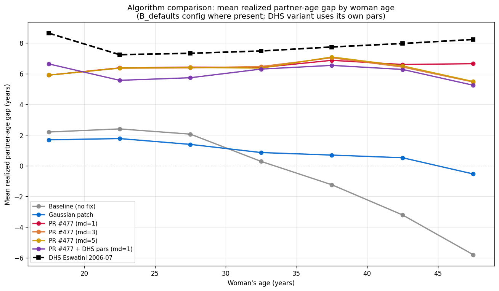
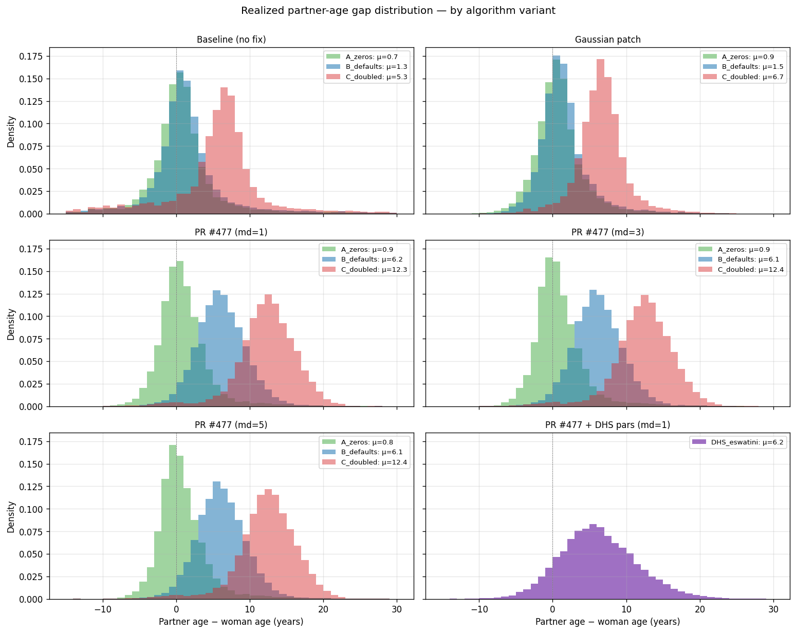

# SUMMARY — experiment 011 (network age-mixing fix)

**Date:** 2026-06-16.
**Status:** complete. Model-development detour, not a calibration run.
**Decision:** adopt upstream **PR #477** for `StructuredSexual.match_pairs`;
drop the local Gaussian patch; set `age_diff_pars` from DHS Eswatini.

## Question

Experiment 009's coverage check failed, and one suspect was the sexual
network's age-mixing structure (see
[../009_coverage_check/SUMMARY.md](../009_coverage_check/SUMMARY.md)). This
experiment paused calibration to answer a narrower, blocking question: does
`age_diff_pars` actually drive the realized partner-age distribution? If the
matching algorithm ignores the parameter, then no prior over `age_diff_pars`
is interpretable and calibrating the network is meaningless.

## Result

**The bug is real and is still present in the current stisim release
(1.5.5).** `match_pairs` matches within the surviving pool by rank
(`argsort(desired_ages)` ↔ `argsort(m_ages)`), which flattens the configured
gap distribution into a function of the marginal age supplies. Sweeping
configured μ across 0 → 7 → 14 moved the realized overall mean gap only
0.7 → 1.4 → 5.3 yr, and produced biologically implausible **negative** gaps
for women 35-49 (−2.7 yr at the default). **PR #477** (restores
`linear_sum_assignment` within the surviving pool) fixes it: realized mean
tracks configured μ nearly 1:1 (0.9 → 6.2 → 12.3) and matches DHS Eswatini
2006-07 within ~1-2 yr across all woman-age bins. The `max_deviation`
knob (1/3/5) made no material difference. The local Gaussian patch did
**not** fix it — it flattens almost identically to the broken baseline.

## Observations

1. **Parameter transmission, default config (μ=7), realized mean gap by
   woman age:**

   | Woman age | Baseline (no fix) | Gaussian patch | PR #477 (md=1) | PR #477 + DHS pars | DHS Eswatini |
   |---|---|---|---|---|---|
   | 15-24 | 2.26 | 1.71 | 6.03 | 6.29 | 8.6 |
   | 25-34 | 1.35 | 1.21 | 6.41 | 5.89 | 7.4 |
   | 35-49 | **−2.68** | 0.42 | 6.76 | 6.30 | 7.7 |
   | 15-49 | 1.35 | 1.54 | 6.16 | 6.21 | ~7.5 |

2. **Sweep sensitivity (overall 15-49 realized mean), configured μ 0/7/14:**
   baseline 0.7 / 1.4 / 5.3 (heavily attenuated, threshold-like); PR #477
   0.9 / 6.2 / 12.3 (near 1:1 transmission). The configured parameter is
   essentially transparent in the broken version at typical operating values.

3. **Negative gaps for older women are the clearest tell.** The extreme
   age-feasibility cutoffs prune well-matched older men, leaving women 35-49
   rank-matched against the surviving younger male tail. PR #477 removes this
   artefact (35-49 gap goes from −2.7 to +6.8).

4. **`max_deviation` is not a sensitive lever.** PR #477 with md = 1, 3, 5
   gave realized 15-49 means within 0.1 yr of each other (6.16 / 6.14 / 6.15).
   Use the default (md=1).

5. **The Gaussian patch is a dead end.** It produces the same flat,
   parameter-insensitive distribution as the broken baseline — discard it.

6. **Upstream state:** the two cherry-picks experiment 009 carried locally
   (`rel_sus_age` #395, Bellan acute defaults #396) are now in the 1.5.5
   release, so local stisim is no longer divergent except for this patch. PR
   #477 is **not** in any release yet (still open) — adopting it means
   running on the PR branch (or cherry-picking it) on top of 1.5.5.

## Artifacts

- `outputs/rank_test_realized_gaps_baseline_no_fix.csv` — broken 1.5.5 baseline.
- `outputs/rank_test_realized_gaps_E_gaussian_patch.csv` — local Gaussian patch (rejected).
- `outputs/rank_test_realized_gaps_A_pr477_md1.csv`, `outputs/rank_test_realized_gaps_B_pr477_md3.csv`, `outputs/rank_test_realized_gaps_C_pr477_md5.csv` — PR #477, max_deviation sweep.
- `outputs/rank_test_realized_gaps_D_pr477_dhs.csv` — PR #477 with DHS-derived `age_diff_pars`.
- `outputs/dhs_partner_age_summary.csv` — DHS Eswatini 2006-07 empirical targets.
- `github_issue.md` — upstream bug report (drafted; basis for PR #477).
- `run_pr477_comparison.py`, `test_rank_matching.py`, `plot_algorithm_comparison.py` — driver + plotting.

## Next

**012 — resume the diagnostic prior expansion (009's deferred 010), on a
fixed network.** Concretely: rebase the model onto stisim 1.5.5 + PR #477
(drop the Gaussian patch), set `age_diff_pars` to the DHS values, then re-run
the 009 coverage check with the expanded prior 009 prescribed
(`rel_init_prev` added, `rel_dur_on_art` upper bound raised, one HIV-mortality
multiplier exposed). Open question for that experiment: does fixing the
network plus widening the prior bring coverage inside the envelope, or does
the deaths/prevalence miss persist and point to deeper structural work?
