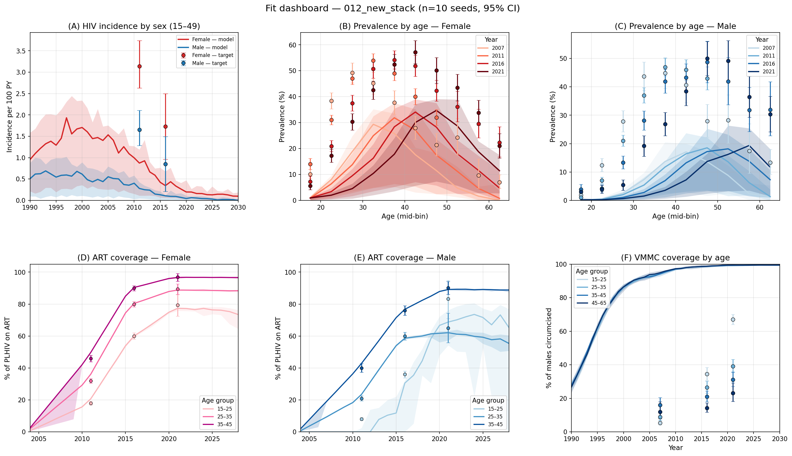
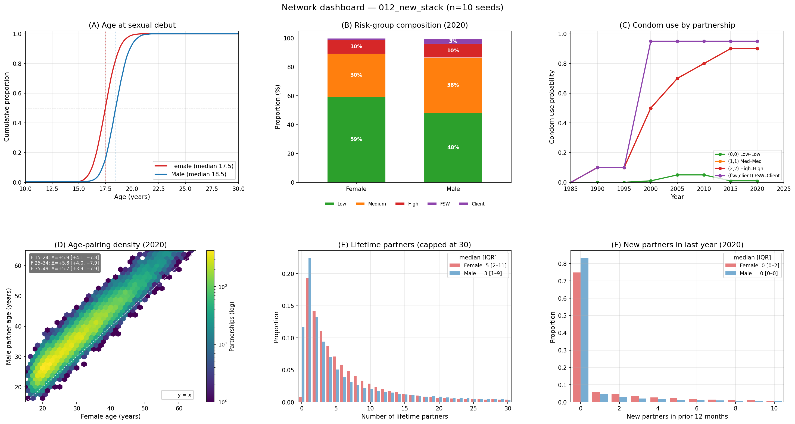

# SUMMARY — experiment 012 (version-bump diagnostics)

**Date:** 2026-06-17.
**Status:** complete. Re-baseline / documentation pass, not a fit.
**Headline:** model runs clean on the updated stack; the network fix is
active and healthy; peak prevalence has shifted *down* vs the 009-era
broken-network baseline — flipping the direction of the calibration problem.

## Question

Both dependencies advanced during the break — **starsim 3.3.3 → 3.5.0** and
**stisim 1.5.5 → 1.5.8** — and the age-mixing fix (#477, confirmed in
[../011_network_age_mixing/SUMMARY.md](../011_network_age_mixing/SUMMARY.md))
now ships as the default `closest_age_tapered_seeking` matcher. The stisim
1.5.6 CHANGELOG warned of a ~59 % Eswatini prevalence shift and that
"downstream calibrated models will need recalibration." This experiment
documents how the model behaves on the new stack, at default parameters,
before resuming calibration in
[../013_prior_expansion/](../013_prior_expansion/).

## Result

The model runs end-to-end with **no harness changes** (the 1.5.5 API
migration in `4bce62a` covered everything). Realized partner-age gaps are now
**positive and consistent at ~6 yr across all female age groups** (011's
broken baseline was 2.3 / 1.4 / **−2.7**). Prevalence-by-age, incidence, and
ART coverage track the PHIA/UNAIDS targets in shape, with wide uninformed
bands (10 seeds, uncalibrated). Female peak-bin prevalence sits at **~32–35 %**
with the peak age migrating older each survey (35-40 → 40-45 → 45-50) — a
clean cohort-aging signature. **No regression** (no collapse, no runaway).

## Observations

1. **Age-mixing is fixed on the shipped matcher.** Realized male−female gap
   by female age group (2020 snapshot, 10 seeds):

   | Female age | 011 baseline (broken) | 011 PR #477 (LSA) | **012 shipped (tapered)** | DHS Eswatini |
   |---|---|---|---|---|
   | 15-24 | 2.26 | 6.03 | **5.96** | 8.6 |
   | 25-34 | 1.35 | 6.41 | **6.00** | 7.4 |
   | 35-49 | −2.68 | 6.76 | **5.92** | 7.7 |
   | 15-49 | 1.35 | 6.16 | **5.96** | ~7.5 |

   The shipped `closest_age_tapered_seeking` lands in the same ~6 yr regime as
   the `linear_sum_assignment` branch validated in 011 — positive and
   consistent. It is **flatter than and slightly below DHS** (which rises to
   8.6 for the youngest women); `age_diff_pars` was left at defaults here, so
   013 can tune it upward toward DHS.

2. **Peak prevalence shifted down vs 009.** Female peak-bin prevalence is
   ~32 % (2011, 35-40) → ~34 % (2016, 40-45) → ~35 % (2021, 45-50); male
   ~18–19 % peaking at 45-60. This **undershoots** the PHIA peak (women 35-45
   are ~45–55 % in the surveys). Experiment 009, on the *broken* network, had
   prevalence drifting *up* / overshooting. The fixed network transmits less,
   pulling peak prevalence down — consistent in direction and rough magnitude
   with the CHANGELOG's ~59 % shift.

3. **This flips the calibration problem.** 009's diagnosis was *too little
   mortality flow → prevalence too high*. On the new stack the pressure is the
   opposite at the peak: prevalence now sits *below* target. The three-suspect
   plan for 013 (add `rel_init_prev`, widen `rel_dur_on_art`, expose a
   mortality multiplier) must be re-read in this light — some of those levers
   push prevalence further down, the wrong direction.

4. **Cohort aging is visible and sensible.** The peak prevalence age bin
   advances ~5 yr per survey in both sexes, as the heavily-infected 2000s
   cohort ages and survives on ART. This is why single-bin prevalence
   declines over time even as the epidemic is roughly stable.

5. **The "~59 %" is a matcher-choice envelope, not the old→new delta.** Per
   the stisim `tests/devtests/PFA_RESULTS.md`, 59 % is the *spread in final
   Eswatini HIV prevalence across all candidate matchers* (worst `sort_pair`
   4.18 % → strict `desired_age_bucket` 2.63 %), at their test calibration —
   not our absolute levels. The old-default (`sort_bisect`) → new-default
   move is smaller (~15–25 % lower). Numbers not directly comparable to our
   ~30 %-prevalence run.

6. **Two entangled mechanisms drive the drop — and the docs conflate them.**
   The stisim docs attribute the shift to age-gap structure ("steeper age gap
   concentrating incidence among older men → fewer at-risk transmissions").
   But the *same* PFA_RESULTS lifetime-partner data shows the strict matchers
   also form **fewer partnerships** (mean lifetime partners: `sort_bisect`
   1.11 vs strict 0.86–1.01) — the new default adds an older-women seeking
   taper, a 1-yr `max_deviation` skip, and an extreme-gap trim that all drop
   pairs the old rank-zip kept. So lower prevalence could be **(a)** age
   structure or **(b)** lower partnership volume, and the headline number
   can't separate them.

7. **The A/B is cheap — no reverting needed** (correcting an earlier note).
   `sort_bisect` is still in the stisim 1.5.8 matcher registry and
   `match_method` is a settable network parameter, so old vs new can be
   compared on the *same* stisim by flipping one parameter. Deferred to
   [../013_matcher_comparison/](../013_matcher_comparison/).

## Artifacts

- `outputs/dashboard_data.obj` — collected 10-seed data (sciris); regenerates
  both figures without re-running.
- `outputs/version_stamp.json` — `{starsim: 3.5.0, stisim: 1.5.8, n_seeds: 10}`.
- `figures/dashboard_fit_012_new_stack.png`, `figures/dashboard_network_012_new_stack.png`.
- `run.py` — reuses `plot_dashboard.py`'s `run_sims`/`collect`/plotters.

## Next

First **[013_matcher_comparison](../013_matcher_comparison/)** — decompose the
prevalence shift by flipping `match_method` (old `sort_bisect` vs new
`closest_age_tapered_seeking`, plus a strict-but-untapered `kdtree_nn`),
holding everything else fixed, and measure partnership volume, realized age
gaps, and HIV prevalence/incidence per matcher. This separates mechanism (a)
age structure from (b) partnership volume, and gives the true old→new delta in
our own calibration.

Then **[014_prior_expansion](../014_prior_expansion/)** on this stack, with
two amendments prompted by this run: (a) revisit the 009 three-suspect prior
in light of the prevalence-direction flip — the peak now undershoots, so
levers that lower prevalence are suspect; (b) tune `age_diff_pars` upward to
bring realized gaps from ~6 yr toward the DHS 7–8.6 yr. Open question: with the
fixed network, is the residual misfit a prevalence *level* problem (seeding /
susceptibility) rather than the mortality problem 009 diagnosed?
