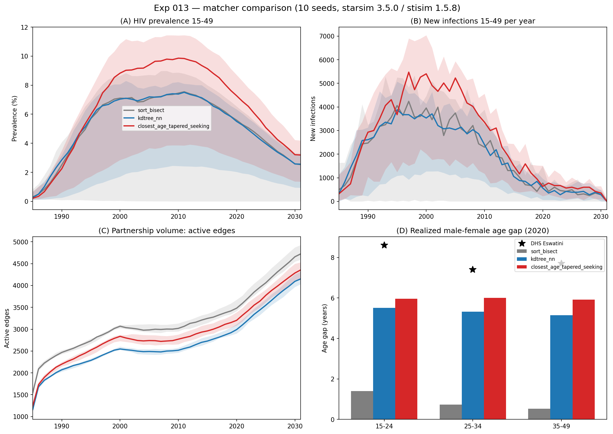
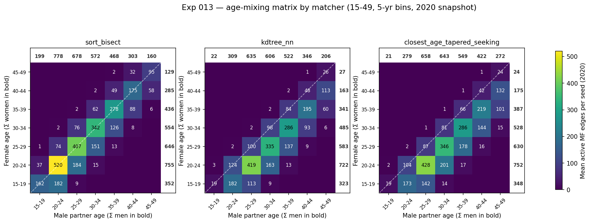

# Exp 013 — Matcher comparison: what drives the network prevalence shift?

**Date:** 2026-07-09.

**Question.** Following [../012_version_bump_diagnostics/SUMMARY.md](../012_version_bump_diagnostics/SUMMARY.md),
which found the updated stack's fixed network moved Eswatini HIV prevalence but
could not say why. The stisim 1.5.6 network fix (#477) entangles two mechanisms:
a corrected male−female **age gap** (structure) and a change in **partnership
volume**. This experiment ran `run_sims.make_sim` unchanged except for the
network `match_method`, across three matchers × 10 seeds (starsim 3.5.0 / stisim
1.5.8, 10k agents, 1985–2031), to ask how much of the prevalence shift is age
structure vs volume.

**Result.** The clean age-vs-volume decomposition the design hoped for **does not
hold** — the three matchers are not volume-matched, so the two mechanisms are
confounded across them. But two findings are robust. **(1)** The corrected
matcher raises prevalence, it does not lower it: 2021 prevalence (15–49, 10-seed
mean) is `sort_bisect` **4.09%** → `kdtree_nn` **4.69%** → `closest_age_tapered_seeking`
(new default) **6.46%**. This **contradicts 012's attribution** of the version-bump
prevalence *drop* to the network fix — the matcher change alone, everything else
held at 1.5.8, moves prevalence *up*. **(2)** At a fixed (correct) age gap,
more partnership volume means more prevalence (`kdtree_nn → tapered`: +5,668
lifetime pairs, +230 active edges, +1.8 prevalence points).

The age-mixing matrices make the structural change visible: `sort_bisect` puts
partnership mass on the diagonal (partners the same age); both corrected matchers
shift mass one 5-yr bin above it (young women partnered with ~5-yr-older men).

## Observations

1. **Age gap works as intended (Panel D, heatmap).** `sort_bisect` gives a broken
   gap of ~0–1.4 yr across female age groups; both corrected matchers give the
   realistic +5–6 yr gap. Note both still **undershoot DHS** (7.4–8.6 yr) by
   ~1–2 yr — directionally right, not yet on target.

2. **Prevalence ordering is not monotone in volume.** Lifetime pairs (10-seed
   mean): `sort_bisect` 82,485 (highest) > `tapered` 69,569 > `kdtree_nn` 63,901
   (lowest). Yet prevalence orders `sort_bisect` (4.09) < `kdtree_nn` (4.69) <
   `tapered` (6.46). The highest-volume matcher has the lowest prevalence — so
   volume alone does not explain the shift.

3. **The two mechanisms partly cancel across `sort_bisect → kdtree_nn`.** That
   step turns the age gap on (0 → +5.3 yr) but also drops volume 22%
   (82.5k → 63.9k pairs). Prevalence barely moves (4.09 → 4.69 overall; ~5.6 →
   ~5.2 among surviving seeds). Correcting the gap pushes prevalence up; the
   volume drop pushes it down; net ≈ flat. This is why the design cannot cleanly
   quantify the age-gap effect in isolation — the two matchers differ in both.

4. **Volume effect is clean where the gap is held fixed.** `kdtree_nn → tapered`
   holds the gap at ~+5.3/+6.0 yr and raises volume (63.9k → 69.6k pairs,
   2,953 → 3,183 active edges), lifting 2021 prevalence 4.69 → 6.46 (overall) and
   ~5.2 → ~7.2 (surviving seeds). More partnerships at a realistic gap → more
   transmission.

5. **Broken age structure yields fragile epidemics.** Seeds reaching 2021 with
   <0.5% prevalence (stochastic extinction): `sort_bisect` **2/10** (plus one at
   1.7%), `kdtree_nn` **1/10**, `tapered` **1/10**. The wide 5–95% bands in
   Panels A–B are driven by these die-outs. Consistent with the mechanism that a
   realistic older-male/younger-female gap bridges infection into each incoming
   cohort of young women — the classic age-disparate pathway feeding young women
   into older, higher-prevalence, less-suppressed male partners — sustaining the
   epidemic; a ~0-yr gap keeps cohorts matched within themselves and lets the
   epidemic burn out more often.

6. **The committed pre-re-run artifacts were stale.** The originally stored
   `summary_table.csv`/figure were leftovers from an earlier run and matched seed
   1, not the 10-seed mean, while `results.jsonl` had been overwritten by an
   interrupted partial run (14/30 sims). Everything here is from a single clean
   30-sim run on 2026-07-09; jsonl, table, and both figures are mutually
   consistent.

## Next

- **The "~59%" release-note figure is a matcher-choice envelope, not an
  old→new drop.** Per stisim `tests/devtests/PFA_RESULTS.md`, 59% is the spread
  in final Eswatini prevalence across all eight candidate matchers (SortPair
  4.18% → DesiredAgeBucket 2.63%) at *their* test calibration. The old→new-default
  move in that calibration is a modest ~15–20% *down*; in our uncalibrated model
  (this experiment) the same move is *up*. The sign of the matcher effect is
  calibration-dependent — there is no single "59% drop" to attribute.
- **The version-bump prevalence drop 012 saw is not the matcher — leading
  suspect is a broken VMMC.** Since the matcher alone raises prevalence, 012's
  009→012 drop comes from the non-matcher parts of the starsim 3.3.3→3.5.0 /
  stisim 1.5.5→1.5.8 upgrade. On inspection, the stisim 1.5.6 rewrite of the
  `VMMC` class **overwrote the exp-005 local patch** (prevalence-target
  semantics): the new upstream `VMMC` applies coverage as a per-step hazard on
  the uncircumcised pool and ignores age stratification, so circumcision coverage
  overshoots to ~100% (vs SHIMS3 targets ~20–40%) — visible comparing panel F of
  007's vs 012's fit dashboards. Over-circumcision suppresses male acquisition and
  drags prevalence down. This bug is held constant across all three matcher arms
  here (so it does not affect this comparison), but it suppresses 013's absolute
  levels and is the likely driver of 012's drop.
- **Next experiment: re-implement prevalence-target VMMC as an in-repo subclass**
  (not a stisim patch, which the next upgrade would wipe again) and measure its
  prevalence impact — must land before 014's coverage check, or that check runs
  on a crushed male-prevalence artifact.
- **Then [../014_prior_expansion/](../014_prior_expansion/)** (the resumed
  coverage check on the fixed stack), with the network fix and VMMC both correct.
- **If a clean age-gap decomposition is ever needed:** compare two matchers that
  are volume-matched but differ only in gap (e.g. a volume-capped `kdtree_nn` vs
  a gap-zeroed variant). Not needed for the calibration path; noted only if the
  mechanism itself becomes the question.
