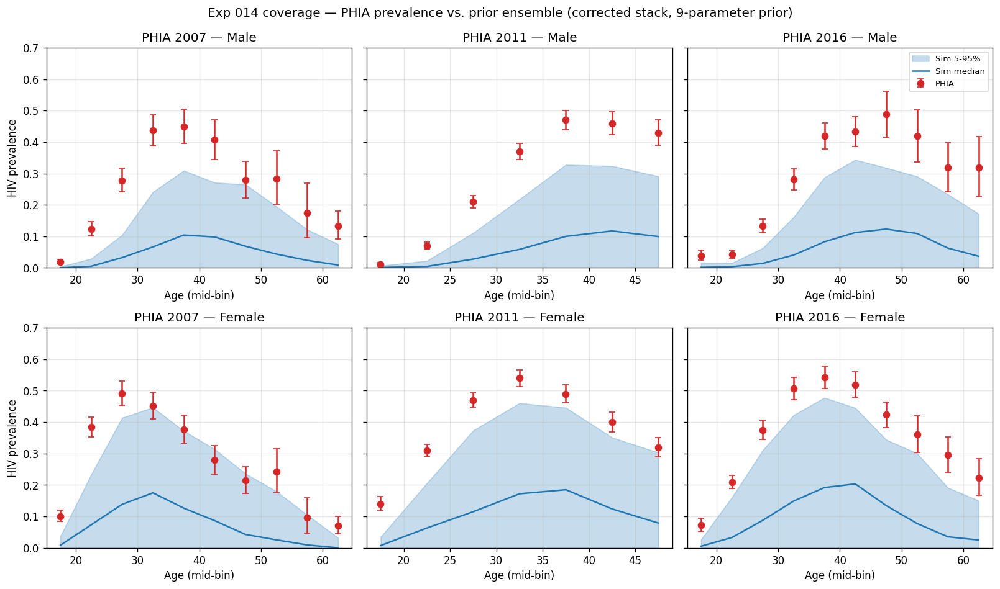
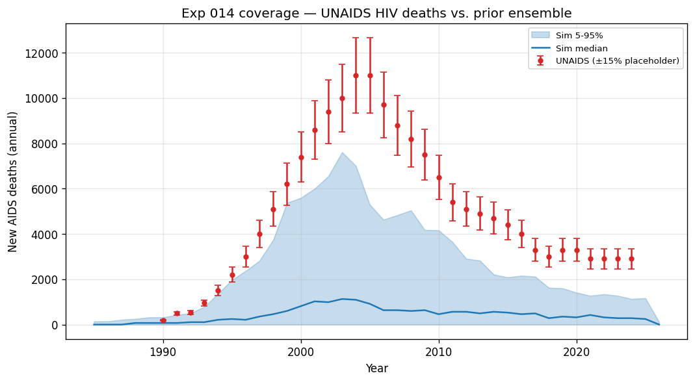
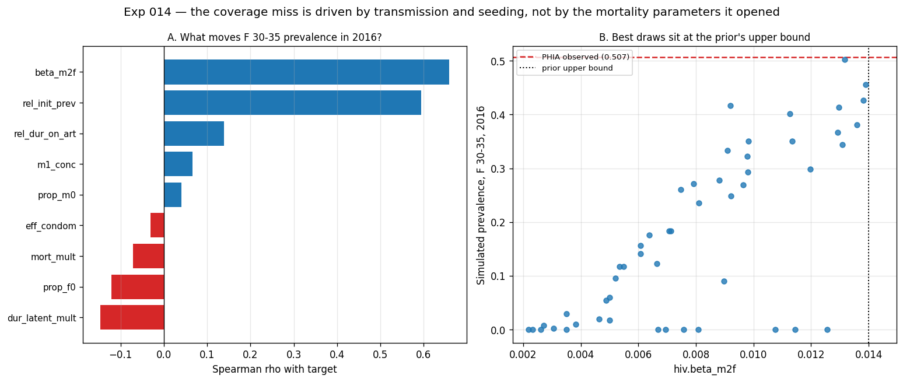

# Exp 014 — Diagnostic prior expansion on the corrected stack

**Status:** complete. **Coverage failed — but the diagnosis inverts 009's.**
**Date:** 2026-08-11.
**Compute:** raccoon (120 cores). 50 draws x 1 replicate, ~40 s wall.
**Stack:** starsim 3.5.0 (`d5380b1b`), stisim 1.5.8 (`6755429`), with the
network fix (011/013) and prevalence-target VMMC (015) in place.

## Question

[009's coverage check](../009_coverage_check/SUMMARY.md) failed at 30/89 (34 %)
and diagnosed *too little mortality flow*, naming three fixed parameters as
suspects. This experiment re-ran the check on the corrected stack with all three
opened into the prior (9 parameters, up from 6) — including a new in-repo
subclass (`hiv_mortality.HIVMortalityMultiplier`) exposing the CD4 death rates
that are hard-coded inside `HIV.make_p_hiv_death()`.

## Result

**4/89 target rows inside the 5–95 % envelope (4 %)** — worse than 009's 34 %.
The miss is entirely one-directional: **85 of 89 rows have the whole ensemble
*below* the observation, and not one sits above it.** Median simulated/observed
is 0.10 for deaths and 0.20 for prevalence.

But the raw number is misleading, and the diagnosis is the opposite of 009's.
**The model can reach the data** — the best single draw hits 0.502 against an
observed 0.507 for 2016 female 30–35. The failure is that almost none of the 50
draws land where the data lives, for two separable reasons, and **the mortality
parameters this experiment opened are not among them.**

| quantity | rows | inside envelope | ensemble entirely below | entirely above |
|---|---|---|---|---|
| AIDS deaths | 35 | 1 | 34 | 0 |
| PHIA prevalence | 54 | 3 | 51 | 0 |

The diagnostic panel is what the coverage number hides — which parameters
actually move the target, and where the best draws sit relative to their bounds:

## Observations

1. **Two parameters carry the epidemic; the three opened here do not.**
   Against 2016 female 30–35 prevalence, `beta_m2f` has rho = 0.66 and
   `rel_init_prev` rho = 0.59. Everything else is under |0.15|. The ranking is
   the same for deaths (peak 2000–2005: `rel_init_prev` 0.62, `beta_m2f` 0.59).

2. **`mort_mult` does essentially nothing — a 6x range with no effect.**
   rho = −0.01 on peak deaths, and only 0.11 restricted to the 44 draws with an
   established epidemic. The mechanism is structural: in `hiv.py:400-412` AIDS
   deaths fire from a separate `ti_zero` pathway driven by CD4 decline, so the
   `p_hiv_death` rate array this subclass scales governs only the minor
   "serious HIV-related illness" route. `dur_latent_mult`, which shifts
   `ti_zero`, does have an effect (rho = −0.32 on peak deaths) — consistent
   with the same mechanism.

3. **009's "too little mortality flow" diagnosis does not survive.** Deaths are
   low because the epidemic is small, not because mortality is slow. Opening the
   mortality block was the right test and it came back negative — which is the
   experiment's main scientific return.

4. **The best draws are pinned at `beta_m2f`'s upper bound.** Four of the top
   five draws sit at 0.0132–0.0139 against a prior ceiling of 0.014 (panel B),
   and the relationship is still rising there. This is the textbook
   prior-too-narrow signature: parameters piled against one edge, with the data
   on the far side of it. The best draw reaching 0.502 vs 0.507 observed means
   the true value is at or just beyond the current bound.

5. **22 % of draws are failed epidemics.** 11/50 draws have ~zero 2016
   prevalence. `rel_init_prev` is the discriminator — median 0.108 in the
   failures vs 0.319 in those that established — not `beta_m2f`, which spans
   0.0022–0.0126 among the failures. Opening `rel_init_prev` down to 0.05
   sampled below the establishment threshold at `n_agents = 10 000`; exp 007 had
   already raised it from 0.1 to 0.2 to seed ~22 rather than ~11 cases. These
   zeros drag the envelope's lower half to the floor.

6. **Why coverage got worse than 009, mechanically.** 009 held `rel_init_prev`
   fixed at 0.2 — above the extinction threshold — so every draw produced an
   epidemic. 014 sampled below it *and* spread 50 draws across 9 dimensions
   instead of 6, so the high-`beta`/high-seed corner where the data lives is
   populated by roughly one draw. Widening a prior lowers coverage whenever the
   added volume is mostly in directions that don't matter.

7. **Caveat on the 4 % vs 34 % comparison.** 009 ran on starsim 3.3.3 / stisim
   1.5.1; 014 runs on 3.5.0 / 1.5.8 with the network and VMMC fixes. The prior
   changed *and* the stack changed, so the two headline numbers are not a clean
   prior-only contrast. The within-014 findings (observations 1–6) do not depend
   on that comparison.

## Acceptance

**Blocks calibration — do not proceed to `method-selection`.** But it is a
productive failure: it converts a vague "not enough mortality" hypothesis into a
specific, testable claim that the epidemic is transmission- and seeding-limited,
with a bound to move and a floor to raise. The `hiv_mortality.py` subclass and
the `make_sim(hiv_class=...)` injection point are correct and reusable; they
simply measured a parameter that turns out not to matter.

## Next

**015 is taken; the next folder is 016.** Proposed —
**016: re-centre the prior on the parameters that matter.**

- Raise `beta_m2f`'s upper bound (currently 0.014, and binding) — obs. 4.
- Raise `rel_init_prev`'s floor above the establishment threshold — obs. 5.
  Worth measuring that threshold directly rather than guessing.
- Drop `mort_mult` from the prior and fix it at 1.0 — obs. 2. Retain
  `dur_latent_mult`, which does move deaths.
- Consider whether `n_agents = 10 000` is large enough that seeding and
  stochastic extinction aren't doing this much work — a `model-setup` question,
  and arguably a prerequisite to any further coverage check.

Two questions to settle before writing 016, in order: (a) is the failed-epidemic
rate a property of the prior or of the population size, and (b) how far does
`beta_m2f` need to go before the relationship in panel B turns over? A short
one-parameter sweep answers both more cheaply than another 9-parameter draw.

## Artifacts

- `outputs/draws.csv` — the 50 prior draws (9 parameters).
- `outputs/ensemble.parquet` — consolidated per-year ensemble, 2 100 rows.
- Per-sim parquet files under the sims subdirectory — written as each sim
  finishes so a spot reclamation is resumable. Left on raccoon, not transferred;
  `outputs/ensemble.parquet` is their consolidation.
- `outputs/coverage_summary.csv` — per-target-row envelope and in/out flag.
- `outputs/run.log` — the run as executed.
