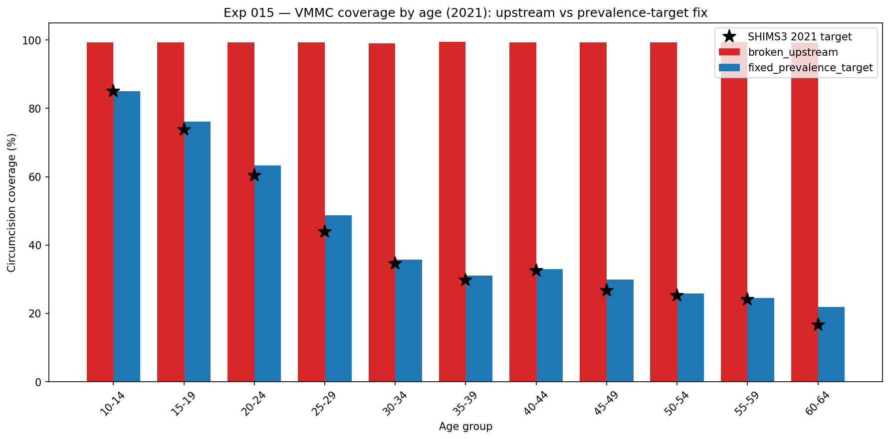
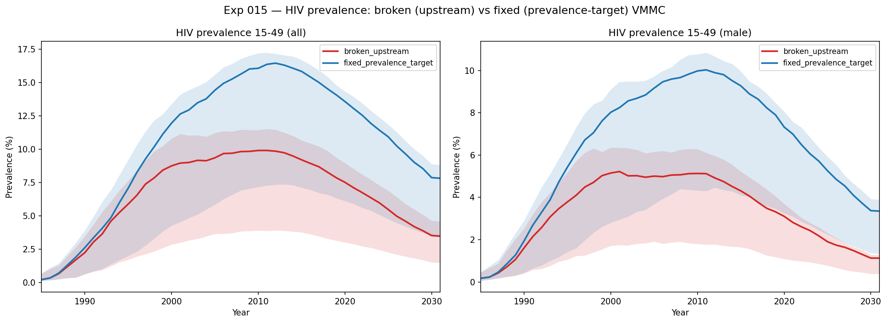
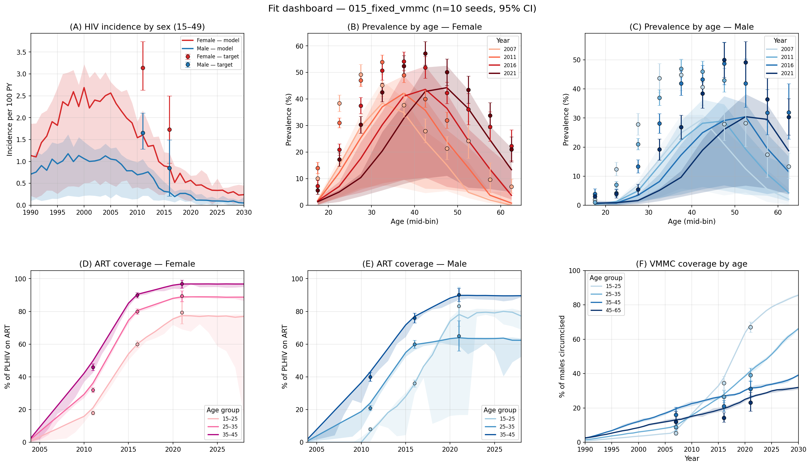

# Exp 015 — VMMC prevalence-target fix (in-repo subclass)

**Date:** 2026-07-10.

**Question.** The exp-005 VMMC fix (prevalence-target semantics — coverage read as
a cross-sectional circumcision *stock* per age bin) was a local patch to the
editable stisim checkout. The stisim 1.5.6 `VMMC` rewrite (#472/#477) overwrote
it, reverting to a per-step *hazard* on the uncircumcised pool that also ignores
age stratification. [../013_matcher_comparison/SUMMARY.md](../013_matcher_comparison/SUMMARY.md)
cleared the network fix of 012's version-bump prevalence drop and named this
broken VMMC as the leading suspect. This experiment re-implements prevalence-
target VMMC as an in-repo subclass (survives stisim upgrades) and measures its
effect on circumcision coverage and HIV prevalence.

**Result.** The fix works and the effect is large. At 2021 (10-seed means),
circumcision coverage for 15–49 falls from an upstream **99.3%** overshoot to
**45.4%** (≈ SHIMS3's official 48.3%), and the coverage-by-age curve tracks the
SHIMS3 targets across all 11 bins instead of pinning every bin at ~100%. Fixing
VMMC **raises** HIV prevalence 15–49 from 6.69% → **11.94%** overall and roughly
**doubles male prevalence, 2.60% → 6.36%** (female 10.72% → 17.43%). Over-
circumcision was suppressing male acquisition hard — this is very likely the main
driver of the version-bump prevalence drop 012 observed and 013 could not pin on
the matcher.

The fixed-arm fit dashboard shows panel F (VMMC coverage by age) restored to the
age-differentiated SHIMS3 pattern, with prevalence-by-age and incidence on the
corrected stack:

## Scorecard (2021, 10-seed mean)

| metric | broken (upstream) | fixed (prevalence-target) | SHIMS3 / note |
|---|---|---|---|
| Circumcision 15–49 | 99.3% | 45.4% | ≈ 48.3% official |
| HIV prev 15–49 (all) | 6.69% | 11.94% | +5.25 pts |
| HIV prev 15–49 (male) | 2.60% | 6.36% | ×2.4 |
| HIV prev 15–49 (female) | 10.72% | 17.43% | +6.71 pts |

## Observations

1. **Upstream ignores the age gradient entirely.** In the coverage-by-age figure
   the broken arm (red) is flat at ~99% across all 11 bins; the fix (blue) matches
   the SHIMS3 stars from 85% at 10–14 down to ~22% at 60–64. Upstream computes
   only an aggregate target and circumcises top-willingness men across all ages.

2. **The bug is stock-vs-flow.** Upstream applies `p × n_uncircumcised` each step
   (a hazard on the remaining pool), so coverage ratchets to ~100% regardless of
   the target. The subclass tops up to `p × (all alive males in bin)` per stratum,
   never removing — a stock target matching cross-sectional survey data.

3. **Fixing VMMC raises prevalence, especially in men.** Male 15–49 prevalence
   roughly doubles (2.60% → 6.36%); the female rise (10.72% → 17.43%) follows via
   reduced male→female transmission. Magnitude (~+5 pts overall) is comparable to
   the version-bump drop 012 flagged.

4. **Denominator is all men, not HIV-negative men.** SHIMS/PHIA report
   circumcision among all male respondents regardless of HIV status, so the
   subclass tops up over all alive males (circumcised HIV+ men still count toward
   the survey prevalence). Filtering to HIV-negatives would over-circumcise.

5. **Efficacy mechanic unchanged.** The subclass copies upstream's per-step
   `rel_sus *= (1 − eff_circ)` (HIV resets `rel_sus` to 1 each step, so no
   compounding). Only *who* is circumcised differs, isolating the coverage bug.

## Acceptance

Usable downstream. The `VMMCPrevalenceTarget` subclass reproduces SHIMS3 coverage
and is a drop-in (named `'vmmc'`). Promote it into repo-level `interventions.py`
so 014 onward inherit it. The prevalence deltas here mean 014's coverage check
must run with this fix in place, or male prevalence is artificially crushed.

## Next

- **Promote `VMMCPrevalenceTarget` into `interventions.py`** and set it as the
  VMMC used by `make_interventions()` (the `vmmc_class` injection point added in
  this experiment stays for A/B testing).
- **Upstream PR to stisim** fixing `VMMC` to stock/prevalence-target semantics
  with stratification, plus a test asserting coverage converges to the target
  (current `test_vmmc_specs` only checks `n_circ > 0`, which is why the overshoot
  slipped through).
- **Then [../014_prior_expansion/](../014_prior_expansion/)** — the coverage check
  on the fully corrected stack (network fix + VMMC fix).
