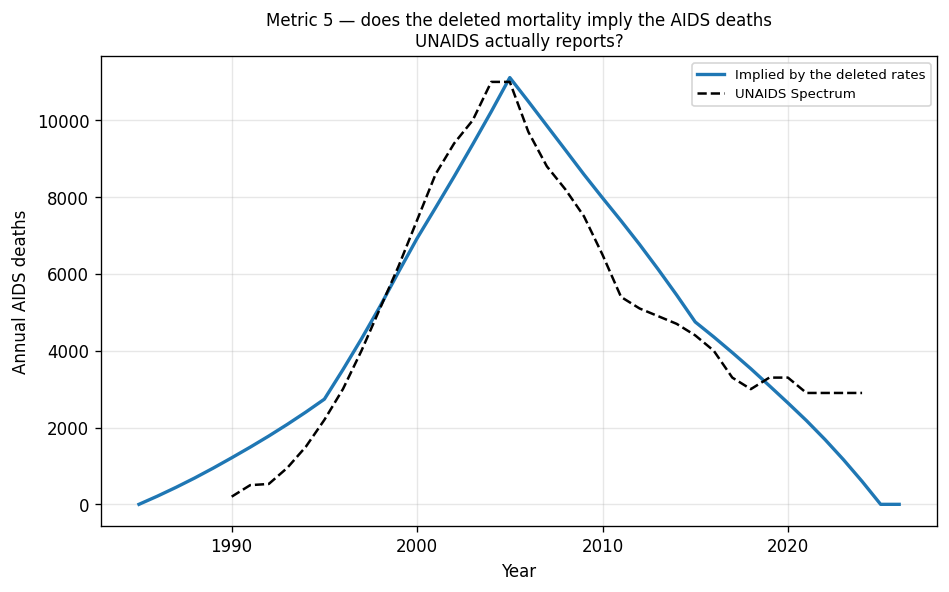
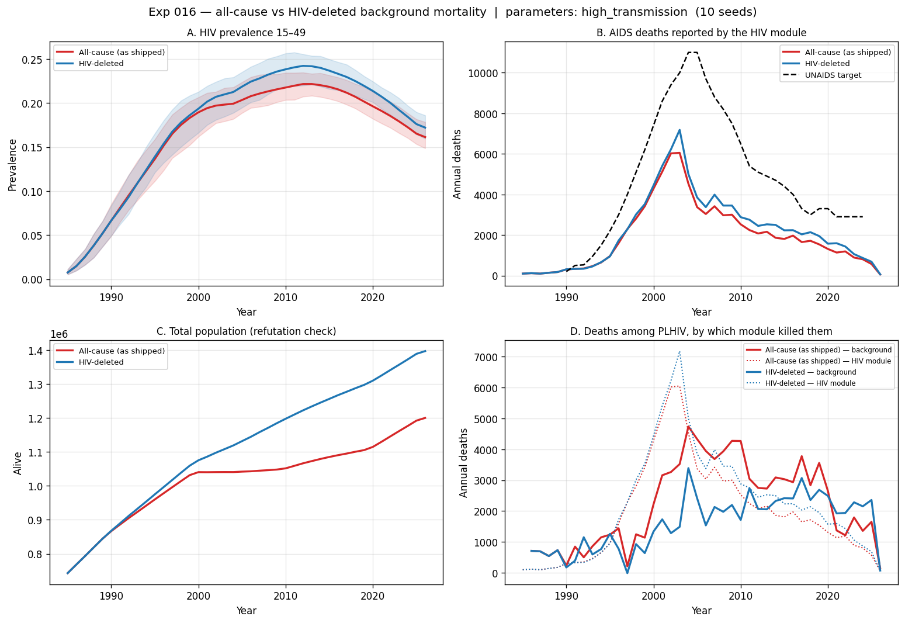
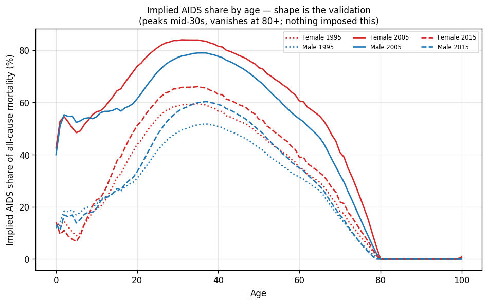
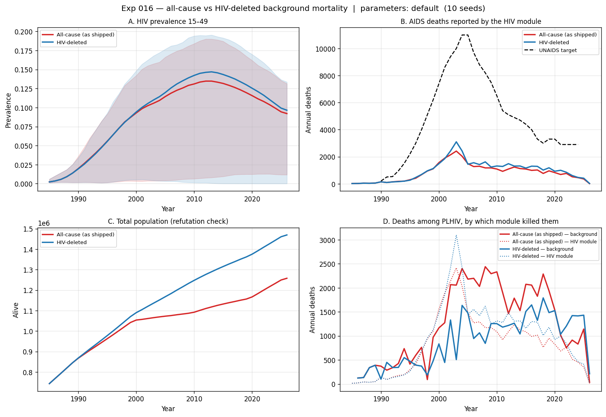
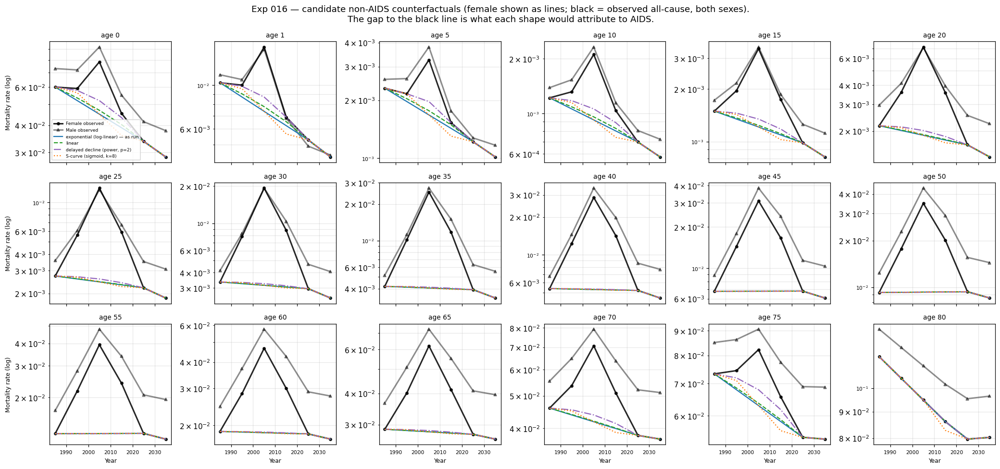
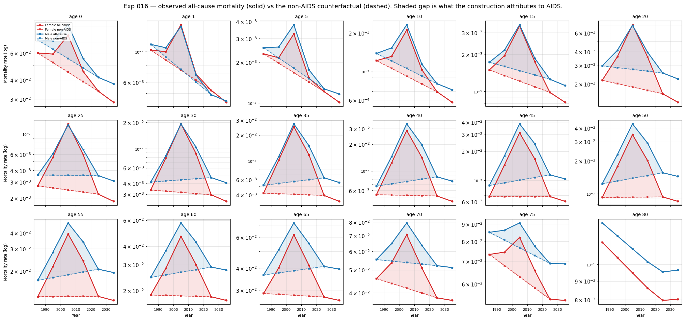

# Exp 016 — HIV mortality is double-counted in the background death rates

**Status:** complete. **Confirmed.** The fix is worth adopting, but it does not
explain 014's coverage failure — and it exposes a larger problem underneath.
**Date:** 2026-08-19.
**Compute:** local (raccoon was down). 2 arms x 2 parameter sets x 10 seeds =
40 sims, ~9 min.
**Model:** `model-v1.0` (5d5698b), starsim 3.5.0, stisim 1.5.8.

## Question

`data/eswatini_deaths.csv` feeds `ss.Deaths`, which kills agents regardless of
HIV status, and its adult rates rise 5.5x to a 2005 peak — the shape of the AIDS
epidemic. If those rates already contain AIDS deaths, the HIV module adds
mortality on top of mortality already there. How large is the effect, and does
correcting it move prevalence and deaths toward the targets?

## Result

**The double-counting is real and large.** Reconstructing a non-AIDS
counterfactual from all-cause mortality alone — log-linear interpolation between
the 1985 and 2025 anchors, nothing about HIV used as input — implies an AIDS
mortality curve that **tracks UNAIDS across the whole epidemic**: 11 113 vs
11 000 in 2005 (+1 %), and a mean ratio of **1.09 over 1995–2015**. The
background data was carrying essentially a whole epidemic's worth of AIDS
deaths.

| year | implied | UNAIDS | ratio |
|---|---|---|---|
| 1995 | 2 739 | 2 200 | 1.24 |
| 2000 | 6 926 | 7 400 | 0.94 |
| 2005 | 11 113 | 11 000 | 1.01 |
| 2010 | 7 979 | 6 500 | 1.23 |
| 2015 | 4 750 | 4 400 | 1.08 |
| 2024 | 598 | 2 900 | 0.21 |

The 2024 collapse is the construction's own assumption surfacing: it forces the
deletion to zero at the 2025 anchor, while UNAIDS still reports 2 900 deaths.
Post-2020 the method under-deletes by design.

**Correcting it fixes the population trajectory**, the second line of
evidence — a model that double-counts mortality should over-kill, and it does:

| 2015 population (target 1 313 671) | all-cause | HIV-deleted |
|---|---|---|
| default parameters | 1 131 932 (**−13.8 %**) | 1 315 148 (**+0.1 %**) |
| high transmission | 1 084 929 (**−17.4 %**) | 1 255 865 (**−4.4 %**) |

**But the effect on prevalence is modest — this is not what sank 014.** At high
transmission, 2005 prevalence 15–49 goes from 0.204 to 0.219 against a target of
0.268. Roughly +1.5 points where ~6 are needed.

## Observations

1. **The construction validates externally.** Metric 5 was built to catch
   over-deletion and instead confirmed the method: mean implied/UNAIDS ratio of
   1.09 across 1995–2015, and 1.01 at the 2005 peak. Reconstructing AIDS
   mortality from all-cause data alone, with no HIV information as input,
   lands within ~10 % of what UNAIDS reports.

2. **Population is where the double-counting shows.** Panel C of the A/B figure
   shows the all-cause arm with a distinctive flat spot through 2000–2010 — the
   AIDS mortality plateau, applied to the whole population on top of the HIV
   module's own deaths. The HIV-deleted arm rises smoothly and lands within
   0.1 % of the 2015 target at default parameters.

3. **The prevalence gain is small.** +1.5 points at high transmission, +0.5 at
   defaults. 014's ensemble sat below the observation in 85 of 89 rows; this
   closes a small fraction of that. **014's diagnosis stands** — the coverage
   failure is mainly prior placement, not mortality double-counting.

4. **The real finding is a deficit in HIV-module mortality.** Even after the fix
   and at a near-plausible epidemic, the module produces 3 856 AIDS deaths in
   2005 against UNAIDS' 11 000. Comparing at its own peak is fairer, since the
   model peaks ~2003 and UNAIDS ~2004–05: peak-to-peak it reaches **7 200 vs
   11 000, about 65 %**. Scaling for the model's smaller epidemic (21.9 % vs
   26.8 % prevalence) does not close that. Post-2010 the gap widens — the model
   falls to ~2 000/year while UNAIDS holds ~3 000.

5. **Removing background AIDS *raises* HIV-module deaths**, by 3 376 → 3 856 at
   2005 and 1 808 → 2 232 at 2015. PLHIV who would have been killed by inflated
   background mortality survive to die of HIV instead. The two death machines
   were competing for the same people.

6. **Default parameters produce unstable epidemics.** Prevalence 15–49 at 2005
   ranges 0.004–0.166 across 10 seeds — some runs have no epidemic at all. This
   is [014's](../014_prior_expansion/SUMMARY.md) extinction finding reproducing
   cleanly. The high-transmission set is tight (0.189–0.224), confirming that
   `beta_m2f` and `rel_init_prev` control establishment.

7. **Documentation correction.** CLAUDE.md and
   [008's README](../008_calibration_targets/README.md) both cite
   `data/eswatini_deaths.csv` as the source of the UNAIDS deaths target. It is
   `data/eswatini_hiv_calib.csv` (008's `run.py` line 74). One is background
   mortality rates, the other UNAIDS Spectrum counts. CLAUDE.md corrected; 008
   is closed and left as written.

## The counterfactual shape barely matters

The assumption flagged in the README as most load-bearing — the shape of the
non-AIDS trend, which is not identifiable from two anchors with every year
between them contaminated — turns out not to be the dominant uncertainty.

Above age 25 the four candidate curves lie on top of each other, because the
1985 and 2025 anchors are nearly identical at those ages (age 35 female:
0.0042 vs 0.0039). Any interpolation between two near-equal endpoints gives the
same near-flat line. They separate only at ages 0–20, where the anchors are far
apart — and those ages carry 18 % of implied deaths against 62 % for 15–49.

| method | 1995 | 2000 | 2005 | 2010 | 2015 | 2020 |
|---|---|---|---|---|---|---|
| exponential (log-linear) — as run | 2 739 | 6 926 | 11 113 | 7 979 | 4 750 | 2 640 |
| linear | 2 645 | 6 814 | 10 990 | 7 878 | 4 664 | 2 599 |
| delayed decline (power p=2) | 2 421 | 6 565 | 10 732 | 7 693 | 4 548 | 2 548 |
| S-curve (sigmoid k=8) | 2 493 | 6 798 | 11 113 | 8 064 | 4 916 | 2 718 |
| **UNAIDS Spectrum** | **2 200** | **7 400** | **11 000** | **6 500** | **4 400** | **3 300** |

All four land within 3.4 % of each other at the 2005 peak. The spread across
shapes (~3–10 %) is well below the year-to-year deviation from UNAIDS (±25 %).
The S-curve matches log-linear exactly at 2005 because a symmetric sigmoid
passes through the midpoint at the midpoint year — it moves the shoulders, not
the peak.

**Implied AIDS deaths by age band** (exponential counterfactual; full age x sex
detail in `outputs/excess_deaths_by_age_sex.csv`):

| band | 1995 | 2000 | 2005 | 2010 | 2015 | 2020 |
|---|---|---|---|---|---|---|
| 0–14 | 412 | 1 221 | 1 964 | 1 095 | 303 | 143 |
| 15–49 | 1 634 | 4 171 | 6 838 | 5 203 | 3 336 | 1 878 |
| 50+ | 693 | 1 534 | 2 311 | 1 681 | 1 111 | 619 |

**Sex split — a consistency check that passes.** The construction attributes
AIDS deaths roughly 50/50 by sex (female share 0.48–0.50 across 1995–2020),
while UNAIDS puts women at 55–56 % of PLHIV. The gap runs in the
epidemiologically expected direction: men present later, take up ART less, and
have higher case fatality per infection, so deaths should be male-skewed
relative to PLHIV share. The implied male:female case fatality of ~1.2 is
consistent with the literature. Nothing in the construction imposed this.

## Caveats

- The construction assumes 1985 and 2025 are AIDS-free (2025 is not quite, so
  this under-deletes at the margin) and that non-AIDS mortality moved smoothly
  between them. Metric 5 bounds the error: within ~10 % on average across
  1995–2015, but under-deleting badly after 2020.
- **Arm B still under-kills, because the HIV module cannot supply what was
  removed.** The construction deletes about the right number of deaths (11 113
  vs 11 000 in 2005), but the module then supplies only ~3 900. So the
  HIV-deleted arm is short roughly 7 000 deaths a year at the peak. Population
  nonetheless lands near the 2015 target, which means the demographic inputs
  absorb some of that — worth remembering before treating population agreement
  as strong independent confirmation.
- Metric 5 involves no HIV modelling: it is (all-cause rate − trend) x
  population, summed. It is a statement about the mortality data, not about the
  model's output. The model's own AIDS deaths (observation 4) are a separate
  quantity that misses in the opposite direction.
- Metric 5 uses the model's own population as denominator — mildly circular.
- The death-attribution identity (panel D) does not separate migration, which is
  on. Agents entering or leaving while infected move that quantity.
- Population targets exist for only 16 of 35 years; 2021 is missing, which is
  why 2015 is used as the headline comparison.

## Age allocation — and a bug found while checking it

Implied AIDS deaths in 2005 by age band, against UNAIDS' 11 000 total:

| band | implied | share | comment |
|---|---|---|---|
| 0–14 | 1 964 | 17.7 % | plausible — children are 9.1 % of PLHIV but die faster untreated |
| 15–49 | 6 838 | 61.5 % | the transmission ages, as expected |
| 50+ | 2 311 | 20.8 % | **probably too high** — the one remaining concern |

**A binning bug inflated an earlier version of this table and briefly reversed
this experiment's recommendation.** `implied_aids_deaths()` merged the mortality
data, which is by *single year of age*, onto population counts in *five-year
bins* — so age 0's rate was applied to the entire 0–4 population, age 5's to all
of 5–9, and so on. Infant mortality is roughly 5x ages 1–4, so this vastly
over-counted children: the total read 13 783 (+25 %) with a 39.6 % child share,
against the correct 11 113 (+1 %) and 17.7 %. Fixed by averaging single-year
rates within each bin before merging. Recorded because the failure mode is
generic: **joining rate data to population data at mismatched age resolution
silently biases toward whichever ages have the steepest within-bin gradient.**

What survives the correction is the 50+ band at 20.8 %. AIDS deaths above 50
should be a small share, since HIV prevalence there is well below the 30s. The
per-age curves show why: the male counterfactual at ages 55–75 is flat or
slightly rising (2025 mortality exceeds 1985, plausibly non-communicable
disease), so the observed hump is charged to AIDS.

The per-age curves make this visible rather than inferred:

- **Ages 25–50:** counterfactual nearly flat, observed a large hump peaking in
  2005. A clean AIDS signal — this is the method working.
- **Ages 0–20:** the counterfactual *declines steeply*, so more of the shaded
  gap comes from the assumed downward trend than from a hump in the data. This
  is where the method is most assumption-dependent — though the corrected age
  split puts children at 17.7 % of implied AIDS deaths, which is plausible, so
  the assumption appears to be holding up better here than expected.
- **Ages 55–75:** the male counterfactual is flat or slightly rising (2025
  mortality exceeds 1985 at those ages, plausibly non-communicable disease), and
  the residual hump is again charged to AIDS.
- **Age 80:** solid and dashed coincide, nothing attributed — correct.

Incidental consistency check: below age 15 the male and female observed curves
nearly coincide, as expected when the driver is mother-to-child transmission
rather than sexual transmission.

**Consequence:** the construction removes too much mortality from children and
the elderly while leaving residual double-counting at 15–49 — the ages that
carry transmission and that the PHIA prevalence targets are stratified by. For a
model calibrated to prevalence by age and sex, that is not a rounding error.

## Acceptance

**Adopt the HIV-deleted mortality.** It is correct in principle — the model
should not apply AIDS mortality twice — it reproduces UNAIDS AIDS deaths within
~10 % across the epidemic without using any HIV information, and it takes the
2015 population from 14 % below target to essentially on target. Good enough to
promote to a repo-level data input.

The apportionment construction (option 2 in the README) is **not** needed yet.
The crude method's total and age profile are close enough that the remaining
error — the 50+ band, and under-deletion post-2020 where the 2025 anchor is
assumed AIDS-free — is smaller than the gaps elsewhere in the model. Revisit if
it becomes binding.

**This does not unblock calibration.** Coverage still fails; the mortality fix
moves prevalence ~1.5 points of the ~6 needed.

## Next

1. **017 — adopt the fix and re-run the model-setup sweep.** Promote the
   HIV-deleted rates to a repo-level data input, then run the population-size,
   replicate-count and establishment-threshold measurements originally planned
   for 016, on the corrected model. Observation 6 shows why that sweep is still
   needed.
2. **018 — the HIV mortality deficit.** The module produces ~65 % of peak AIDS
   deaths and ~50 % post-2010. Candidate causes already identified: nobody on
   ART can die of HIV (`ti_zero` is cleared at ART initiation, `hiv.py:616-617`),
   `p_hiv_death` is a minor pathway (014 measured rho = 0.11 for `mort_mult`),
   and untreated survival is ~13 years by construction (`dur_latent` 10 y +
   `dur_falling` 3 y). This bears directly on the decision question, since
   survival on ART is what a treatment-cascade scenario turns on.
3. **Then coverage check v3**, once the model setup is measured and the prior
   re-centred per 014.

## Artifacts

- `outputs/mortality_construction.csv` — per age/sex/year: rate deleted, implied AIDS share.
- `outputs/data_hiv_deleted/` — the alternate datafolder used by the fixed arm.
- `outputs/results.parquet` — consolidated results, 40 runs.
- `outputs/death_attribution.csv` — deaths among PLHIV split by module.
- `outputs/implied_aids_deaths.csv` — metric 5.
- `outputs/excess_deaths_by_age_sex.csv` — implied AIDS deaths by age, sex, year.
- `outputs/method_comparison_vs_unaids.csv` — counterfactual-shape sensitivity.
- `outputs/scorecard.csv`, `outputs/run.log`.
- `analysis_methods.py` — the shape sensitivity and excess-death tables; kept
  separate from `run.py` because it asks about the construction, not the model.
