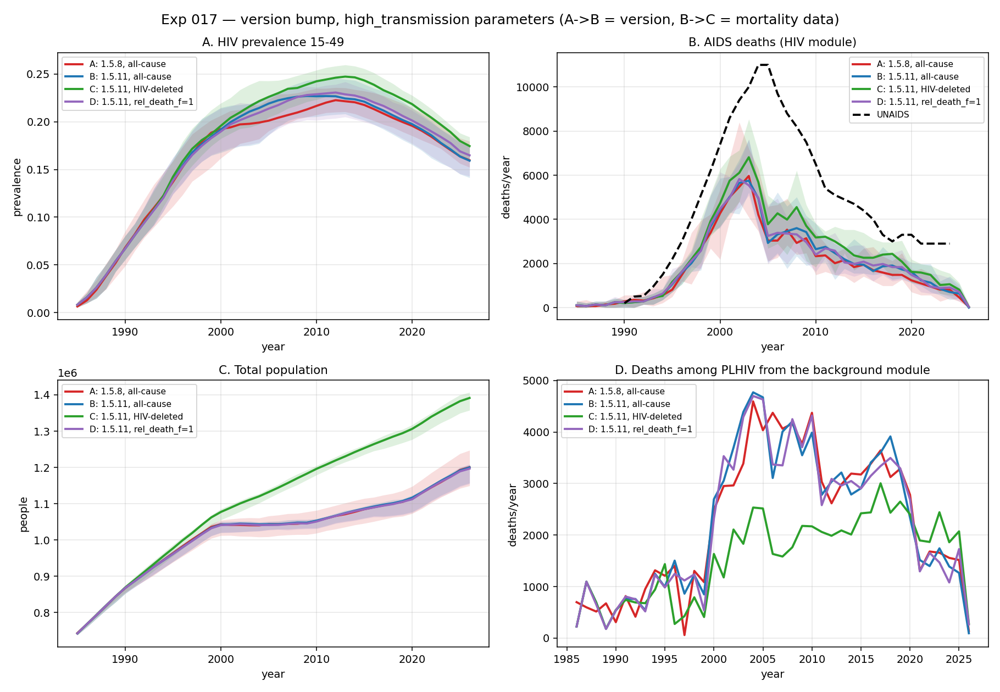
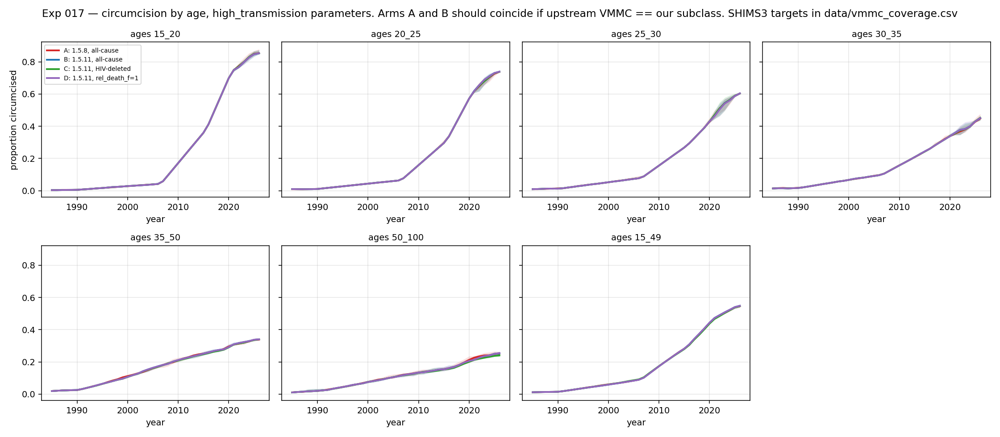
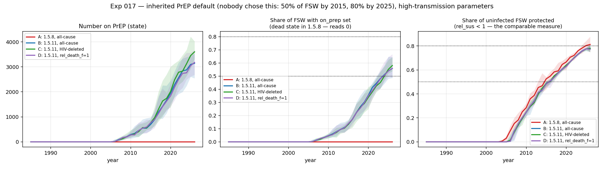

# Exp 017 — Version bump: stisim 1.5.8 → 1.5.11, starsim 3.5.0 → 3.5.2

**Status:** complete. **The bump is behaviourally neutral and safe to adopt —
and it does not close 016's AIDS-death deficit.**
**Date:** 2026-08-26.
**Compute:** local. 4 arms × 2 parameter sets × 10 seeds = 80 sims, ~145 s each.
**Model:** `model-v1.0` (5d5698b), unmodified — `run.py` selects the VMMC class
by installed version, so both stacks ran off one codebase.

## Question

stisim 1.5.11 makes on-ART HIV mortality nonzero by default. That is the first
candidate cause [016](../016_double_counted_mortality/SUMMARY.md) named for the
model's AIDS-death deficit — *"nobody on ART can die of HIV"*. How much does the
bump change the model, and how much of the deficit does on-ART mortality close?

Arms, each adjacent pair differing by one thing:

| arm | stack | background mortality | `rel_death_f` |
|---|---|---|---|
| **A** | 1.5.8 / 3.5.0 | all-cause | n/a (parameter does not exist) |
| **B** | 1.5.11 / 3.5.2 | all-cause | 0.74 (default) |
| **C** | 1.5.11 / 3.5.2 | HIV-deleted (016) | 0.74 |
| **D** | 1.5.11 / 3.5.2 | all-cause | 1.0 |

A→B isolates the version, B→C the mortality data. **D was added mid-experiment**
to isolate `rel_death_f`, after a first pass proposed it as the mechanism behind
an apparent prevalence shift. It refuted that hypothesis — see observation 6.

## Result

**The version bump changes nothing measurable.** At high-transmission
parameters, no A→B comparison of prevalence or AIDS deaths reaches |z| > 1.7 at
any year from 1995 to 2021. Per-seed peak AIDS deaths are 6 306 ± 1 063 (A) vs
6 257 ± 814 (B) — indistinguishable.

**And so it does not close the deficit.** Arm C reaches **64% of the UNAIDS
peak**, statistically identical to 016's arm B at 65%. On-ART mortality being
zero was **not** why the model under-supplies AIDS deaths.

For an adoption decision this is the good outcome: a release with three breaking
changes that leaves the calibrated behaviour untouched is one we can take
without recalibrating. For the scientific question that motivated the experiment,
it is a clean refutation.

## Scorecard

Prevalence 15–49, high transmission, mean of 10 seeds with two-sample z on the
pooled between-seed error:

| year | A | B | A→B | z | D (`rel_death_f`=1) | B→D | z |
|---|---|---|---|---|---|---|---|
| 1995 | 0.1364 | 0.1404 | +2.9% | +0.6 | 0.1397 | −0.5% | −0.1 |
| 2005 | 0.2036 | 0.2129 | +4.6% | +1.7 | 0.2115 | −0.7% | −0.2 |
| 2015 | 0.2189 | 0.2227 | +1.8% | +0.8 | 0.2223 | −0.2% | −0.1 |
| 2021 | 0.1937 | 0.1921 | −0.9% | −0.4 | 0.1920 | −0.0% | −0.0 |

Peak AIDS deaths (mean trajectory peaks at 2003; UNAIDS at ~2004–05):

| arm | peak | per-seed mean ± sd | share of UNAIDS peak |
|---|---|---|---|
| A (1.5.8) | 6 052 | 6 306 ± 1 063 | 55% |
| B (1.5.11) | 6 165 | 6 257 ± 814 | 56% |
| D (1.5.11, `rel_death_f`=1) | 6 066 | 6 215 ± 837 | 55% |
| **C (1.5.11 + HIV-deleted)** | **7 069** | **7 069 ± 717** | **64%** |
| 016 arm B (1.5.8 + HIV-deleted) | 7 200 | — | 65% |

## Observations

1. **The control passes at both ends.** Arm A reproduces 016's arm A to within
   seed noise — prevalence within 0.4% at every cell, deaths within 2.5% except
   default-2021 (−11.3%, z = −0.5). Arm C reproduces 016's arm B at high
   transmission (deaths −1.3% at 2005, −0.9% at 2021). The design is anchored at
   both ends, so the middle is interpretable.

2. **VMMC equivalence confirmed — `vmmc.py` can be deleted.** Circumcision at
   15–49 is 0.084 (A) vs 0.084 (B) at 2005 and 0.474 vs 0.475 at 2021, matching
   across every age band. Upstream `sti.VMMC` gained the prevalence/stock-target
   semantics in 1.5.9 that our subclass was written to supply. This retires an
   in-repo fix carried since exp 005.

   

3. **PrEP is not a confounder.** `p_fsw_protected` — share of uninfected FSW
   carrying a susceptibility reduction — is 0.702 (A) vs 0.669 (B) at 2021, and
   ~0.03 vs ~0.00 at 2005. The mechanism was rewritten completely but realised
   protection barely moved.

4. **`on_prep` is confirmed dead in 1.5.8.** It reads exactly 0.000 for the
   entire run in arm A while 0.405–0.491 in arm B, against near-identical
   realised protection. `Prep.step()` applies the `rel_sus` reduction without
   ever setting the state, so 1.5.8 re-draws coverage from scratch every month
   and nobody is continuously protected. 1.5.11 fixes it. **Worth reporting
   upstream against 1.5.8/1.5.10**, which is still current for anyone not on
   1.5.11.

   

5. **The apparent prevalence rise does not survive testing — and the only thing
   that moves prevalence is the mortality data, not the version.** A first pass
   read +9–10% on *median* prevalence. That was a summarisation artifact: the
   mean shift at the same cell was +4.6%, and when median and mean disagree that
   much at n = 10 the median is tracking one or two seeds rather than a location
   shift.

   Aggregating the whole 1995–2021 trajectory per seed — far more power than any
   single year — gives the clean picture:

   | pset | comparison | change | z |
   |---|---|---|---|
   | high_trans | A→B (version) | +2.6% | +1.16 |
   | high_trans | B→D (`rel_death_f`) | −0.4% | −0.17 |
   | high_trans | **B→C (mortality data)** | **+6.1%** | **+2.61** |
   | default | A→B (version) | +29.9% | +1.97 |
   | default | B→D (`rel_death_f`) | −1.7% | −0.48 |
   | default | **B→C (mortality data)** | **+8.6%** | **+2.25** |

   **B→C is the only comparison in the experiment that clears significance on
   prevalence** — 016's finding reconfirmed on the new stack.

   The default-arm +29.9% is entirely the two extinction seeds, visible in the
   spread: arm A's between-seed SD is **0.0520** against 0.0122 (B), 0.0105 (D)
   and 0.0126 (C). Dropping A's two failed-to-establish seeds brings its SD to
   ~0.014, in line with the rest. It is two zeros dragging a mean, not a level
   shift — and 8/10 vs 10/10 establishing is Fisher p ≈ 0.47.

   **Accepted as a null** (decision, 2026-08-26): no effect detectable at n = 10;
   a real effect below ~5% cannot be excluded. Resolving +2.6% would need ~40
   seeds per arm. Not worth it — the undetected effect is at most ~3% against
   014's ~6 percentage-point coverage gap, and 018's sweep measures replicate
   requirements properly anyway.

   Recorded at length because the first pass got this wrong in two ways —
   quoting a median as if it were a location shift, and proposing a mechanism
   for an effect that was not there. Both corrections came from running arm D,
   not from re-reading the numbers.

6. **`rel_death_f` is refuted as the mechanism — arm D.** The hypothesis was
   that 1.5.11's new female mortality multiplier (0.74, **zero occurrences in
   1.5.8 and 1.5.10** — it is genuinely new) lengthened female survival and
   raised prevalence. Setting it to 1.0 while holding every other 1.5.11 change
   moves prevalence by −0.0% to −3.1%, |z| ≤ 0.9, at every year and both
   parameter sets. It is not the mechanism, because there is no effect to
   explain.

   It does behave sensibly on deaths in the expected direction — removing it
   raises AIDS deaths +6.5% at 2005 — but the effect is within noise (z = +0.7)
   and reverses by 2021 (−5.2%) as the smaller surviving PLHIV pool supplies
   fewer deaths.

7. **`rel_death_f` applies to two of three death routes, not all.**

   | route | who | `rel_death_f`? |
   |---|---|---|
   | `p_hiv_death` — CD4-binned stochastic hazard | off-ART | yes |
   | `get_art_mortality_hazard` — anchored to the same off-ART rate | on-ART | yes |
   | `ti_zero` — deterministic AIDS death when CD4 reaches 0 | anyone | **no** |

   The AIDS clock (`dur_latent` 10 y + `dur_falling` 3 y) is sex-neutral, and
   016 established it is what sets untreated survival in this model. So the
   multiplier acts on the minority pathway, which is consistent with observation
   6 finding no effect.

8. **On-ART mortality is numerically small, and the anchoring design explains
   why.** The on-ART hazard is `rel_art_mortality_* ×` the off-ART hazard *at
   the same CD4* — but agents on ART have restored CD4, where that hazard is
   itself tiny. A "breaking change" that reads as large in the CHANGELOG moves
   peak deaths by less than seed noise. **The invariant that makes the design
   safe is what makes it inert.** This is the experiment's most transferable
   finding.

9. **No performance change.** 146.4 s (A), 147.5 s (B), 142.1 s (C) per sim,
   excluding low-contention smoke-test runs. starsim 3.5.2's performance work is
   not visible at this model size — useful for sizing 018's sweep.

10. **The mortality data dominates the version, by a lot.** B→C moves peak deaths
    +14.7% (6 165 → 7 069, and the only arm whose per-seed spread separates from
    the others) and 2021 population from 1 167 910 to 1 371 833. 016's finding is
    the real lever, and remains unadopted.

## On `rel_death_f = 0.74` — should women have lower HIV mortality?

Not resolved by this experiment, but worth recording since the parameter is now
in the model and undocumented (it is one of the values review point #3 asked
about and did not get an answer for).

Empirically, HIV mortality *is* lower in women in sub-Saharan Africa. But the
model applies the multiplier **conditional on CD4**, which is a much stronger
claim — "at the same CD4 count, women die 26% slower" — and the support for that
is weak:

- **The viral-load paradox.** Women have roughly half a log₁₀ lower VL than men
  at seroconversion (Sterling, NEJM 2001), yet progress to AIDS at similar
  rates. Lower VL did not buy proportionate survival.
- **The population-level gap is largely health-system, not biological.** Men
  present later, at lower CD4, initiate ART later and have worse retention.
- **Double-counting risk here specifically.** If engagement is the mechanism and
  our model already represents it — and it does; [interventions.py](../../interventions.py)
  includes ANC testing, which is female-only and raises female diagnosis — then
  a 0.74 mortality multiplier applies the same effect twice.

Given arm D shows the model is insensitive to it at these parameters, this is
not urgent. Flagged for `parameter-engineering` as a candidate for a prior
spanning 1.0 rather than a fixed constant.

## Acceptance

**Adopt 1.5.11 / 3.5.2.** Nothing broke, the control reproduces at both ends,
VMMC is equivalent, runtime is flat, and no calibrated behaviour moves. The
release brings `vls_coverage` (time-varying and age/sex-stratified viral
suppression) and the rewritten PrEP API, both prerequisites for the decision
question in [CLAUDE.md](../../CLAUDE.md). The checkouts are on `v1.5.11` /
`v3.5.2`.

**The motivating hypothesis is refuted.** 016's AIDS-death deficit is not
explained by ART agents being immortal. At 64% of the UNAIDS peak after both the
bump and the mortality correction, ~4 000 deaths/year at the peak remain
unaccounted for. 018 inherits that question with one candidate eliminated.

Consistent with the README's own warning: arm C closing the deficit entirely
would have been suspicious. It closed none of it, which is cleaner than a
partial close would have been.

## Next

1. **018 — adopt and sweep.** Promote 016's HIV-deleted mortality to a
   repo-level input, delete `vmmc.py` (observation 2), fix
   [plot_dashboard.py:111](../../plot_dashboard.py#L111), pin `pyproject.toml`
   to the versions actually installed, and **remove the inherited PrEP default**
   (decided 2026-08-26 — the shipped ramp starts in 2004, a decade before PrEP
   existed, and would bias transmission parameters during calibration; PrEP
   returns deliberately specified for the decision analysis). Then run the
   population-size, replicate-count and establishment-threshold measurements 016
   queued, on a model whose version and mortality are both settled.
2. **019 — the residual mortality deficit.** With on-ART immortality eliminated
   and `rel_death_f` ruled out, 016's remaining candidates stand: `p_hiv_death`
   is a minor pathway (014 measured ρ = 0.11 for `mort_mult`), and observation 7
   points at the likely culprit — untreated survival is ~13 years by
   construction via the sex-neutral `ti_zero` clock (`dur_latent` +
   `dur_falling`), which no mortality parameter in 1.5.11 touches. That clock,
   not the hazard multipliers, is where the deficit probably lives.
3. **Then coverage check v3**, once model setup is measured.

## Artifacts

- `outputs/results.parquet` — consolidated, 80 runs, with per-run `stisim`,
  `starsim` and `runtime_s` columns.
- `outputs/reproduction_check.csv` — arm A vs 016 arm A, arm C vs 016 arm B,
  two-sample z on pooled between-seed error.
- `outputs/scorecard.csv` — prevalence, deaths, population, circumcision and
  PrEP per arm at 2005 and 2021.
- `outputs/death_attribution.csv` — deaths among PLHIV split by module.
- `outputs/runtime.csv` — seconds per sim by arm and version.
- `outputs/data_hiv_deleted/` — regenerated arm-C datafolder (not promoted;
  that is 018's step).
- `figures/arms_high_transmission.png`, `figures/arms_default.png` — four-panel
  four-arm comparison per parameter set.
- `figures/circumcision_high_transmission.png`,
  `figures/circumcision_default.png` — the VMMC equivalence check by age band.
- `figures/prep_uptake.png` — the PrEP confounder check.

## Caveats

- **A null result at n = 10 is not proof of no effect.** On the
  trajectory-aggregated statistic the high-transmission arm resolves prevalence
  differences of roughly 5%; the observed A→B shift is +2.6% (z = 1.16), so a
  real effect of a few percent is not excluded. The claim is "nothing large
  enough to require recalibration", not "bit-identical".
- The default-parameter arm is too noisy for quantitative claims. This was known
  and accepted when the seed count was set at 016's 10; observation 5 is where
  it bites.
- Arm D was added after the first three arms had run. It uses the same seeds and
  the resume logic left A, B and C untouched, but it was not pre-registered in
  the README — it was prompted by a hypothesis that it then refuted.
- Arm A's runtime mean in `outputs/runtime.csv` (129 s) is contaminated by
  smoke-test runs at lower worker contention; observation 9 uses seeds ≥ 2 only.
- Observation 7's route table is read from 1.5.11 source, not measured. The
  relative share of deaths flowing through `ti_zero` vs `p_hiv_death` is not
  quantified here — that is 019's first measurement.
