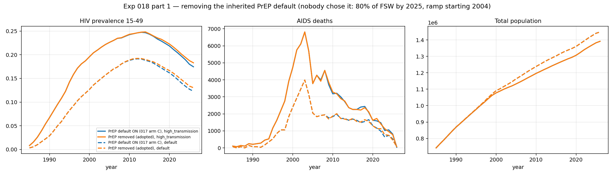
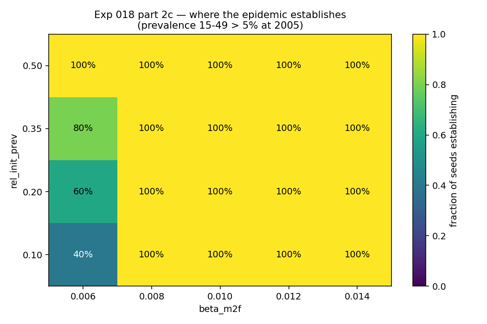

# Exp 018 — Adopt the 1.5.11 stack; establishment mapped, sizing deferred

**Date:** 2026-08-27.

**Question.** Two, in order. (1) What does adopting the five pending stack
changes actually do — four cleared by
[017](../017_version_bump/SUMMARY.md) and one decision, the removal of the
inherited `sti.Prep()` default, whose effect nobody had measured? (2) How
should the model be configured for calibration — population size, replicate
count, and which parts of the prior produce an epidemic at all?

**Result.** The five changes are adopted; this defines **`model-v1.1`**.
Removing the inherited PrEP default raises 2021 prevalence 15–49 by
**+4.1% (z = 1.68)** at default parameters and **+2.0% (z = 1.15)** at high
transmission — the predicted direction, monotone in time, but below 2σ at 10
seeds. The establishment map is clean and the boundary is sharp: **`beta_m2f`
≥ 0.008 establishes in 5/5 seeds at every `rel_init_prev` tested**, and the
entire failure region sits at `beta_m2f = 0.006`. **Part 2a (population-size
sweep) and 2b (replicate count) were not run and are deferred** — see
*Deferred* below. 2b is partly answered anyway, by an incidental finding that
corrects the premise it was built on.

## Observations

1. **PrEP removal is real but small, and not significant at 10 seeds.**
   2021 prevalence 0.1546 → 0.1609 (default, z = 1.68) and 0.2098 → 0.2140
   (high transmission, z = 1.15). The effect grows with time as the inherited
   ramp climbs — 2005 is exactly zero at both parameter sets (the ramp starts
   2004), 2015 is +1.3% / +0.4%, 2021 is the largest. Deaths move within noise
   and the two parameter sets disagree in sign (−2.5%, z = −0.37; +4.5%,
   z = 0.44), so no deaths claim is supported. Full table in
   `outputs/prep_removal.csv`.

2. **The adoption is nonetheless correct on grounds other than effect size.**
   The removed intervention was a fabricated one — an undeclared ramp to 80%
   of FSW starting in 2004, a decade before efficacy evidence, inherited by
   every experiment from 001 to 017. That it is worth only ~4% of 2021
   prevalence is the good case: it means adopting it does not invalidate
   earlier prevalence work, while leaving PrEP free to be specified from
   programme data in the decision analysis, where it belongs.

3. **The establishment boundary is sharp and lies below the prior we care
   about.** 100 short sims over 5 × 4 cells: every cell at
   `beta_m2f` ≥ 0.008 establishes 5/5, and the failure region is the single
   column `beta_m2f = 0.006`, where establishment rises with initial
   prevalence (40% / 60% / 80% / 100% at `rel_init_prev` = 0.10 / 0.20 / 0.35 /
   0.50). Median 2005 prevalence in that column is 0.047–0.073 — straddling
   the 0.05 criterion — so this is a genuine threshold, not a cliff.
   `outputs/establishment.csv`.

4. **Correction: the 47% CV that motivated part 2b belongs to the old stack,
   not this one.** 018's README and `config.yaml` both cite "CV ≈ 47% at
   default parameters vs ≈ 4% at high transmission" from 017 as the reason
   replicate count needed measuring. Recomputing 017's parquet by arm shows
   that 47% is **arm A (stisim 1.5.8) alone**, where 2/10 default seeds went
   extinct. On the adopted stack it is gone:

   | source | stack | default pset CV | high-transmission CV | seeds establishing (default) |
   |---|---|---|---|---|
   | 017 arm A | 1.5.8 | **45.9%** | 4.5% | **8/10** |
   | 017 arm B | 1.5.11 | 8.7% | 5.5% | 10/10 |
   | 017 arm C | 1.5.11 + HIV-deleted | 7.8% | 4.5% | 10/10 |
   | **018 adopted** | **model-v1.1** | **7.8%** | **4.4%** | **10/10** |

   CV here is between-seed SD of trajectory-mean prevalence 15–49. All 20
   seeds of 018's adopted arm establish (2005 prevalence 0.133–0.189 default,
   0.205–0.243 high transmission). The heteroskedasticity was a property of
   the stack we have now replaced.

5. **So 2b has a provisional answer without being run.** At N = 10 000 on the
   adopted stack, CV is 4–8% at both parameter sets — the 5–20% band, i.e.
   **10–20 replicates**, with high transmission sitting at the 3–5 boundary.
   This is provisional because it covers only two points and both are inside
   the establishing region; the low-transmission point near `beta_m2f` = 0.008
   is exactly where obs 3 says variance should climb, and it is unmeasured.

6. **Run time is confirmed at ~130 s per sim, N = 10 000, 1985–2026.** Adopted
   arm mean 130.3 s over 20 sims (141.8 s default, 118.8 s high transmission —
   the difference is worker contention, not epidemiology), against 017's
   ~145 s. The 100 establishment sims stopping at 2006 averaged 67.4 s.
   CPU time for this experiment: 43 min (part 1) + 112 min (2c).

7. **The AIDS-death deficit survives adoption, so 019 stands unchanged.** The
   adopted high-transmission arm peaks at **7 069 deaths (2003)** against
   UNAIDS **11 000 (2004)** — **64.3%**, a shortfall of ~3 900/year, identical
   to 017 arm C's 64%. Removing PrEP did not touch it. The default parameter
   set reaches only 4 174 (38%).

## Deferred

**Part 2a (N ∈ {5 000, 10 000, 20 000, 50 000} × 10 seeds) and part 2b (3
parameter points × 10 seeds) were not run.** Researcher's decision,
2026-08-27, to close on what exists rather than defer the whole experiment a
fourth time. `run.py --part size` and `--part repl` are written, use the same
harness the other two parts ran on, and are resumable — per-cell parquet in
`outputs/sims/` means nothing already run is repeated.

What this costs: the sizing conclusion carried into calibration is still the
*pre-computed* one from 017 arm C's `PopByAgeSex` output — 0 of 54 PHIA target
strata below 5 expected infected agents at N = 10 000, 2 below 10 — computed
at high-transmission prevalence (~0.22) and therefore optimistic anywhere the
prior explores lower prevalence. Obs 4–5 reduce the replicate-count exposure
but not the population-size exposure. **This must be settled before coverage
check v3 reports a coverage fraction**, since a stratum with 3 expected cases
fails coverage for reasons that have nothing to do with the parameters.

## Acceptance

**Usable downstream.** `model-v1.1` is the configuration for everything that
follows: HIV-deleted background mortality in `data/eswatini_deaths.csv`
(all-cause preserved as `data/eswatini_deaths_all_cause.csv`, rebuilt by
`mortality_construction.py` at the repo root), upstream `sti.VMMC`, no PrEP,
`pyproject.toml` pinned to `stisim>=1.5.11` / `starsim>=3.5.2`. A sixth change
beyond the README's five: `PopByAgeSex` is promoted into `analyzers.py` after
being written locally three times (016, 017, 018) — it supplies the stratified
alive-counts `hiv_epi` lacks, which is what converts population-scaled results
back into agent counts for the rare-event floor check.

Note the mortality file layout is the *inverse* of what the README planned —
the plan was to add `eswatini_deaths_hiv_deleted.csv` and leave
`eswatini_deaths.csv` untouched. `stidata.get_rates` resolves the deaths file
by convention as `{location}_deaths.csv`, so there is no way to point stisim
at an alternately-named file without swapping the whole datafolder. The
reasoning is recorded in `config.yaml` under `adoption.mortality`.

**Blocking for one thing only:** coverage check v3 should not open until the
population-size question is answered, per *Deferred*.

## Next

- **[019 — age-dependent untreated survival](../019_age_dependent_survival/README.md)**
  — pre-registered, and obs 7 leaves its premise intact: is the flat, sex- and
  age-neutral 13.1 y untreated survival the missing ~3 900 AIDS deaths/year?
  Two amendments from this experiment: set seeds from obs 5 (10 is defensible;
  CV is 4.4% at the high-transmission point 019 uses), and drop the README's
  claim that the default-parameter arm cannot carry quantitative claims at
  CV ≈ 47% — obs 4 shows that was the 1.5.8 stack.
- **020 — the deferred sizing sweep.** `run.py --part size` and
  `--part repl` in this folder, or lifted into its own experiment. Must
  precede coverage check v3.
- **Coverage check v3**, after sizing — the first coverage check against
  `model-v1.1`, with the usable prior region from obs 3 (`beta_m2f` ≥ 0.008)
  rather than the unconstrained bounds that produced 014's dead draws.
- **Two upstream reports still unfiled:** `on_prep` dead in stisim 1.5.8/1.5.10
  (017 obs 4), and `rel_death_f`'s missing provenance.

## Artifacts

| file | contents |
|---|---|
| `outputs/prep_removal.csv` | part 1 A/B: prevalence and deaths at 2005/2015/2021, both arms, both parameter sets, with relative change and z |
| `outputs/adopt.parquet` | full trajectories, adopted arm, 20 sims (the control arm is read from `../017_version_bump/outputs/results.parquet`) |
| `outputs/establishment.csv` | 2c grid: fraction of 5 seeds establishing and median 2005 prevalence per cell |
| `outputs/establish.parquet` | full trajectories, 100 establishment sims, stop 2006 |
| `outputs/sims/` | per-cell parquet, the resume cache |
| `figures/prep_removal.png` | part 1 — prevalence 15–49, AIDS deaths, population; PrEP on vs off at both parameter sets |
| `figures/establishment.png` | part 2c — establishment heatmap over `beta_m2f` × `rel_init_prev` |
