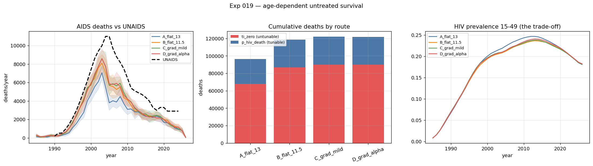
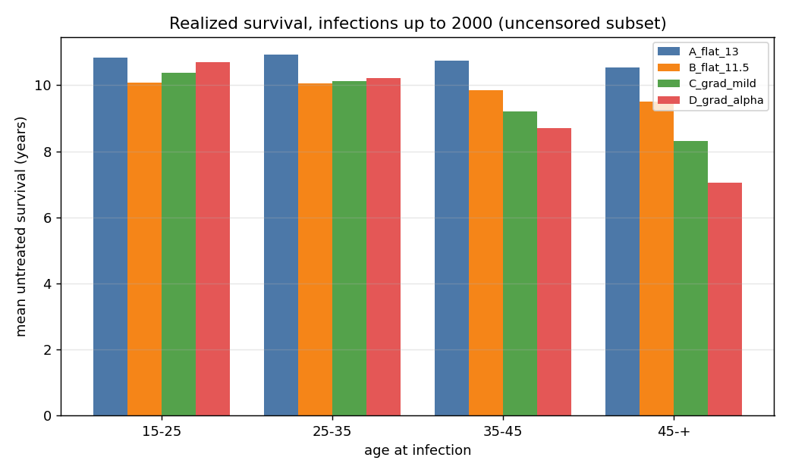
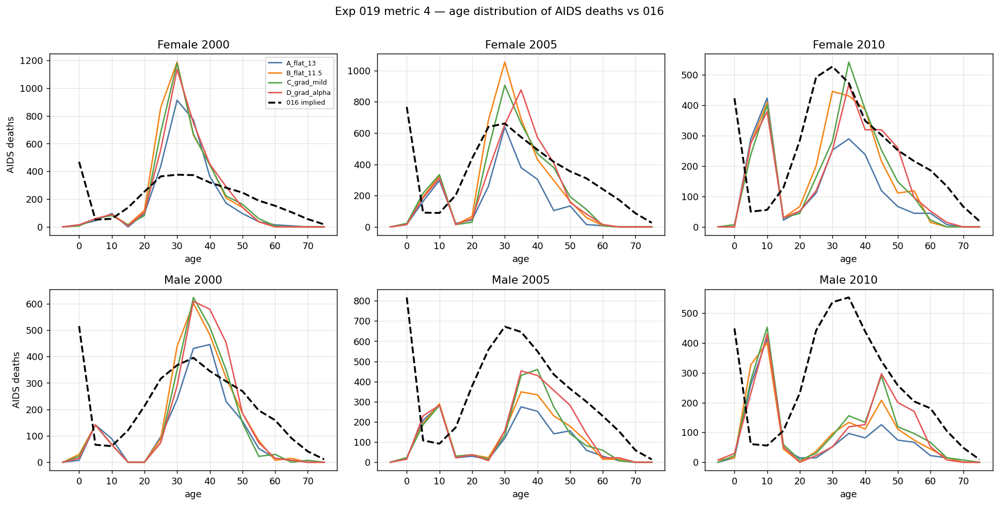
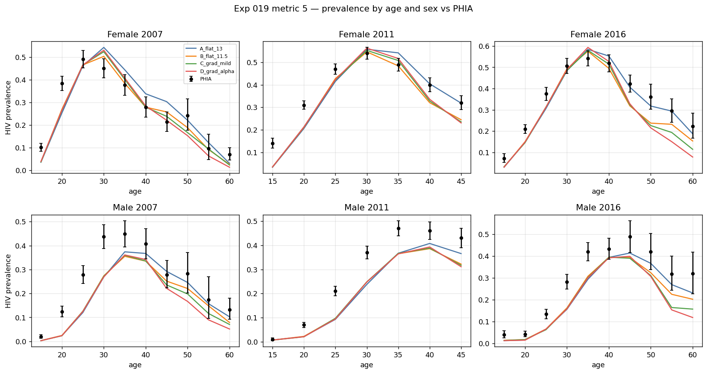

# Exp 019 — Age-dependent untreated survival closes 39% of the AIDS-death deficit, and costs prevalence to do it

**Date:** 2026-09-01. **Model:** model-v1.1 (exp 018), stisim 1.5.11,
starsim 3.5.2. **Compute:** 40 sims, N = 10 000, 1985–2026, local laptop.

**Question.** [016](../016_double_counted_mortality/SUMMARY.md) found the HIV
module supplies ~65% of peak UNAIDS AIDS deaths;
[017](../017_version_bump/SUMMARY.md) eliminated on-ART immortality and
`rel_death_f` as explanations, and [018](../018_adopt_and_size/SUMMARY.md)
showed adoption of the 1.5.11 stack did not touch it. 017 observation 7 located
the remaining candidates in untreated survival: `lognorm_ex(10 y, 3 y)` latency
plus `lognorm_ex(3 y, 1 y)` late stage, mean 13.1 y, applied identically to a
17-year-old and a 55-year-old. This experiment separates **level** (is 13.1 y
simply too long?) from **gradient** (is the *absence* of age dependence the
problem, independent of the mean?).

**Result.** Both help; level helps more; neither is enough. Peak AIDS deaths go
**64.3% → 73.8% → 78.2%** of the UNAIDS peak across arms A → B → C, so
shortening survival closes **39% of the deficit** and ~2 400 deaths/year
survive the most aggressive arm. The full ALPHA gradient adds nothing over the
half-strength one (78.1% vs 78.2%). And the cost is real: PHIA prevalence mean
absolute error worsens monotonically **0.0590 → 0.0782** as deaths improve, on
a fit already biased low. **The model cannot match deaths and prevalence
simultaneously under the current natural history** — the fourth success
criterion in the README, "the trade-off bites."

## Observations

1. **Metric 1 — the premise is confirmed, and now measured rather than
   estimated.** 017 integrated the hazard table to guess ~80/20; the measured
   split is **70.5% (arm A) to 73.9% (arm D)** of HIV deaths flowing through
   `ti_zero`, the route with no multiplier of any kind. Progression + hazard
   reconciles exactly to `hiv.new_deaths`. So roughly three-quarters of deaths
   are decided by a date drawn at infection, and **every mortality knob in
   stisim — `rel_death`, `rel_death_f`, the on-ART multipliers, 014's
   `mort_mult` — acts on the remaining quarter.** That is why 014's `mort_mult`
   measured ρ = −0.01 over a 6× range and why 017's two candidates were both
   inert.

2. **Metric 2 — level does most of the work, gradient adds a little, and the
   full ALPHA gradient adds nothing over half of it.**

   | arm | mean survival | peak deaths | % of UNAIDS peak | deficit |
   |---|---|---|---|---|
   | **A** `flat_13` (upstream) | 13.1 y nominal | 7 069 | **64.3%** | 3 931 |
   | **B** `flat_11.5` | 11.5 y nominal | 8 121 | **73.8%** | 2 879 |
   | **C** `grad_mild` | ~11.5 y | 8 602 | **78.2%** | 2 399 |
   | **D** `grad_alpha` | ~11.5 y | 8 594 | **78.1%** | 2 406 |

   A→B is +9.5 points at zero gradient (the level effect); B→D is +4.3 points
   at constant level (the gradient effect). C ≈ D says the gradient saturates
   well before ALPHA's full steepness — the mild 0.89/0.84/0.73/0.61 captures
   the whole available gain. Arm A reproduces 018 observation 7's 64% exactly,
   which is the cross-check that the harness is measuring the same thing.

3. **Metric 3 — the subclass does what it claims, and the design held.**
   Realized untreated survival, on infections up to 2000 so the window is not
   right-censored:

   | age at infection | A | B | C | D |
   |---|---|---|---|---|
   | 15–24 | 10.83 | 10.08 | 10.38 | 10.70 |
   | 25–34 | 10.92 | 10.05 | 10.13 | 10.21 |
   | 35–44 | 10.74 | 9.85 | 9.20 | 8.70 |
   | 45+ | 10.54 | 9.51 | 8.32 | **7.06** |
   | **all** | **10.84** | **10.02** | **9.97** | **9.88** |

   Arm A is flat within 0.4 y across 30 years of age at infection — the defect
   the experiment set out to test. B, C and D land at 9.9–10.0 y overall, so
   they are matched on level and differ only in shape exactly as designed,
   which is what licenses B→D as a clean gradient contrast. D's 45+ band at
   7.06 y sits right on ALPHA's ~7.5 y.

   

4. **But the level premise was overstated, and this is the observation most
   likely to matter later.** Arm A's *realized* mean untreated survival is
   **10.84 y, not the nominal 13.1 y** — because the `p_hiv_death` hazard kills
   a quarter of agents before their drawn `ti_zero` arrives. The README argued
   from cohort medians of 11–12 y that 13.1 y was too long. Measured against
   realized survival, upstream was already inside that range, and arms B–D push
   it to 9.9–10.0 y, at or below the low end of the empirical range. So the
   arms that fit deaths better have survival that is arguably *too short*.
   Nominal distribution parameters are not the quantity to compare to cohort
   data; realized survival is.

5. **Metric 4 — an independent target agrees with UNAIDS, and the model is
   below both in every year.** 016's implied AIDS deaths, reconstructed from
   all-cause mortality with no HIV information as input, put 11 110 deaths at
   2005 against UNAIDS' 11 000 — two independent constructions within 1%,
   which materially strengthens the target. Model/016 ratios:

   | year | A | B | C | D |
   |---|---|---|---|---|
   | 1995 | 0.4 | 0.7 | 0.7 | 0.6 |
   | 2000 | 0.7 | 0.9 | 0.9 | 0.9 |
   | 2005 | 0.4 | 0.5 | 0.5 | 0.6 |
   | 2010 | 0.4 | 0.5 | 0.6 | 0.6 |
   | 2015 | 0.5 | 0.6 | 0.6 | 0.5 |
   | 2020 | 0.7 | 0.8 | 0.8 | 0.8 |

   No arm exceeds 1.0 anywhere. The worst years are **2005 and 2010** — the
   peak and immediate post-peak — so the shortfall is concentrated in time
   rather than uniform, and shortening survival lifts the whole curve without
   changing its shape.

   

6. **Metric 5 — the trade-off bites, and it bites monotonically.**

   | arm | PHIA mean abs error | mean bias | strata < 5 expected agents |
   |---|---|---|---|
   | A | **0.0590** | −0.0405 | 2 |
   | B | 0.0657 | −0.0603 | 2 |
   | C | 0.0725 | −0.0654 | 2 |
   | D | 0.0782 | −0.0695 | 3 |

   Prevalence was already biased low by 4 points; every arm that improves
   deaths makes it worse, reaching −7 points at D. Shortening survival removes
   PLHIV, which is the opposite of the direction 014's coverage gap needs. This
   is the cost the README anticipated and it is not small relative to the gain.

   

7. **The rare-event floor is real and it is the young male strata.** 2 of 54
   PHIA target rows carry fewer than 5 expected infected agents at N = 10 000
   (2007 M 15–19 at **2.4**, 2007 F 60–64 at 4.6) and 3 carry fewer than 10.
   This is measured with the corrected sex mapping — see the correction note
   added to 018's SUMMARY, whose own floor check had `Gender` inverted. Part of
   the thinness is model bias, not just low prevalence: the model puts 0.003 on
   2007 M 15–19 against PHIA's 0.019.

## Two bugs found in this experiment's own analysis code

Recorded because both produced confident wrong readings before being caught,
and the second is a trap any per-seed aggregation can fall into.

1. **Year binning by `round` instead of `floor`** straddled calendar-year
   boundaries, inflating late-epidemic counts ~35%.
2. **Missing zeros in the per-seed mean.** Cells with a death in only 3 of 10
   seeds were averaged over those 3, not over 10. Combined with (1) this
   manufactured an apparent *excess* of model deaths in 2020 (ratio 1.4) where
   the truth is a deficit (0.7) — a sign error in the headline of metric 4.

Both are fixed; the death-log totals now reconcile with the `hiv.new_deaths`
trajectory to a constant 1.05× across all years (endpoint handling in
`to_df(resample="year")`, harmless for shape comparisons).

## Acceptance

**Do not adopt any arm yet.** The finding that matters is not which arm wins —
it is that **deaths and prevalence are in structural tension**, and that tension
is now quantified: +14 points of UNAIDS peak costs −3 points of prevalence
bias, and 22% of the death deficit survives regardless. Adopting arm C would
buy a better death fit at a worse prevalence fit, and the calibration is
entitled to make that trade with a likelihood rather than have it pre-made here.

What this does settle:

- `mort_mult` can be **fixed at 1.0** for the first wave. Metric 1 measures the
  route it acts on at ~27% of deaths, corroborating 014's ρ = −0.01. If the
  `ti_zero` route is later restructured, this reopens.
- A latency multiplier is a **legitimate calibration parameter with real
  leverage** (+9.5 points from level alone), and 014 already measured
  `dur_latent_mult` at ρ = −0.32 on peak deaths — the strongest signal after
  `beta_m2f` and `rel_init_prev`. It belongs in the wave-1 parameter set.
- An **age gradient is not worth a calibration parameter**: C ≈ D means the
  shape saturates early, and the gain over flat-level is +4.3 points against
  a −0.7-point prevalence cost. Worth an upstream feature request with
  evidence attached; not worth a dimension in the prior.

**Blocking:** nothing new. The population-size question from 018 still blocks
coverage check v3, and observation 7 sharpens why.

## Next

- **The deficit is a shape problem, not only a level problem.** Metric 4 puts
  the worst ratios at 2005–2010 while 1995 and 2020 sit at 0.6–0.8, and
  shortening survival lifts the curve without bending it. The remaining
  candidates are therefore things that act on *timing*: the ART cascade's
  ramp (deaths averted too early), the acute/falling transmission multipliers,
  or the 2003-vs-2004 peak offset. **020 or later.**
- **`p_effective_art = 1.0`.** Discovered while assessing parameters, not by
  this experiment, but it belongs here: stisim assumes every ART initiator
  achieves viral suppression, so population suppression is exactly coverage.
  The decision question in [CLAUDE.md](../../CLAUDE.md) turns on *raising
  suppression*, which currently has no mechanism distinct from raising
  coverage. PHIA measures VLS; it should be set from data as an **input**, not
  calibrated and not fitted.
- **020 — the sizing sweep deferred by 018**, now with observation 7 as
  motivation as well as 018's. Must precede coverage check v3.
- **021 — parameter engineering**, in progress. This experiment supplies:
  fix `mort_mult` at 1.0, open `dur_latent_mult`, do not open an age gradient.
- **Coverage check v3** will need a decision on whether deaths and prevalence
  are both hard targets. On this evidence they cannot both be satisfied, so a
  history-matching wave with both as hard constraints risks an empty NROY
  space. Down-weighting deaths, or moving them to validation, is a live option
  — to be decided in `likelihood-design`, on this evidence.

## Artifacts

| file | contents |
|---|---|
| `outputs/routes.csv` | metric 1: cumulative deaths by route, per arm |
| `outputs/deaths_vs_unaids.csv` | metric 2: peak, peak year, % of UNAIDS peak, deficit |
| `outputs/survival.csv` | metric 3: realized survival by arm and age-at-infection band |
| `outputs/deaths_by_age.csv` | metric 4: model deaths by age/sex/year vs 016's implied |
| `outputs/prevalence.csv` | metric 5: model vs PHIA by stratum, with expected agent counts |
| `outputs/results.parquet` | full trajectories, 40 sims |
| `outputs/deaths.parquet` | agent-level death records: route, age at infection, realized survival, sex |
| `figures/deaths_and_routes.png` | deaths vs UNAIDS, route split, prevalence cost |
| `figures/survival.png` | realized survival by age band and arm |
| `figures/deaths_by_age.png` | age distribution of deaths vs 016 |
| `figures/prevalence_vs_phia.png` | prevalence by age and sex vs PHIA, all arms |
