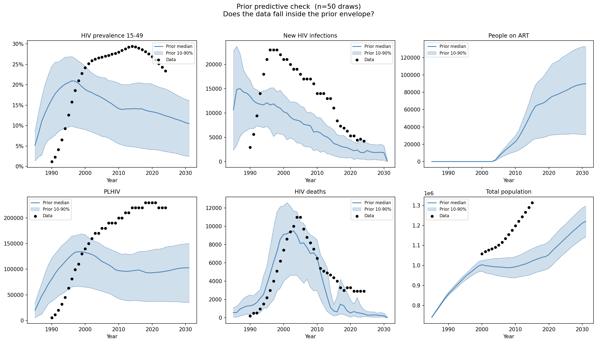

# Experiment 01 — Prior predictive / coverage check

## Question
Can any parameter combination within the prior reproduce the observed
epidemic trajectory? If not, why, and what needs to change before ABC
calibration will work?

## What we ran
50 Latin-hypercube draws from the prior below, each a full 1985–2031
simulation (10 000 agents, 10 CPUs, ~153 s total wall time).

| Parameter | Range |
|---|---|
| `beta_m2f` | 0.002 – 0.014 |
| `eff_condom` | 0.50 – 0.90 |
| `rel_init_prev` | 0.05 – 5.0 |
| `rel_dur_on_art` | 1.0 – 20.0 |
| `prop_f0` | 0.55 – 0.90 |
| `prop_m0` | 0.55 – 0.80 |
| `m1_conc` | 0.05 – 0.30 |

## Findings

### 1. `beta_m2f` is the dominant driver of epidemic size (r = 0.92)
`rel_init_prev` had almost no effect on peak PLHIV (r = 0.09). The
upper end of the beta range (0.014) was too low: the best draws
reached ~149K PLHIV in 2020, vs. the UNAIDS estimate of ~200K.
**Fix: widen `beta_m2f` to 0.002 – 0.020.**

### 2. `rel_init_prev` upper bound of 5.0 caused epidemic start too early
At `rel_init_prev = 5.0`, FSW initial HIV prevalence at 1985 is
75–100%, causing the epidemic to peak in the mid-1990s. Data shows
prevalence still increasing through ~2010–2015.
**Fix: narrow `rel_init_prev` to 0.05 – 0.50.**

### 3. Background death rates include the AIDS-era mortality spike
Male age-35 death rates peak at 0.027/year in 2005 (vs. 0.005 in
1985), meaning the all-cause file embeds HIV deaths. The HIV disease
module then kills those same people again — double-counting AIDS deaths,
shrinking population during the epidemic, and accelerating epidemic
burn-out. Visible in the figures as a population dip around 2000.
**Fix: replaced `eswatini_deaths.csv` with cause-deleted rates
(log-linear interpolation between 1985 and 2035 anchors for the
1995/2005/2015/2025 rows). Original preserved as
`eswatini_deaths_allcause.csv`.**

### 4. Late incidence is reachable
With `beta_m2f` near the upper end of the tested range, 2015–2020
mean new infections reached ~6 400/year (data ~5 000–8 000). The
epidemic does not collapse — it can sustain transmission.

## Figures

*Note: this figure was produced with the original (uncorrected) prior
and all-cause death rates. A rerun with the corrected prior and
cause-deleted deaths is done in experiment 02.*

## Changes made as a result of this experiment
| File | Change |
|---|---|
| `data/eswatini_deaths.csv` | Replaced with cause-deleted rates |
| `data/eswatini_deaths_allcause.csv` | Original all-cause rates (kept for reference) |
| `experiments/02_coverage_check_v2/` | Rerun with corrected prior and cause-deleted deaths |

## Updated prior for experiment 02
| Parameter | Old range | New range | Reason |
|---|---|---|---|
| `beta_m2f` | 0.002 – 0.014 | 0.002 – 0.020 | Best draws still 25% below data PLHIV |
| `rel_init_prev` | 0.05 – 5.0 | 0.05 – 0.50 | High end caused epidemic 15 years too early |
| Everything else | unchanged | unchanged | — |
