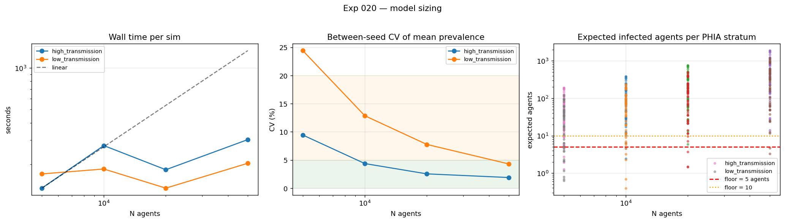

# Exp 020 — The rare-event floor is a fit problem, not a sizing problem

**Date:** 2026-09-01. **Model:** model-v1.1. **Compute:** 110 sims, N = 5 000
to 50 000, 1985–2026, local laptop (12 cores, ~6 GB free).

**Question.** How large must the model be, and how many replicates per parameter
set, for a coverage check to mean anything? The sweep
[016](../016_double_counted_mortality/SUMMARY.md) queued,
[017](../017_version_bump/SUMMARY.md) moved and
[018](../018_adopt_and_size/SUMMARY.md) deferred — three times, each because the
model underneath changed. model-v1.1 is fixed, so it ran here.

**Result.** **N = 20 000 is the minimum and N = 50 000 is preferred, but neither
clears the floor at low transmission — and the reason is a model fit error, not
a population-size error.** Going from N = 10 000 to 50 000 raises the thinnest
low-transmission stratum from 0.40 to 3.33 expected infected agents and still
leaves 2 of 54 target rows below 5. The stratum that will not clear is 2007
M 15–19, where the model puts prevalence 0.003 against PHIA's 0.019 — a −65%
relative miss. **No amount of N fixes that.**

## Observations

1. **The floor, measured at both ends of the prior rather than only the
   favourable end.**

   | N | high transmission | low transmission |
   |---|---|---|
   | 5 000 | min 1.27 — 4 below 5, 8 below 10 | min 0.63 — 10 below 5, 16 below 10 |
   | 10 000 | min 2.42 — 2 below 5, 3 below 10 | min 0.40 — 5 below 5, 9 below 10 |
   | 20 000 | min 5.87 — **0 below 5**, 1 below 10 | min 1.46 — 3 below 5, 5 below 10 |
   | 50 000 | min 14.09 — **0 below 5, 0 below 10** | min 3.33 — **2 below 5**, 2 below 10 |

   018's pre-computed estimate said N = 10 000 was nearly adequate. That was
   wrong twice: its sex mapping was inverted (corrected in 018's SUMMARY), and
   it was computed at high transmission only. Every stratum count scales with
   prevalence, and a prior that explores `beta_m2f` = 0.008 spends much of its
   time in the regime where the floor binds. **Adding the low-transmission arm
   is what turned this from a confirmation into a finding.**

2. **The floor and the fit problem are the same problem.** The stratum that
   survives every increase in N is 2007 M 15–19. The retrospective fit figures
   (`plot_fit_progression.py`) decompose the model's −4-point prevalence bias
   by sex and age band:

   | band | women | men |
   |---|---|---|
   | 15–24 | −8.4 pp (−49%) | −3.7 pp (**−65%**) |
   | 25–34 | −1.0 pp (−3%) | −12.7 pp (−47%) |
   | 35–44 | +4.5 pp (+11%) | −7.2 pp (−16%) |
   | 45–64 | −0.5 pp | −4.4 pp |

   The model under-infects young men by two thirds, so that stratum is thin
   because of a structural age-shape error, not because the population is small.
   Raising N buys statistical resolution on a quantity the model is getting
   wrong. **This reframes the sizing question: past N = 20 000, more agents
   mostly buys precision on a bias.**

3. **Replicates: N = 50 000 moves both parameter points into the 3–5 band.**

   | N | CV high-trans | CV low-trans | band |
   |---|---|---|---|
   | 5 000 | 9.4% | **24.4%** (1 of 10 seeds extinct) | 50+ or increase N |
   | 10 000 | 4.4% | 12.9% | 10–20 |
   | 20 000 | 2.5% | 7.8% | 10–20 |
   | 50 000 | 1.9% | **4.3%** | 3–5 |

   CV is between-seed SD of trajectory-mean prevalence 15–49. Note this is *not*
   automatically a compute win: for a fixed target precision on a mean, cost
   ∝ N × R is roughly invariant to the split, because σ falls about as fast as
   N rises (measured here as σ ∝ N^−0.66 at the low-transmission point, against
   N^−0.5 for pure Poisson). **The case for larger N rests on observation 1, not
   on variance** — averaging over replicates reduces noise on a mean but leaves
   per-stratum counts Poisson-thin.

4. **Memory is sub-linear and the laptop is not the constraint I feared.** Peak
   RSS 470 / 632 / 871 / 1 291 MB at N = 5k / 10k / 20k / 50k — ten times the
   agents for 2.7× the memory, consistent with ~400 MB of fixed interpreter and
   library overhead plus ~20 MB per 1 000 agents. Four concurrent N = 50 000
   sims fit in the ~6 GB available, against the 1.5–2 GB per sim projected
   before measuring. The worker cap of 3 used here was conservative.

5. **Run-time scaling was not measured, and that is a design failure in this
   experiment.** Part A ran N groups under a worker cap that fell as N rose
   (10 / 8 / 4 / 3) to protect memory. That confounds wall time with contention:
   the observed 134 / 273 / 182 / 302 s across the sweep is noise, not a scaling
   curve, and it cannot be used to size a history-matching wave. Answering it
   needs a serial or fixed-worker re-run at two or three values of N — cheap,
   and it should happen before any wave is scheduled on a VM. The memory, CV and
   floor results are unaffected, since peak RSS is per-process and CV is
   computed within an N group.

6. **Establishment held everywhere except the smallest population.** 10 of 10
   seeds established at every (N, parameter point) except low transmission at
   N = 5 000, where 9 of 10 did. Consistent with 018's establishment map, which
   put the boundary at `beta_m2f` ≥ 0.008 at N = 10 000 — the low-transmission
   point here sits exactly on that boundary, so a smaller population pushing one
   seed under it is expected rather than surprising.

## Acceptance

**Coverage check v3 should run at N = 20 000 with 10 replicates**, and declare
the thin strata rather than pretend they are informative. Reasoning:

- N = 20 000 clears the floor entirely at high transmission and leaves 3 rows
  below 5 at low transmission. N = 50 000 improves that to 2 rows and drops
  replicates to 3–5, but the remaining rows do not clear at any feasible N
  (observation 2), so the extra compute buys less than it appears to.
- **Excluding or down-weighting 2007 M 15–19 and 2007 F 60–64 is the honest
  move**, and it must be stated as a limitation rather than done quietly. A
  coverage fraction computed over strata the model cannot resolve is not a
  measure of the model.
- If the coverage check is later run on raccoon, N = 50 000 with 5 replicates
  costs about the same as N = 20 000 with 10–20 and is strictly better on the
  floor. On the laptop, N = 20 000 is the pragmatic choice.

**Blocking nothing further.** The sizing question deferred since 016 is closed,
with the caveat in observation 5.

## Next

- **The age-shape problem is now the main event.** Observation 2 makes the
  under-infection of young men and the over-infection of women 35–44 the
  binding constraint on the fit, not a level error that `beta_m2f` can absorb.
  Suspects: `rel_sus_age` (1.7 for women 15–24, no male age term at all),
  `rel_beta_f2m` = 0.25, and age mixing in `StructuredSexual` — the subject of
  experiment 011, worth revisiting with this decomposition in hand.
- **022 — parameter engineering**, which this sharpens: opening `beta_m2f` on
  0.008–0.025 log is necessary but not sufficient, and on its own would push
  women 35–44 further above PHIA.
- **A 20-minute serial re-run** at N ∈ {10 000, 50 000}, fixed at one worker, to
  recover the run-time scaling this experiment failed to measure.
- **Coverage check v3**, at N = 20 000 with 10 replicates and the thin strata
  declared.

## Artifacts

| file | contents |
|---|---|
| `outputs/floor.csv` | per (N, parameter point): thinnest stratum, count below 5 and 10 |
| `outputs/expected_counts.csv` | expected infected agents for all 54 PHIA strata, every N and point |
| `outputs/scaling.csv` | CV, wall time and peak RSS by N and point |
| `outputs/replicates.csv` | CV and recommended replicate count at three parameter points |
| `outputs/size.parquet`, `repl.parquet` | full trajectories, 110 sims |
| `figures/sizing.png` | wall time, CV and expected agents per stratum against N |
| `figures/prevalence_fit_vs_phia.png` | prevalence vs PHIA at N = 20 000 (retrofit, see `plot_fit_progression.py`) |
