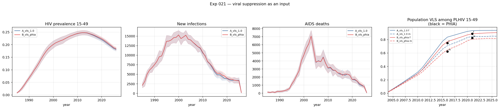

# Exp 021 — VLS as an input: the cascade was overstated by 9 points, and fixing it barely moves prevalence

**Date:** 2026-09-01. **Model:** model-v1.1 + `vls_coverage` input.
**Compute:** 20 sims, N = 10 000, 1985–2026, local laptop.

**Question.** `sti.ART(vls_coverage=...)` arrived in stisim 1.5.11 and has never
been set, so the model defaults to **1.0 — every ART initiator virally
suppressed**, transmitting at `effective_art_efficacy` = 0.99 rather than
`nonsupp_art_efficacy` = 0.35. PHIA measures suppression among the treated
three times over. What does the model do when that input is supplied?

**Result.** Two separate answers, and they point opposite ways.

**The cascade validation is a decisive win.** Running at 1.0, the model
overstated population viral suppression among PLHIV 15–49 by **+8.5 (men) and
+8.8 (women) percentage points** in 2016 — against between-seed SDs of 0.004–0.009,
so an error of 10–20 SDs, not noise. With the PHIA input supplied the error
falls to **+2.3 and +2.1**, and 2021 lands within 2 points (−1.9, −0.2).

**The epidemiological effect is null.** Prevalence 15–49 rises by 1.6% by 2021
(z = 1.03) and 1.7% by 2025 (z = 1.04) — right direction, monotone in time,
below 2σ at 10 seeds. Against PHIA the prevalence fit is **unchanged**: mean
absolute error 0.0590 → 0.0586, bias −0.0405 → −0.0398.

## Observations

1. **Metric 1 — the model was overstating its own cascade.** Population VLS
   among PLHIV, ages 15–49, against SHIMS2 and SHIMS3:

   | year | sex | arm A (default 1.0) | arm B (PHIA) | PHIA | A error | B error |
   |---|---|---|---|---|---|---|
   | 2016 | m | 0.708 | 0.646 | 0.623 | **+8.5 pp** | +2.3 pp |
   | 2016 | f | 0.836 | 0.769 | 0.748 | **+8.8 pp** | +2.1 pp |
   | 2021 | m | 0.847 | 0.805 | 0.824 | +2.3 pp | **−1.9 pp** |
   | 2021 | f | 0.932 | 0.884 | 0.886 | +4.6 pp | **−0.2 pp** |

   This is a genuine validation rather than a fit: ART coverage and
   suppression-given-ART are both *inputs*, so suppression among all PLHIV is an
   emergent output of diagnosis, initiation and retention. Arm B reproducing it
   to within 2 points means the cascade is internally consistent end to end.

2. **The input is doing what it claims, with a mechanism worth noting.** Arm B's
   realized suppression among the treated is 0.913 (m) / 0.921 (f) at 2016
   against inputs of 0.913 / 0.922 — essentially exact. At 2021 it is 0.956 /
   0.949 against inputs of 0.967 / 0.959, a ~1-point shortfall, because
   `p_effective_art` is assigned **at initiation** and the treated population is
   a *stock*: agents who started earlier carry the earlier, lower value. The
   realized figure therefore lags the input whenever suppression is improving.
   Worth remembering for any scenario that ramps suppression — the effect
   arrives with a delay set by ART retention.

3. **Metrics 2–4 — null on every epidemiological target.** Arm B vs arm A:

   | year | prevalence 15–49 | new infections | AIDS deaths |
   |---|---|---|---|
   | 2005 | −0.0% (z = −0.00) | +0.2% (z = 0.05) | +1.3% (z = 0.14) |
   | 2011 | +0.3% (z = 0.15) | −1.3% (z = −0.23) | +2.7% (z = 0.55) |
   | 2016 | +0.7% (z = 0.44) | +7.9% (z = 1.04) | −4.3% (z = −0.43) |
   | 2021 | +1.6% (z = 1.03) | +4.6% (z = 0.51) | +4.7% (z = 0.43) |
   | 2025 | +1.7% (z = 1.04) | −3.3% (z = −0.37) | −1.7% (z = −0.14) |

   Prevalence is the only quantity with a coherent signal — positive at every
   year from 2011, growing monotonically as ART coverage rises, which is exactly
   the expected mechanism. But it never clears 2σ. Infections and deaths change
   sign between years, so neither supports a claim.

4. **My own prior expectation was directionally right and quantitatively
   irrelevant.** Before running this I suggested it might move deaths and
   prevalence in the same direction and help close 014's coverage gap, which
   019's survival route could not. The direction holds — prevalence rises — but
   the magnitude is +1.6%, against a bias of −4 percentage points. That is
   roughly a twenty-fifth of the gap. The reasoning error was treating the 60-point
   rise in *population* suppression as the model's error, when the model already
   had the ART coverage ramp as an input and its actual error was the 4–9% of
   treated patients who are unsuppressed.

5. **Adopt anyway, on the same argument 018 made for PrEP.** The effect on the
   fitting targets is null, so adoption costs nothing there. What it buys is
   (a) an inherited default nobody chose is replaced by a measured input, and
   (b) the cascade now matches observation, which the decision question needs
   directly — see below.

## Why this matters for the decision question despite being null

The decision problem is long-acting PrEP scale-up **versus improving the
treatment cascade to raise population viral suppression**. Arm A's baseline
overstated population suppression by 8.8 points in 2016 and 4.6 in 2021. A
counterfactual that asks "what if we raised suppression?" measured against a
baseline that already overstates it **understates the headroom available to the
cascade arm** — it makes treatment scale-up look less valuable than it is,
systematically, and by more in the earlier years.

That is a bias in the comparison, not in the fit, which is why it does not show
up in metrics 2–4 and would not have been caught by a calibration.

## Acceptance

**Adopt into model-v1.2**, with `vls_coverage` defaulting to the PHIA series in
`make_interventions()` rather than `None`. The A/B is what licenses flipping the
default: the change is measured, its effect on the fitting targets is null
within noise, and its effect on the cascade is a 4× error reduction.

Carried assumptions, both recorded rather than buried:

- **Pre-2016 suppression is held flat at the 2016 value.** No measurement
  exists before SHIMS2. Early-ART-era suppression was plausibly worse, so this
  understates the correction rather than overstating it.
- **No age stratification**, because `derive_given_art_by_age` in
  `vls_construction.py` measured suppression-given-ART flat in age to within
  0.3–0.8 pp across 15–44 in 2016. The steep age gradient in *population*
  suppression is a coverage gradient, already represented.

## Next

- **The ART coverage input needs its own experiment.** Recorded in
  `vls_construction.py` and worth repeating: the 2021 rows of
  `external_data/SWAZILAND_calibration_nationalARTprevalence.csv` are
  **back-derived from SHIMS3 VLS divided by the national suppression rate** —
  `Count` is NaN for 2021 where 2011 and 2016 have counts, the values carry full
  float precision unlike the rounded earlier rounds, and 0.793535 × 0.959
  reproduces SHIMS3's women 15–24 VLS exactly. So `data/art_coverage.csv`'s 2021
  values are not an independent measurement, and they embed the suppression rate
  this experiment just supplied separately. That is a circularity in a model
  input and it should be resolved before the cascade is used for a decision.
- **The prevalence gap remains unexplained.** 019 ruled out untreated survival
  as a full explanation and showed deaths and prevalence trade off; 021 rules
  out the suppression default. The −4-point bias survives both. Candidates now
  sit in transmission structure — `beta_m2f`'s ceiling (014 obs 4 had the best
  draws pinned at it), risk-group structure, or age mixing.
- **022 — parameter engineering**, which this and 019 now inform: fix
  `mort_mult` at 1.0, open `dur_latent_mult`, `beta_m2f` on 0.008–0.025 log,
  no age gradient for either survival or suppression.
- **020's N = 50 000 arm** is running; it decides whether coverage check v3 runs
  at 20 000 with three known-thin strata flagged, or at 50 000.

## Artifacts

| file | contents |
|---|---|
| `outputs/cascade_vs_phia.csv` | metric 1: model VLS, ART coverage and VLS-given-ART vs PHIA, both arms |
| `outputs/ab.csv` | metrics 2–4: arm B vs arm A with relative change and z, five years |
| `outputs/prevalence.csv` | metric 2: prevalence by age and sex vs PHIA, both arms |
| `outputs/results.parquet` | full trajectories, 20 sims |
| `figures/vls_effect.png` | prevalence, infections, deaths, and population VLS vs PHIA |
| `figures/prevalence_vs_phia.png` | prevalence by age and sex vs PHIA, both arms |
