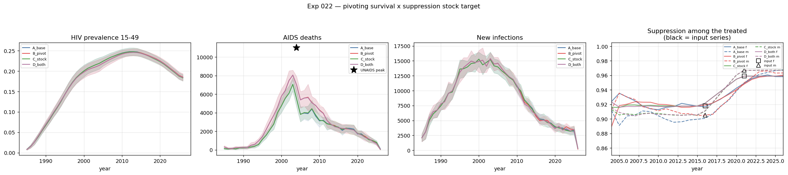
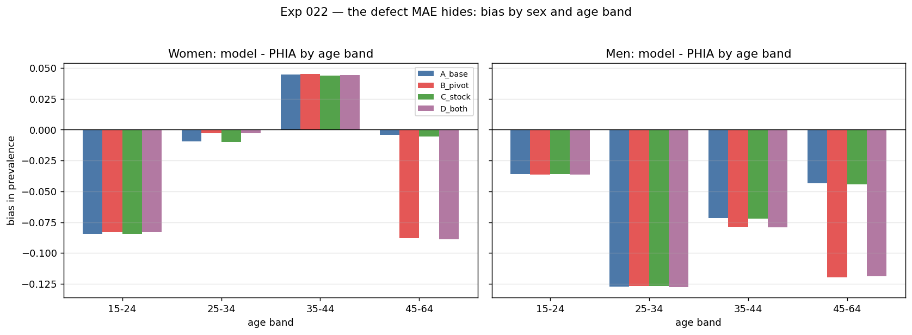

# Exp 022 — The pivot fails, the stock target works, and the young-age deficit survives everything

**Date:** 2026-09-02. **Model:** model-v1.2 + two ART input fixes.
**Compute:** 40 sims, N = 10 000, 1985–2026, local laptop.

**Question.** Two model changes, both prompted by checking this project's
inputs against the researcher's own prior published model of the same epidemic
(Akullian et al. 2020, Lancet HIV; appendix at `external_data/mmc1.pdf`).
(1) Does a *pivoting* age gradient on untreated survival — longer at young ages,
shorter at old, as EMOD parameterises it — fix the age-shape defect that six
previous experiments could not? (2) Can viral suppression improve for people
already on ART, so a regimen change like the TLD transition is representable?

**Result.** **The pivot fails, and fails informatively.** It leaves the
young-age deficit completely untouched and destroys the 45–64 fit: MAE rises
0.0584 → 0.0817 and strata inside the PHIA CI fall from 23 to 9. It buys +9
points of the UNAIDS death peak (64.3% → 73.3%) — the same trade-off 019 found,
reached by a different route. **The stock target works exactly as intended** and
is adopted: suppression among the treated tracks its input to four decimals at
2021 where flow-only lags by 1.8 points, at no cost to the fit
(0.0584 → 0.0586, within noise). The two factors do not interact.

## Observations

1. **The pivot does not touch the young-age deficit.** Bias by band, model −
   PHIA, averaged over the three PHIA years:

   | band | women A | women B | men A | men B |
   |---|---|---|---|---|
   | 15–24 | −0.085 | −0.083 | −0.036 | −0.037 |
   | 25–34 | −0.010 | −0.003 | −0.127 | −0.127 |
   | 35–44 | +0.045 | +0.045 | −0.072 | −0.079 |
   | 45–64 | **−0.004** | **−0.088** | **−0.043** | **−0.120** |

   

   Three bands are unchanged to within 0.007 and the fourth moves 8–9 points the
   wrong way. **The whole effect of the pivot is destructive.**

2. **Why: the pivot is wildly asymmetric in realized effect.** The multipliers
   look balanced around 1 (1.086 / 0.845 / 0.604 / 0.363) but their *nominal*
   consequences are not — +0.9 y of latency at the young end against −6.4 y at
   the old end. Realized survival confirms it:

   | age at infection | A (flat) | B (pivot) | change |
   |---|---|---|---|
   | 15–24 | 10.85 | 11.52 | **+0.67 y** |
   | 25–34 | 10.91 | 10.26 | −0.65 y |
   | 35–44 | 10.72 | 8.48 | −2.24 y |
   | 45–64 | 10.34 | 6.31 | **−4.03 y** |

   A 0.67-year lengthening cannot move a 49–65% prevalence deficit. A 4-year
   shortening at 45+ removes PLHIV wholesale. So the "pivot pushes both defects
   the right way at once" hypothesis is dead — not because the direction was
   wrong, but because the magnitudes are six to one against the useful end.

3. **This does not rehabilitate 019's conclusion, it sharpens it.** 019 said an
   age gradient is not worth a calibration parameter, from a family of
   shortening-only arms. 022 shows a pivoting gradient is not worth one either,
   for a different reason: the young-end lever is too weak to matter within
   stisim's natural history, because `dur_latent` is only 10 y of a 13.1 y total
   and the `p_hiv_death` hazard truncates survival before `ti_zero` anyway
   (019 obs 4). **Untreated survival is now exhausted as an explanation for the
   age-shape defect**, in both directions.

4. **Deaths improve, and the trade-off is confirmed a third time.** Peak AIDS
   deaths 7 069 → 8 058, or 64.3% → 73.3% of the UNAIDS peak. Almost identical to
   019 arm B's 73.8%, which reached it by shortening survival uniformly. So any
   route that shortens late-life survival buys roughly the same 9 points of
   deaths and pays for it in prevalence. That is now measured three ways and
   should be treated as a structural property, not a coincidence.

5. **The stock target does exactly what it was built to do.** Suppression among
   the treated, against its own input series:

   | | 2016 m | 2016 f | 2021 m | 2021 f |
   |---|---|---|---|---|
   | input | 0.905 | 0.918 | 0.967 | 0.959 |
   | A, flow only | 0.901 (−0.004) | 0.917 (−0.001) | 0.949 (**−0.018**) | 0.949 (**−0.010**) |
   | C, stock target | 0.911 (+0.006) | 0.922 (+0.004) | **0.967 (−0.000)** | **0.959 (+0.000)** |

   Flow-only lags by 1.8 points for men in 2021 — the years when suppression is
   improving fastest and the treated stock is largest, which is exactly when a
   regimen change would matter. The stock target eliminates the lag. Population
   VLS among PLHIV stays within 1–3 points of PHIA in both.

6. **No interaction.** D differs from B by 0.0001 in MAE and not at all in peak
   deaths. Shortening late-life survival removes treated patients, which could
   in principle have changed the stock the suppression target acts on; measured,
   it does not.

7. **The ART coverage correction is inert for the fit.** 2016 men 15–24 went
   0.360 → 0.556, a 20-point change, traced to SHIMS2 Table 8.3.A's 20–24 row
   being applied to the whole `[15,25)` band (see
   [`art_coverage_construction.py`](../../art_coverage_construction.py)).
   Against 021 arm B, the same configuration on the old value: MAE 0.0586 →
   0.0584, within-CI 22 → 23. It moves the fit by 0.0002. Worth doing for
   provenance — young HIV-positive men are few, so their onward transmission
   contribution is small even when their coverage is wrong by 20 points.

8. **The young-age deficit is now the only thing left, and nothing has moved
   it.** Women 15–24 at −0.085 and men 15–24 at −0.036 are identical across all
   four arms here, and unchanged from 018, 019 and 021. Seven experiments have
   now failed to shift it: mortality attribution (016), version bump (017), PrEP
   removal (018), untreated survival shortening (019), suppression default
   (021), population size (020), and both survival pivoting and suppression
   dynamics (022). **It is not in the natural history and not in the cascade.**

## Acceptance

**Adopt the stock target; reject the pivot.**

- **`VLSStockTarget` becomes part of model-v1.3.** The fit is unchanged, so
  adoption costs nothing there; what it buys is a mechanism the model needs on
  its own terms — the decision question is about *raising* suppression, and
  under flow-only semantics a suppression improvement can only reach new
  initiators. Same argument 018 made for PrEP and 021 for the VLS default.
- **`E_grad_emod` is not adopted.** It stays in `hiv_survival.ARMS` as a
  documented, measured option, because "we tried EMOD's own survival curve and
  it made the fit worse" is a result worth being able to reproduce.
- **Both ART input fixes are adopted**, on provenance grounds, with the effect
  measured at ~0 (obs 7).

**Do not open `dur_latent_mult` as a calibration parameter.** 019 recommended it
on the strength of a +9.5-point death gain. 022 shows that gain is generic to
any late-life shortening and always costs prevalence, so the parameter would
spend calibration effort trading two targets against each other rather than
fitting both. If deaths are down-weighted as planned, its leverage largely
disappears with them.

## Next

- **023 — parameter engineering**, now much better posed. The age-shape defect
  is not in survival or the cascade, so it is in transmission structure. The
  EMOD appendix gives the concrete lead: female susceptibility 4.894 (<25) and
  2.844 (≥25), a ratio of **1.72** — which is where this model's `rel_sus_age`
  of 1.7 came from — but at levels roughly **1.4× below** this model's implied
  6.8 and 4.0. Candidates in order: `rel_sus_age` (both level and the missing
  male age term), `rel_beta_f2m`, and age-disparate partnership formation in
  `StructuredSexual` (experiment 011's territory).
- **Deaths as a down-weighted target** stands, and 022 strengthens the case:
  the 9-point death gain is available from several mechanisms and all of them
  cost prevalence, so a hard deaths target would force the calibration into a
  trade the data cannot resolve.
- **Coverage check v3** at N = 20 000 with 10 replicates per
  [020](../020_model_sizing/SUMMARY.md), with 2007 M 15–19 and 2007 F 60–64
  declared unresolvable.
- **`outputs_pre_art_fix/`** holds the identical factorial run on the old ART
  value, archived rather than deleted. Not analysed; available if the ART
  correction ever needs auditing beyond obs 7.

## Artifacts

| file | contents |
|---|---|
| `outputs/fit_by_band.csv` | metric 1: prevalence bias by sex × age band, per arm |
| `outputs/scorecard.csv` | MAE, bias, within-CI at both resolutions, per arm |
| `outputs/deaths.csv` | metric 2: peak AIDS deaths vs UNAIDS, per arm |
| `outputs/survival.csv` | metric 3: realized untreated survival by age at infection |
| `outputs/cascade.csv` | metric 4: population VLS and suppression-given-ART vs input and PHIA |
| `outputs/results.parquet`, `deaths.parquet` | full trajectories and agent-level death records, 40 sims |
| `figures/overview.png` | prevalence, deaths, infections, suppression among the treated |
| `figures/bias_by_band.png` | the defect MAE hides: bias by sex and age band, all arms |
| `figures/prevalence_fit_A_base.png` | the standard fit figure, control arm |
| `figures/prevalence_fit_B_pivot.png` | the standard fit figure, survival pivot |
| `figures/prevalence_fit_C_stock.png` | the standard fit figure, stock target |
| `figures/prevalence_fit_D_both.png` | the standard fit figure, both changes |
