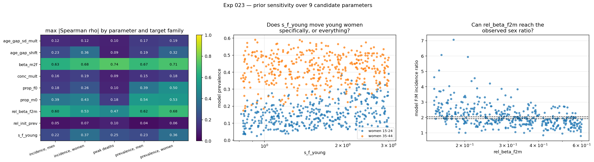

# Exp 023 — Seven parameters for wave 1, and 014's second-ranked parameter turns out to be an artefact

**Date:** 2026-09-02. **Model:** model-v1.3. **Compute:** 400 draws × 1
replicate, N = 10 000, 1985–2026, ~1.8 h on 8 workers.

**Question.** Which parameters should wave 1 open, on what priors, against which
targets — and does the prior actually move those targets?

**Result.** **The prior is clean and the design prunes to seven.** 397 of 400
draws establish an epidemic (99%), and every parameter that survives has a
distinct, on-target signal. Two do not survive: **`rel_init_prev` is nearly
inert (max |ρ| = 0.10)** — a reversal of 014, which ranked it second only to
`beta_m2f` at ρ = 0.59–0.62 — and `conc_mult` is the weakest of the mixing set
at 0.19, as 014 predicted. The **F:M incidence ratio is reachable** (the earlier
"not reachable" was a three-draw artefact), and it is reached at
`rel_beta_f2m` ≈ 0.20–0.30, meaning the current 0.25 is about right.

## Observations

1. **The prior establishes almost everywhere.** 397/400. All three failures sit
   at `beta_m2f` between 0.0082 and 0.0096 — the very bottom of the prior — and
   span the full `rel_init_prev` range, so the failure is driven by transmission
   alone. [018](../018_adopt_and_size/SUMMARY.md)'s establishment floor of 0.008
   is essentially right; a tighter floor near 0.0096 would clear the last three.
   014's problem of 22% dead draws dragging the envelope to the floor does not
   recur.

2. **Sensitivity, max |ρ| by target family** (397 established draws):

   | parameter | prev F | prev M | inc F | inc M | deaths | **max** |
   |---|---|---|---|---|---|---|
   | `beta_m2f` | 0.71 | 0.67 | 0.68 | 0.63 | 0.74 | **0.74** |
   | `rel_beta_f2m` | 0.68 | 0.62 | 0.53 | 0.60 | 0.47 | **0.68** |
   | `prop_m0` | 0.53 | 0.54 | 0.43 | 0.39 | 0.18 | **0.54** |
   | `prop_f0` | 0.50 | 0.39 | 0.26 | 0.18 | 0.10 | **0.50** |
   | `s_f_young` | 0.36 | 0.23 | 0.37 | 0.22 | 0.25 | **0.41** |
   | `age_gap_shift` | 0.32 | 0.19 | 0.36 | 0.23 | 0.09 | **0.36** |
   | `age_gap_sd_mult` | 0.19 | 0.17 | 0.12 | 0.12 | 0.10 | 0.27 |
   | `conc_mult` | 0.18 | 0.15 | 0.19 | 0.16 | 0.09 | 0.19 |
   | `rel_init_prev` | 0.06 | 0.04 | 0.07 | 0.05 | 0.10 | **0.10** |

3. **Every surviving parameter hits the target it was opened to control.** This
   is the check that matters, and it passes:

   | parameter | strongest target | ρ |
   |---|---|---|
   | `beta_m2f` | peak deaths | +0.74 |
   | `rel_beta_f2m` | prevalence F:M ratio | **−0.68** |
   | `prop_m0` | male 45–64 prevalence | −0.54 |
   | `prop_f0` | female 45–64 prevalence | −0.50 |
   | `s_f_young` | female young:old ratio | **+0.41** |
   | `age_gap_shift` | 2011 F:M incidence ratio | +0.36 |

   `rel_beta_f2m` controlling the sex ratio and `s_f_young` controlling the
   female young:old ratio is exactly the intended division of labour.

4. **`s_f_young` is specific, not a level parameter in disguise.** ρ = +0.36
   against women 15–24 and +0.04 against women 35–44. It moves the young band
   and leaves the older one alone, which is what licenses keeping it alongside
   `beta_m2f`.

5. **`rel_init_prev` is nearly inert, and 014's ranking of it was an artefact.**
   Max |ρ| = 0.10 across every target family — the weakest parameter in the set.
   014 obs 1 put it at ρ = 0.59–0.62, second only to `beta_m2f`. The explanation
   is clean: **014's prior went down to 0.05, below the establishment
   threshold**, so `rel_init_prev` was acting as an on/off switch for whether an
   epidemic happened at all, and that is what its correlation was measuring
   (014 obs 5 says as much — `rel_init_prev` was "the discriminator" between
   dead and live draws). With 018's floor at 0.1 every draw establishes and the
   seed level barely matters by 2007. **Fix it at 0.2.**

6. **`age_gap_shift` does reach the male age profile, differentially and
   weakly.** ρ = −0.13 against men 25–34 versus +0.07 against men 35–44 — the
   right *sign* pattern for the residual (which needs 25–34 lifted relative to
   35–44), but small. So the mixing hypothesis has a real lever and it is not a
   strong one. `age_gap_sd_mult` acts uniformly on men (+0.13 / −0.00) and is
   the weaker of the two mixing parameters throughout.

7. **The F:M incidence ratio is reachable, and points at the current value.**
   The ensemble spans 0.78–7.05 against an observed 1.90–2.04, and the crossing
   happens at `rel_beta_f2m` ≈ **0.20–0.30** (right-hand panel). That
   **contradicts the inference I drew from the EMOD comparison**, which reasoned
   from a 26% per-partnership-year deficit that 0.25 was too low. The data says
   0.25 is about right, possibly slightly high. The EMOD comparison neglected
   coital dilution and condom differences, both of which were flagged as caveats
   at the time and both of which cut this way.

## The orthogonality check I wrote was uninformative, and what replaced it

The README asked for pairwise |ρ| between parameters among well-fitting draws.
As implemented it correlated the **prior draws themselves**, which are an
independent uniform sample — so every pair came back at |ρ| ≤ 0.014, confirming
only that the sampler is independent. With 99% of draws establishing there was
no "well-fitting subset" to restrict to either.

The question that actually matters is whether two parameters **do the same thing
to the model**, which is answered by correlating their *effect signatures* across
all 23 targets:

| pair | signature r | |
|---|---|---|
| `beta_m2f` ↔ `s_f_young` | **+0.82** | **confounded** |
| `conc_mult` ↔ `rel_beta_f2m` | **+0.81** | **confounded** |
| `beta_m2f` ↔ `rel_beta_f2m` | +0.76 | borderline |
| `prop_f0` ↔ `prop_m0` | +0.74 | borderline |
| `age_gap_sd_mult` ↔ `prop_f0` | +0.69 | |

`conc_mult` being confounded with `rel_beta_f2m` is the decisive argument for
dropping it — it is both the weakest parameter and redundant with a much
stronger one. This also confirms the warning in `matchers.py`'s own docstring
that `age_diff_pars` is not orthogonal to concurrency.

`beta_m2f` ↔ `s_f_young` at 0.82 is a genuine concern, but obs 4 is the
mitigation: they have similar *global* signatures while differing on the one
statistic that separates them (the female young:old ratio, ρ +0.41 vs
`beta_m2f`'s weaker hold on it). Expect them correlated in the wave-1 posterior
and report the correlation rather than pretending it away.

## Acceptance

**Wave 1 opens seven parameters:**

| parameter | prior | scale |
|---|---|---|
| `beta_m2f` | 0.008–0.025 | log |
| `rel_beta_f2m` | 0.15–0.60 | log |
| `s_f_young` | 0.8–3.0 | log |
| `age_gap_shift` | −2 to +3 yr | linear |
| `age_gap_sd_mult` | 0.6–1.8 | log |
| `prop_f0` | 0.45–0.85 | linear |
| `prop_m0` | 0.40–0.80 | linear |

**Dropped, with reasons:**

- **`rel_init_prev` → fixed at 0.2.** Max |ρ| = 0.10. Obs 5: 014's high ranking
  was an artefact of sampling below the establishment threshold.
- **`conc_mult` → fixed at 1.0.** Max |ρ| = 0.19, the weakest, *and* confounded
  with `rel_beta_f2m` at r = 0.81.

Nine to seven, both cuts on measured evidence rather than judgement. That is the
sweep having done its job.

**Prior bound worth tightening:** raising the `beta_m2f` floor from 0.008 to
0.0096 would eliminate the last three dead draws at no cost to coverage, since
all three failures sit in that sliver. Worth doing in 024 rather than here.

## Next

- **024 — coverage check v3.** N = 20 000, 10 replicates, the seven parameters
  above, the target set settled here. The question 009 and 014 both failed:
  does the data fall inside the ensemble?
- **Re-identification (step 7) is still not done**, and it is now the largest
  gap in the sequence. Recovering known parameters from synthetic data before
  touching real data is the check most often skipped immediately before a
  calibration produces confident nonsense. Seven parameters at ~130 s per run
  makes it affordable, and `beta_m2f` ↔ `s_f_young` at r = 0.82 is exactly the
  kind of confounding a synthetic-data test would expose as unrecoverable.
- **Method selection deserves revisiting.** CLAUDE.md named history matching
  when 014 had nine parameters, no incidence data and hard death targets. Seven
  parameters with incidence added and deaths down-weighted is a different
  problem, and HM's main virtue here — graceful handling of unreachable targets
  — matters less now that deaths are soft.
- **The pre-registered failure mode stands.** `age_gap_shift` reaches the male
  age profile only weakly (obs 6), so if wave 1 leaves a 25–34-specific male
  trough, that is the signal that male age-dependent risk behaviour is a
  structural gap rather than a parameter value — as predicted, since a
  demand-driven convolution cannot produce a non-smooth profile.

## Artifacts

| file | contents |
|---|---|
| `outputs/draws.csv` | the 400-draw prior sample |
| `outputs/summary.csv` | per-draw target statistics, 23 targets |
| `outputs/sensitivity.csv` | Spearman ρ, every parameter × every target |
| `outputs/confounding.csv` | effect-signature correlation between parameters |
| `outputs/orthogonality.csv` | prior-draw correlations — retained to show why they are uninformative |
| `outputs/diagnostics.csv` | the README's specific questions, answered |
| `outputs/ensemble.parquet` | full trajectories, 400 draws |
| `figures/sensitivity.png` | the ρ heatmap, `s_f_young` specificity, and the F:M ratio crossing |
