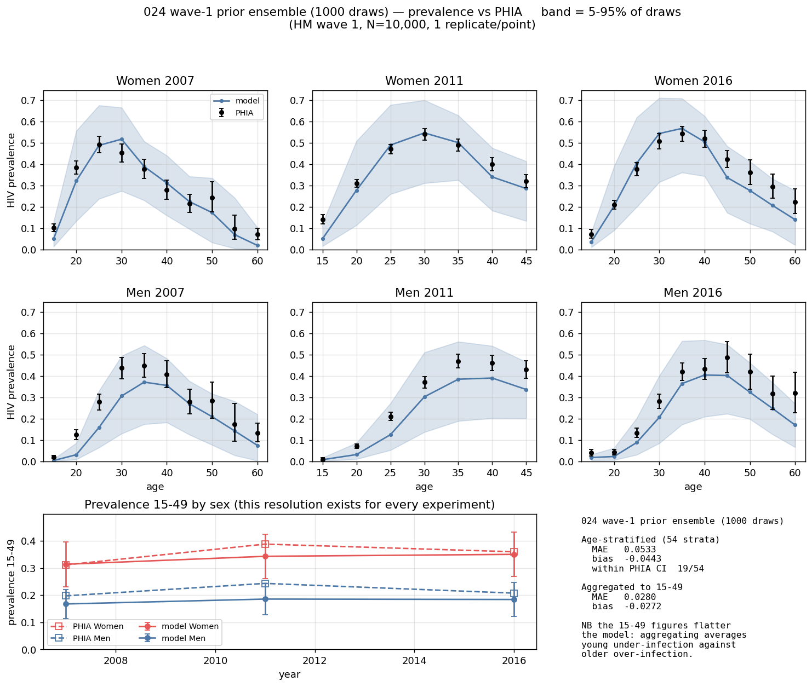
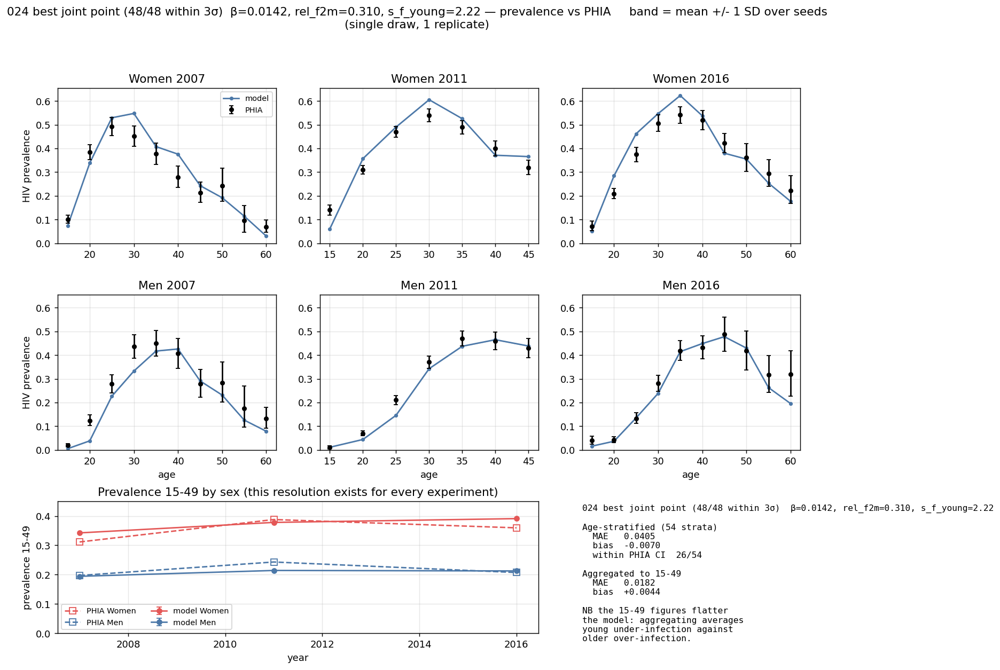
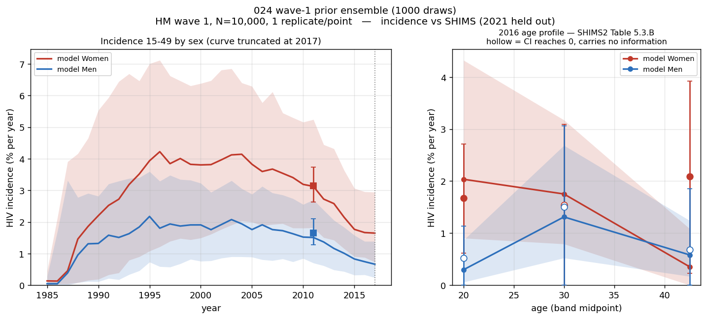
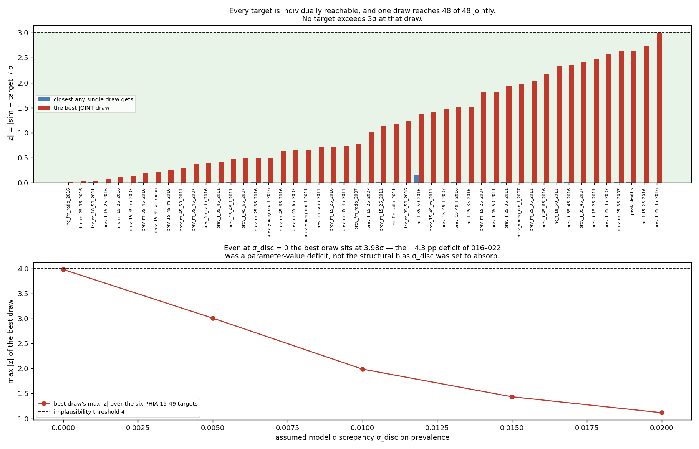

# Exp 024 — Wave 1: the model can fit the data, and the "irreducible" prevalence deficit was a parameter-value deficit

**Date:** 2026-09-03. **Model:** model-v1.3. **Compute:** raccoon, 120 workers,
1000 points × 1 replicate, N = 10 000, **456 s** (the README budgeted ~4.5 h on 8
workers).

**Question.** Does the data rule out any of the parameter space, and does the
emulator work well enough to trust the cut?

**Result.** **The emulator is good (R² = 0.923) and the answer to the more
important question is yes — the model can reach the data.** A single parameter
point fits **48 of 48 targets within 3σ**, and the prior's 5–95% envelope covers
**45 of 48**. That is the coverage check
([009](../009_coverage_check/SUMMARY.md), [014](../014_prior_expansion/SUMMARY.md))
passing for the first time. The NROY is 87.2% of the box, which sounds
uninformative and is not: one aggregate observation constrained **one** direction
in a 7-D space by 36%, and left four directions untouched — which is all one
observation can do.

**The headline finding is a reversal.** The −4.3 pp prevalence deficit that
experiments 016–022 could not move, and which this experiment budgeted
σ_disc = 0.02 to absorb, **was not structural misspecification. It was a
parameter-value deficit.** Even with σ_disc set to **zero** — PHIA sampling error
alone, no discrepancy allowance whatever — the best draw sits at 3.98σ on the six
PHIA 15–49 targets. Seven experiments held transmission at its defaults and
diagnosed a structural bias that opening `beta_m2f` largely removes.

## Observations

1. **The emulator fits well and the wave is valid.** R² = 0.923, MSE = 3.6e−4 on
   750 training points, optimiser converged. Comfortably past the 0.8 bar, and
   not so high (>0.99) as to suggest overfitting. The trend coefficients rank
   `log_beta_m2f` (0.154) > `log_rel_beta_f2m` (0.129) > `log_s_f_young` (0.078),
   reproducing 023's Spearman ordering from a completely different method.

2. **87.2% NROY is the right answer, not a failed one — and the README's success
   criteria were mis-specified.** The README called NROY near 100%
   "uninformative" and 10–80% "clean". That conflates NROY *volume* with
   *informativeness*. With 7 parameters and 1 emulated scalar, most of the box
   must survive: one observation constrains roughly one direction. The diagnostic
   that actually answers the question is `constrained_dims.png`:

   | direction | variance reduction | dominant loadings |
   |---|---|---|
   | PC1 | **35.7%** | `log_beta_m2f` 0.67, `log_rel_beta_f2m` 0.54, `log_s_f_young` 0.35 — all same sign |
   | PC2 | 9.3% | `log_age_gap_sd_mult` 0.64, `age_gap_shift` −0.59 |
   | PC3 | 5.5% | `prop_f0` 0.56, `prop_m0` 0.56, `log_s_f_young` 0.53 |
   | PC4–PC7 | **0.0%** | — |

   PC1 is the composite transmission-intensity direction, and it is the only one
   materially cut. The marginals are therefore essentially unchanged from the
   prior — **the constraint is diagonal in the box, so projecting onto any single
   axis loses it.** Reporting only the marginal intervals would have made this
   wave look like it did nothing.

3. **This also confirms 023's identifiability warning, from the other side.**
   023 found `beta_m2f` ↔ `s_f_young` confounded at effect-signature r = 0.82 and
   predicted they would be correlated in the posterior. PC1 loads both positively
   together: they enter the emulated feature as a **product**. Wave 1 constrains
   that product and leaves the ratio free — exactly the predicted failure, now
   measured rather than anticipated. It is also why re-identification (step 7)
   remains the outstanding gap.

4. **One draw fits everything.** Design row 868 lands within 3σ on all 48
   registered targets — all 8 tier A, all 16 tier B, all 24 tier C. Its worst
   residual is 3.00 (`prev_f_25_35_2016`); `peak_deaths` is −2.64. Age-stratified
   MAE is **0.0405** with bias **−0.0070**, against 022 arm A's 0.0584 and
   −0.043. Strata inside the PHIA CI: **26/54**, against 23.

   

   | parameter | value | prior range |
   |---|---|---|
   | `beta_m2f` | 0.0142 | 0.0096–0.025 |
   | `rel_beta_f2m` | 0.310 | 0.15–0.60 |
   | `s_f_young` | 2.22 | 0.8–3.0 |
   | `age_gap_shift` | +0.07 yr | −2 to +3 |
   | `age_gap_sd_mult` | 1.50 | 0.6–1.8 |
   | `prop_f0` | 0.609 | 0.45–0.85 |
   | `prop_m0` | 0.474 | 0.40–0.80 |

   **This is one draw of 1000, not a posterior.** It is worth recording because
   it demonstrates joint reachability, which covering each target separately does
   not: if every target were reachable but only by mutually exclusive points, the
   model still could not fit.

5. **Elevated young-female susceptibility survives the test designed to reject
   it.** The prior deliberately extended `s_f_young` below 1.0 so the data could
   reject the mechanism. Among the 50 best joint points the median is **1.73**
   (IQR 1.21–2.22) and the best is 2.22 — the data endorses it rather than
   tolerating it.

6. **`rel_beta_f2m` prefers a higher value than 023 concluded, and the two
   analyses are not measuring the same thing.** The 50 best joint points give a
   median of **0.40** (IQR 0.30–0.49) against the default 0.25 and 023's
   "0.20–0.30 is about right". 023 read that off the **F:M incidence ratio
   alone**; this is a joint fit across 48 targets. Both can be true — the ratio is
   matched at 0.25, and the rest of the target set pulls higher. Worth resolving
   in wave 2 rather than declaring either number correct.

7. **Incidence: 2011 is hit almost exactly; female 35–49 in 2016 is the one
   target no draw reaches.** The SHIMS1 cohort estimates (women 3.14, men 1.65
   per 100 py) land on the ensemble median. But `inc_f_35_50_2016` has a target of
   2.09 against an ensemble 95th percentile of **1.087** — the entire prior is
   below it, and the model's female incidence *declines* with age where SHIMS2
   says it stays high. That is SHIMS2's own chapter conclusion ("new infections
   continue at high rates among ... females aged 35–49") and the model cannot
   produce it.

   

8. **The residual structural defect is now two specific things, not a diffuse
   age-shape problem.** Of 48 targets the 5–95% envelope misses three:

   | target | target value | ensemble p95 | percentile |
   |---|---|---|---|
   | `inc_f_35_50_2016` | 2.09 | 1.087 | **100.0** |
   | `prev_m_15_25_2007` | 0.0589 | 0.0480 | 97.7 |
   | `prev_m_15_25_2011` | 0.0506 | 0.0504 | 95.0 |

   **Older women's incidence and young men's prevalence** — and both point the
   same way, at whom the model puts older women and young men in contact with.
   This supersedes the "women 15–24 / men 25–34 / women 35–44" characterisation
   carried from 016–022, which was measured at default transmission parameters
   and largely dissolves once `beta_m2f` is free.

## The one defect wave 1 reported was in my target construction, not the model

Wave 1 initially returned 46/48, missing `prev_m_45_65_2011` at 4.99σ and
`prev_f_45_65_2011` at 3.26σ. Both were artefacts.

`run.py` built tier C on a fixed `(45, 65)` top band. **SHIMS1 (2011) publishes
strata only to `[45:50)`**, while 2007 and 2016 reach `[60:65)`. So the 2011
target was built from PHIA 45–49 and compared against a model average over
45–65 — and male prevalence falls steeply after 50, so the model looked 5σ low on
a band it fits:

| | model 45–65 | model 45–50 | PHIA 45–49 | z (45–65) | z (45–50) |
|---|---|---|---|---|---|
| men | 0.2864 | 0.4385 | 0.4300 | **−4.99** | **+0.30** |
| women | 0.2372 | 0.3658 | 0.3200 | **−3.26** | **+1.81** |

Fixed in `tier_c_bands()`, which now derives the cap from the target file per
year so it cannot be reintroduced when a survey with different coverage is added.
**The emulated wave-1 feature uses ages 15–50 and is unaffected**, so the
emulator, the NROY and the 87.2% all stand exactly as run; `rederive.py`
recomputes only the affected tier-C features from the cached ensemble, with no
re-simulation. After the fix the best draw reaches 48/48.

## What this means for σ_disc, and the honest reading of it

σ_disc = 0.02 was set so that the best configuration then known sat at ~2σ. That
number was calibrated against a bias this experiment shows was not structural,
and it dominates the observation variance (0.02² against PHIA's 0.0043–0.0066²,
so ~90% of it). It is the main reason the NROY is 87% rather than tighter:

| σ_disc | best draw's max &#124;z&#124; | fraction of draws under threshold 4 |
|---|---|---|
| 0.020 | 1.12 | 44.1% |
| 0.010 | 1.99 | 8.4% |
| 0.005 | 3.01 | 0.9% |
| 0.000 | 3.98 | 0.1% |

**Wave 2 should cut σ_disc to about 0.01.** That keeps a real allowance for the
two genuine defects in observation 8 while removing the part that was standing in
for a parameter-value error, and it is worth 5× more cutting power. Lowering it
to zero is not defensible — obs 7 and 8 are real model discrepancy.

## Acceptance

**Usable. Wave 2 opens.** Emulator quality passes, the cut is interpretable, and
the coverage question that blocked 009 and 014 is answered affirmatively. The
7-parameter set from 023 is confirmed as adequate: no parameter sits against a
prior boundary at the best joint points, and the box does not need widening.

**Recorded against the pre-registered failure mode.** 023 predicted that if wave
1 left a 25–34-specific male trough, male age-dependent risk behaviour would be a
structural gap rather than a parameter value. It did not — `prev_m_25_35` fits at
−2.64σ or better. The male defect that survives is at **15–24**, not 25–34, and
the female defect is incidence at 35–49. The prediction was aimed at the wrong
band.

## Next

- **025 — wave 2.** σ_disc = 0.01, emulate the tier B features (F:M prevalence
  ratio, female young:old ratio), and add the two structural residuals from obs 8
  as their own features so later waves are forced to confront them. N = 20 000
  per [020](../020_model_sizing/SUMMARY.md) now that age-stratified targets are in
  play.
- **Re-identification (step 7) is now overdue and obs 3 sharpens why.** `beta_m2f`
  and `s_f_young` are confirmed to enter the wave-1 feature as a product. A
  synthetic-data recovery test would show directly whether the tier B and C
  features separate them, and at 456 s per 1000 points it is nearly free.
- **Resolve obs 6** — whether `rel_beta_f2m` should sit at 0.25 or 0.40 — since it
  is a per-act transmission parameter that a downstream PrEP-versus-treatment
  comparison is directly sensitive to.
- **Ask whether older women's incidence needs a mechanism.** Obs 7 is the one
  target nothing in the box reaches. The candidates are age mixing (older women
  partnering older, higher-prevalence men) and the female partnering taper to
  zero at 55 noted in 021. This is a model-structure question, not a calibration
  one.

## Artifacts

| file | contents |
|---|---|
| `outputs/design.csv` | the 1000-point Latin hypercube, log space |
| `outputs/design_scored.csv` | design plus targets-hit and tier-A implausibility per point |
| `outputs/sim_results.csv` | 48 features × 1000 points, re-derived post-fix |
| `outputs/observations.csv` | every target with its σ, tier and provenance |
| `outputs/ensemble.parquet` | full trajectories, 1000 points × 42 years |
| `outputs/best_point.json` | design row 868's parameters and residuals |
| `outputs/nroy_summary.txt` | NROY fraction and marginal intervals as reported by the package |
| `outputs/hm/wave1/` | package diagnostics, emulator metrics, NROY samples |
| `figures/prevalence_fit_vs_phia.png` | the standard prevalence-fit figure, ensemble |
| `figures/incidence_fit_vs_shims.png` | incidence by sex, curve truncated at 2017 |
| `figures/best_joint_point.png` | the 48/48 draw against PHIA |
| `figures/best_joint_point_incidence.png` | the same draw against SHIMS incidence |
| `figures/target_residuals.png` | per-target residuals and the σ_disc scan |

`outputs/sims/` (per-point parquet, 118 MB) is left on raccoon; `ensemble.parquet`
is the consolidated form and is sufficient to re-derive every feature.
