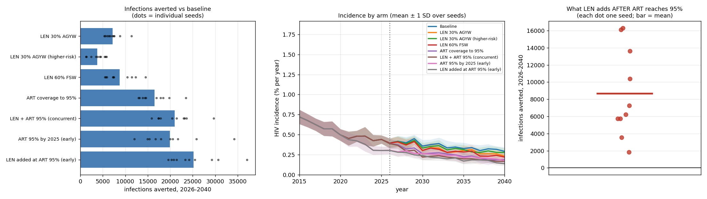

# Exp 026 — Prevention still matters at high suppression, but the cascade is the larger prize and FSW delivery is 18× more efficient than broad AGYW

**Date:** 2026-09-07. **Model:** model-v1.3 (starsim 3.5.2 / stisim 1.5.11).
**Compute:** local laptop, 8 arms × 10 seeds = 80 sims, **1850 s**.
**Parameters:** a single point — 024's design row 868, the draw that fit 48/48
targets. No parameter uncertainty (see Acceptance).

**Question.** The relative value of scaling up long-acting PrEP versus improving
the treatment cascade to raise population viral suppression — and where
prevention still matters when suppression is high.

**Result.** All three parts answered, and the ordering is unambiguous.

1. **The cascade is the larger prize.** ART coverage → 95% averts **16,525**
   infections (26.2% of baseline's 63,162 over 2026–2040), more than any single
   PrEP arm — the largest of which, 60% of FSW, averts 8,771 (13.9%).
2. **Prevention still matters at high suppression — modestly, and robustly.**
   `both` − `art_95` = **4,449 infections averted (sd 1,953), 9.5% of the
   infections remaining under the cascade arm, positive in 10 of 10 seeds.** On
   the early-cascade pair it is **5,261 (12.2% of remaining), also 10/10.** So
   the answer to the novel clause is yes, with a consistent sign, at roughly a
   tenth of residual burden.
3. **The efficiency spread across delivery targets dwarfs the impact spread.**
   Person-years of PrEP per infection averted: **FSW 3.6**, higher-risk AGYW
   50.4, broad AGYW 67.3. FSW delivery is **18× more efficient** than broad AGYW
   while averting *more* infections in total. This was not a pre-registered
   question and is the most decision-relevant number in the experiment.

## Observations

**obs 1 — The third-95 finding held up and reshaped the arms correctly.**
Eswatini's suppression-given-ART is 0.959 (women) / 0.967 (men), so cascade
headroom is entirely in coverage, concentrated in men 25–34 at 0.650. Building
the cascade arm as coverage rather than adherence was the right call: it
produced the largest single effect in the experiment.

**obs 2 — The aggregate ART column is a weak verification instrument, and this
is worth fixing before the next scenario experiment.** `art_95` reaches an
aggregate `p_on_art` of 0.953 at 2030 against baseline's 0.931 — a 2.2 pp move
that averts 26% of infections. The mechanism is coherent (coverage closes in
low-coverage, high-transmission strata, chiefly men 25–34, while women are 2/3
of PLHIV and already near-covered, so the aggregate barely registers it), but it
means the verification table cannot discriminate the arms it is meant to check.
**A per-stratum coverage column, specifically men 25–34, would.**

**obs 3 — Baseline aggregate ART coverage is not flat: 0.891 (2021) → 0.942
(2040).** The README describes the baseline cascade as "held flat". The
stratum-specific *inputs* are held flat; the aggregate rises anyway, consistent
with composition change in the PLHIV denominator rather than an input ramp. The
counterfactual is therefore "status-quo policy", not "status-quo coverage" —
which is the right counterfactual, but not the one the README's wording implies.

**obs 4 — The two AGYW arms do not bracket the self-selection assumption,
because they differ in scale as well as in risk.** `prep_agyw_risk` averts 3,785
against `prep_agyw`'s 7,203 — *less* impact — while using 190,638 person-years
against 484,639, i.e. 2.5× fewer. Both arms cover 30% of their eligible group,
and the higher-risk group is smaller, so the arms differ in *how many people are
treated* and *who they are* simultaneously. The README's intent was to bracket
the uptake-heterogeneity assumption; this pair cannot, because the two effects
are confounded. **Isolating it requires holding PrEP person-years constant and
varying only eligibility.**

**obs 5 — The early-cascade arms perturb the 2021 validation hold-out year, and
the README's non-contamination claim is now wrong.** `art_95_early` and
`prep_at_high_art` use `cascade_start=2020, cascade_reach=2025`
([run.py:109-110](run.py#L109-L110)), so their 2021 ART coverage is 0.898 against
baseline's 0.891. This is deliberate and documented in `run.py`, but the README
still states the scenario window opens in 2026 so "no scenario can contaminate
either" the targets or the hold-out. No calibration is contaminated — scenario
arms are never fitted — but **the 2021 incidence hold-out cannot be used to
validate those two arms**, and `prep_increment_at_95_early` (5,261) is measured
on a pair that deviates from history before 2026.

**obs 6 — Female share of cumulative infections is stable at 65.6–66.9% across
every arm**, including the PrEP-for-AGYW arms. No arm materially shifts who
acquires infection; they shift how many. For an experiment whose stratified
output was meant to answer "where prevention still matters", that flatness is
itself the answer at the sex level, and pushes the question onto age.

**obs 7 — Seed noise is large per-seed and adequate in the mean.** The headline
increment's per-seed range is 1,977–8,616 (sd 1,953, CV 44%), giving a standard
error of ~618 on the mean of 10. The sign is safe; a per-seed reading is not.

## What this does not support

**No credible interval, as pre-registered.** With one parameter set, arm
differences carry seed noise only. The ~618 standard error above is *not* the
uncertainty that matters for the abstract — parameter uncertainty is
unquantified, and 025's NROY sample is what would supply it. `run.py` takes a
list of parameter sets for exactly this substitution.

**No prevalence-fit figure.** The workflow rule is that every experiment emits
`prevalence_fit_vs_phia.png` via `standard_figures.plot_prevalence_fit`. 026 did
not, which for a scenario experiment is defensible but leaves the parameter point
undocumented in figure form. 016/017 lost their age-stratified fit permanently
this way.

**No `config.yaml`.** 023 and 024 have one; CLAUDE.md requires the model tag
recorded there alongside starsim/stisim versions. 026's provenance — model-v1.3,
design row 868, the seven parameter values — exists only as README prose. These
are the CROI abstract's numbers.

## Acceptance

Accepted as the abstract's basis, with obs 5 stated as a limitation and the FSW
efficiency result promoted to a headline. The two traps the README set out to
avoid both held: no phantom `sti.Prep` ramp (explicit `coverage` throughout), and
the exp 022 `vls_coverage` fix means the baseline does not overstate suppression
— without it the comparison would have systematically flattered PrEP.

## Next

**The third-95 finding does not change 025's feature set, and 025 should run as
written.** Three reasons: the finding concerns model *inputs* (ART coverage by
age/sex, VLS-given-ART — both data-driven), not the seven calibration
parameters; 025 already carries three simultaneous features against the
history-matching guidance of 1–2, so a fourth dilutes attribution further; and
the finding *strengthens* the feature already there — `inc_all_mean` — because
the decision quantity is an incidence difference at high suppression, not a
prevalence stock.

**It does change what 025's gate must be read for.** The decision quantity is
what PrEP buys AGYW 15–24 after the cascade closes, while the coverage gap being
closed is in men 25–34. What links them is who AGYW acquire from across the age
gap — `age_gap_shift` and `age_gap_sd_mult`. Those are the two parameters 025's
features inform *least*: no feature in the set is an age-mixing statistic, and
`prev_young_old_f_mean` is a female prevalence shape that `s_f_young` also
drives. So **read `age_gap_sd_mult` recovery in the full-size pre-flight
alongside the pre-registered `beta_m2f`/`s_f_young` product-vs-ratio question.**
The smoke run has `log_age_gap_sd_mult` as the one parameter whose truth fell
outside the NROY — at n=25 with 12 NROY samples that is noise, not a result, but
it is the parameter decision sensitivity says to watch.

**Wave 3 candidate, not settled here.** Whether an age-mixing statistic earns a
feature slot ahead of (or alongside) the F:M ratios is a decision-sensitivity
question — 023 did the calibration-sensitivity half, not this half. Route via
`parameter-engineering` before wave 3 is scoped.

**Follow-up experiments this opens, in priority order:**

1. **Person-year-matched AGYW targeting** (obs 4) — hold PrEP person-years fixed,
   vary eligibility only, to actually bracket the self-selection assumption the
   LenOptim >2× quartile implies. This is the arm the abstract's PrEP impact
   number is most sensitive to.
2. **Re-run the headline increment on 025's NROY sample** once it lands, to
   replace seed noise with parameter uncertainty.
3. **Per-stratum verification columns** (obs 2), and drop or re-scope the 2021
   hold-out comparison for the early arms (obs 5).

## Artifacts

| | |
|---|---|
| `outputs/scorecard.csv` | per-arm cumulative infections, averted, female share, PrEP person-years, py per averted |
| `outputs/contrasts.csv` | the 7 pre-registered contrasts with seed spread and sign consistency |
| `outputs/headline.csv` | `prep_increment_at_95` alone |
| `outputs/per_seed.csv` | 80 rows: arm × seed, infections by sex |
| `outputs/scenario_spec.csv` | what each arm actually changed, as run |
| `outputs/scenario_verification.csv` | ART coverage and PrEP users at 2021/2025/2030/2040 |
| `figures/scenarios.png` | infections averted by arm, per-seed spread |
| `figures/scenario_verification.png` | cascade and PrEP uptake trajectories by arm |
