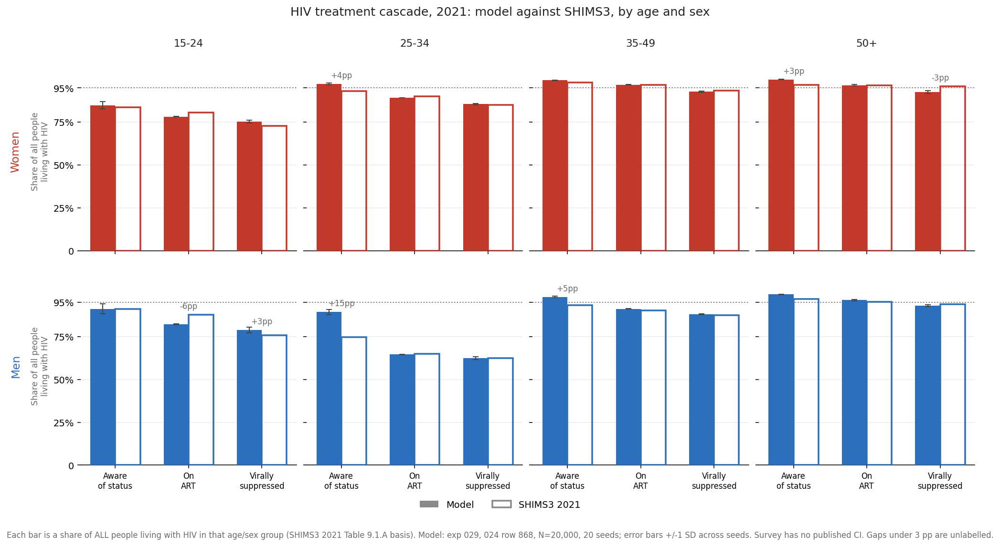
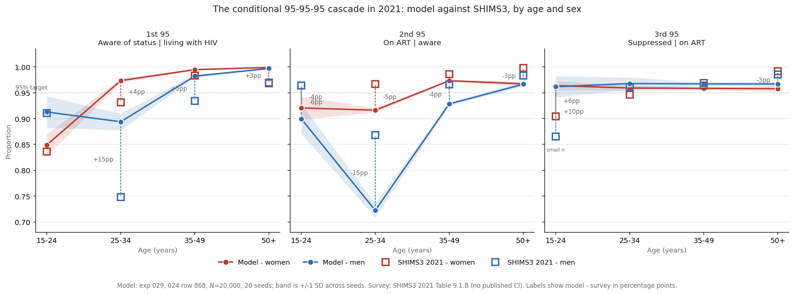
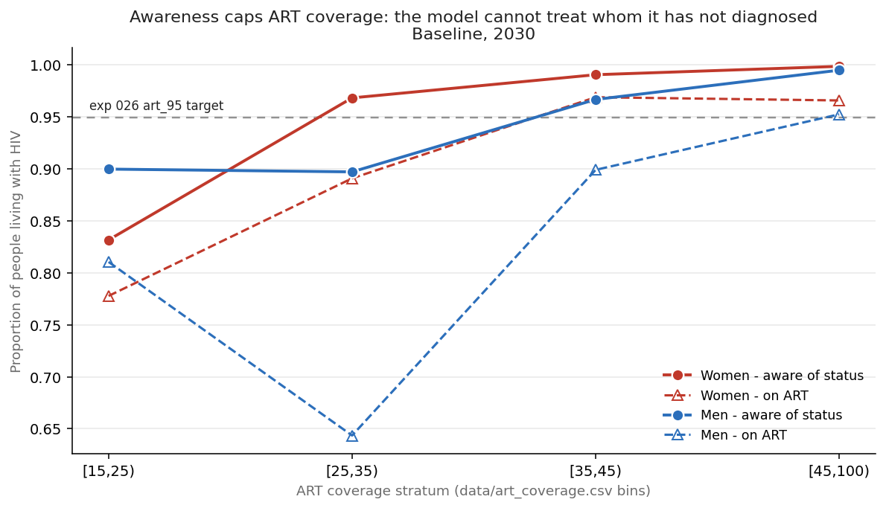
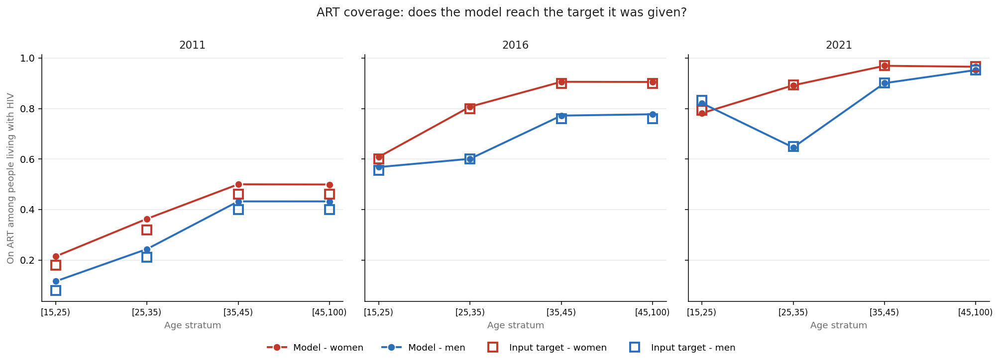
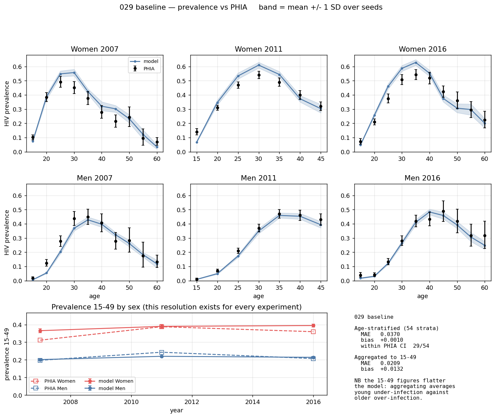

# Exp 029 — The model gets ART coverage right by getting both conditional steps wrong, and three strata cannot reach exp 026's 95% target at all

**Date:** 2026-09-17. **Model:** model-v1.5 (starsim 3.5.2 / stisim 1.5.11).
**Compute:** local laptop, 10 workers, 20 seeds, 912 s.
**Parameters:** a single point — 024 design row 868, the draw that fit 48/48
targets and the point [026](../026_scenarios/SUMMARY.md) built its scenarios on.
No parameter uncertainty; between-seed spread only.

**Question.** Decomposed into its three conditional steps — aware|PLHIV,
on-ART|aware, suppressed|on-ART — where does the model's care cascade stand by
age and sex, and how does each step compare with the survey? Opened before
revisiting [028](../028_hm_wave2_v15/SUMMARY.md)'s wave-3 plan, because 026's
headline result (cascade averts 16,525 infections, more than any PrEP arm) rests
on a cascade quantity that nothing in this repo had ever reported.

**Result.** The model reproduces ART coverage among PLHIV to within a mean of
**1.4 pp** across the eight age×sex strata — and does so while getting the first
95 wrong by up to **+14.6 pp** and the second by up to **−14.6 pp**, in opposite
directions, in the same stratum. Separately, **three of eight strata have
awareness below 95% and therefore cannot reach 026's `art_95` target at all** —
including men 25-34, the stratum 026 identified as the entire source of cascade
headroom.

The same data on the conditional basis — which is what isolates *which* step is
wrong, and shows the two errors cancelling:

## Observations

**obs 1 — The errors are compensating, and that is mechanical, not lucky.**
Every one of the eight strata has awareness too high and linkage too low:

| stratum | aware\|PLHIV (model / SHIMS3) | on-ART\|aware (model / SHIMS3) | product (model / SHIMS3) |
|---|---|---|---|
| **men 25-34** | 0.894 / **0.748** (**+14.6**) | 0.722 / **0.868** (**−14.6**) | 0.646 / 0.650 (−0.4) |
| men 35-49 | 0.982 / 0.934 (+4.8) | 0.928 / 0.966 (−3.8) | 0.912 / 0.903 (+0.9) |
| men 15-24 | 0.913 / 0.911 (+0.2) | 0.900 / 0.964 (−6.4) | 0.821 / 0.877 (−5.6) |
| women 25-34 | 0.973 / 0.931 (+4.3) | 0.916 / 0.967 (−5.1) | 0.892 / 0.900 (−0.8) |
| women 15-24 | 0.849 / 0.836 (+1.3) | 0.921 / 0.964 (−4.3) | 0.782 / 0.807 (−2.5) |

Mean absolute error: **4.0 pp** on the first step, **5.0 pp** on the second,
**1.4 pp** on their product. The cancellation is structural — `data/art_coverage.csv`
is an *input*, so the stratified coverage target forces on-ART|PLHIV to the data
regardless of how many agents the testing ramp diagnosed. Whatever awareness the
model produces, the linkage step absorbs the residual. This error is invisible to
every output this project had before today: `Cascade` reports only the product.

**obs 2 — Awareness is a hard ceiling, and three strata sit under 95%.**
stisim fills a stratified ART target only from `in_stratum & hiv.diagnosed &
~hiv.on_art` (`hiv_interventions.py:573`), and nothing in the ART pathway sets
`hiv.diagnosed` — only `HIVTest`/`ANCTest` do, on fixed ramps
(`interventions.py:13-77`) that no coverage target influences. At 2030 baseline:

| stratum | awareness = max reachable ART | short of 95% by |
|---|---|---|
| **women [15,25)** | 0.832 | **11.8 pp** |
| **men [25,35)** | 0.897 | **5.3 pp** |
| **men [15,25)** | 0.900 | **5.0 pp** |
| other five | 0.967-0.999 | — reachable |

**obs 3 — So 026's `art_95` arm was partly unachievable, and in exactly the
stratum that mattered.** 026 built the arm as a coverage push on the strength of
men 25-34 sitting at 0.650, and reported it averting 16,525 infections. The
model can lift that stratum to at most **0.897**, not 0.95. Whether the arm
actually fell short was never checked: the target simply does not fill, with no
warning and no error. **This does not invalidate 026's ordering** — the arm still
delivered a large coverage increase, and cascade still beat every single PrEP arm
— but the headline number is for a smaller intervention than its label claims,
and the direction of the bias is known: it understates what a true 95-95-95 would
buy. Re-reading it requires the target-vs-achieved measurement 026 never took.

**obs 4 — Under baseline, by contrast, nothing falls short.** The model hits its
ART coverage input in all three survey years — worst gap 1.2 pp (2021, 15-24,
both sexes), and the small positive offsets in 2011/2016 are annual-resampling
timing, not unmet targets. So the ceiling only binds when a target is pushed
above observed awareness, which is precisely what a 95-95-95 arm does.

**obs 5 — The 0.650 that drove 026 is two-thirds an awareness problem.** SHIMS3
Table 9.1.B decomposes men 25-34's 65.0% coverage as **74.8% aware × 86.8%
on-ART-given-diagnosed**. Of the 30 pp gap to 95%, roughly 20 pp is people who do
not know their status. 026 framed the whole gap as a treatment-cascade problem
and costed an ART-coverage intervention against it; on the survey's own numbers
the larger share is a *testing* problem, which no arm in 026 addressed.

**obs 6 — The third 95 matches at the aggregate because it is an input, and
diverges where it is extrapolated.** Model VLS|ART at 15+ is 0.959 (women) /
0.967 (men) against SHIMS3's 0.959 / 0.967 — identical, because exp 021 adopted
PHIA suppression as an input. But at 15-24 the model reads **+6.0 pp** (women)
and **+9.7 pp** (men) too high, because `vls_coverage` carries no young-age
differential. The men 15-24 survey cell is parenthesised in the report
(small denominator, n=48), so that comparison is weak; the women's, at n=158, is not.

**obs 7 — The awareness data was in the repo the whole time, unread.** The
first 95 had no target in this project because nobody had opened
`data/241123_SHIMS_ENG_RR3_Final-1.pdf`. SHIMS3 Tables 9.1.A and 9.1.B publish
the full conditional cascade by sex and by exactly the age bins wanted, with
denominators. `cascade_construction.py` now extracts them to
`data/eswatini_cascade_95s.csv`, validated by the identity
aware × on-ART|aware × VLS|ART = VLS|PLHIV to within 0.6 pp on every cell.
**CLAUDE.md's target list should note this file exists** — it is not a fitting
target, but it is now the only age/sex awareness data in the project.

**obs 8 — Two data hazards found in passing.** (a) `data/art_coverage.csv` uses
Gender 0 = *female*, while `calibration_data/art_coverage_by_age_sex.csv` uses
Gender 0 = *male*. Both are in-repo, both carry ART coverage by age and sex, and
they disagree. Getting it backwards swaps the sexes and still produces a
plausible figure. (b) The two files also disagree on values: for 15-24 in 2021
the model's input is 0.794 (women) / 0.832 (men) against SHIMS3 Table 9.1.A's
0.807 / 0.877. That accounts for about 4.5 of the 5.6 pp "miss" in men 15-24 in
obs 1 — the model is hitting its target; its target disagrees with the survey.

## What this does not establish

**Whether `art_95` actually fell short, and by how much.** obs 2 gives the
ceiling from a *baseline* run. The arm itself was not re-run, so the realised
shortfall — and its effect on the 16,525 figure — is inferred from the mechanism,
not measured. That measurement is one 8-arm re-run of 026 with this analyzer
attached.

**Anything about years before 2021.** The conditional cascade has no age/sex data
before SHIMS3. The 2011 and 2016 comparisons here are on the unconditional
coverage only, so the compensating-error pattern of obs 1 is verified at one
point in time.

**The standard prevalence figure is present but unremarkable:** MAE 0.037 across
54 strata, 29/54 within CI, bias +0.001 — consistent with 024's fit at this
point, as expected since the parameters are identical.

## Acceptance

Accepted. The experiment answered its question and found the failure its success
criteria flagged as "bad and most consequential" — a ceiling in men 25-34. The
compensating-error result (obs 1) was not anticipated and is the more important
finding of the two, because it applies to every past experiment that judged the
cascade by on-ART|PLHIV alone.

## Next

1. **Re-run 026's arms with `CascadeByAge` attached and record target vs
   achieved.** How far short did `art_95` actually land, and what does that do
   to the 16,525? This is the one measurement that closes obs 3.
2. **Add a testing-scale-up arm.** obs 5 says the larger share of the men 25-34
   gap is awareness, and no arm in 026 moves awareness. A 95-95-95 arm that
   raises the testing ramp alongside the ART target is a different — and on
   these numbers more realistic — intervention than the one 026 costed.
3. **Then return to 028's deferred question:** whether this target set can
   identify these seven parameters at all, or whether joint-but-not-marginal is
   the best available. Unchanged by 029 — the cascade is driven by inputs, not
   by the calibrated parameters.
4. **Upstream (stisim), low priority:** the global and stratified ART correction
   paths draw from different pools — `(ti_art <= ti) & ~on_art` at
   `hiv_interventions.py:529` versus `diagnosed & ~on_art` at `:573`. The
   stratified path is strictly more permissive (it ignores both the linkage
   delay and the `art_initiation` probability) and nothing documents the
   difference.

## Artifacts

| | |
|---|---|
| `outputs/results.parquet` | 20 seeds x 47 years x 463 columns, consolidated |
| `outputs/cascade_vs_shims3.csv` | model vs SHIMS3 2021, every step x bin x sex, with pp differences |
| `outputs/cascade_timeseries.csv` | all five cascade quantities, every year and bin |
| `outputs/art_ceiling.csv` | awareness vs 0.95 per ART stratum, 2021 and 2030 |
| `outputs/coverage_vs_target.csv` | model ART coverage vs its input, all years |
| `figures/cascade_bars.png` | the conventional cascade — each stage as a share of all PLHIV |
| `figures/cascade_95s.png` | the three conditional steps, model vs SHIMS3 |
| `figures/art_ceiling.png` | awareness as the cap on ART coverage |
| `figures/coverage_vs_target.png` | model vs input target, 2011/2016/2021 |
| `figures/prevalence_fit_vs_phia.png` | the standard figure |
| `../../analyzers.py` | `CascadeByAge`, new — counts by 5-year band and sex |
| `../../cascade_construction.py` | new — extracts SHIMS3 Tables 9.1.A/B |
| `../../data/eswatini_cascade_95s.csv` | new — the conditional cascade, 2021 |
