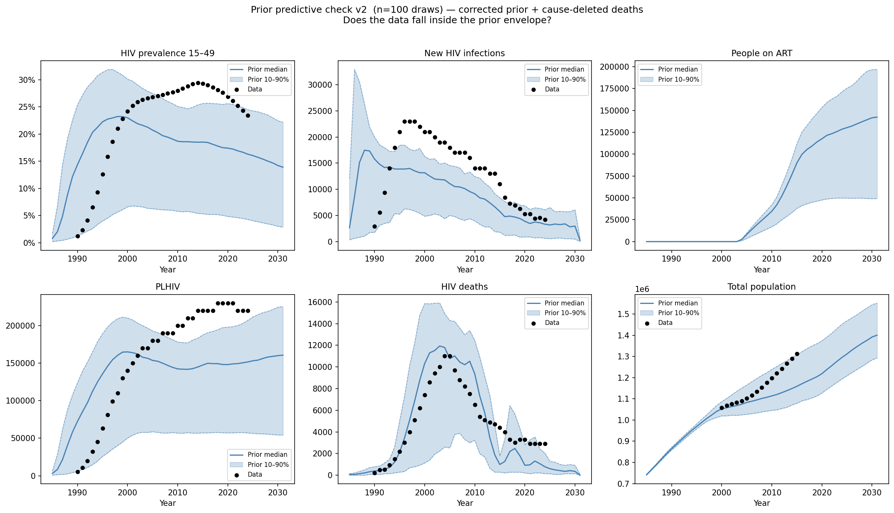

# Experiment 02 — Prior predictive check v2 (corrected prior + cause-deleted deaths)

## Question
With the corrected prior (`beta_m2f` widened to 0.020, `rel_init_prev` narrowed to 0.50) and
cause-deleted background mortality, does the data fall inside the prior envelope?

## What we ran
100 Latin-hypercube draws from the updated prior (see table below), each a full 1985–2031
simulation (10 000 agents, 10 CPUs, 318 s wall time). All 100/100 draws completed.

| Parameter | Range | Change from 01 |
|---|---|---|
| `beta_m2f` | 0.002 – 0.020 | Widened from 0.014 (best 01 draws still 25% below data PLHIV) |
| `eff_condom` | 0.50 – 0.90 | Unchanged |
| `rel_init_prev` | 0.05 – 0.50 | Narrowed from 5.0 (high end caused epidemic 15 yr too early) |
| `rel_dur_on_art` | 1.0 – 20.0 | Unchanged |
| `prop_f0` | 0.55 – 0.90 | Unchanged |
| `prop_m0` | 0.55 – 0.80 | Unchanged |
| `m1_conc` | 0.05 – 0.30 | Unchanged |

Background mortality: cause-deleted rates (log-linear interpolation through AIDS spike years),
replacing the all-cause file that double-counted HIV deaths.

## Findings

### 1. Timing–magnitude tradeoff is the fundamental problem
High `beta_m2f` produces epidemic magnitude near the data (~200K PLHIV) but the epidemic
peaks in **1995–2000** — 10–15 years too early. Low `beta_m2f` gives the right timing
(peak ~2007–2010) but generates only ~48K PLHIV at peak — 75% below the data.

Correlation across 100 draws:
- `beta_m2f` × peak PLHIV:  r = **+0.92**
- `beta_m2f` × peak year:   r = **−0.65**

Only 9/100 draws had peak year ≥ 2005. Those 9 draws had median peak PLHIV = **48K**
(data: ~200K UNAIDS, ~210K PHIA-era). No draw simultaneously satisfied both targets.

### 2. Population growth still too slow on most runs
The cause-deleted mortality fix helped, but total population growth is still too slow in
roughly half of draws — suggesting either migration or fertility parameters need attention.
The prior envelope passes the coverage check for `n_alive` because a few runs have very
low HIV mortality, artificially inflating the band.

### 3. Late incidence falls too quickly
HIV incidence peaks in the early 2000s in most draws and declines toward zero by 2020.
The PHIA 2016 survey measured female incidence at ~1.7%/yr and male ~0.9%/yr —
well above the model median at those years.

### 4. We have been calibrating against UNAIDS model estimates, not survey data
The coverage check plots showed aggregate UNAIDS estimates (modeled outputs) rather
than the PHIA household survey measurements. PHIA provides:
- **Age/sex-specific prevalence** at survey years 2007, 2011, 2016, 2021
  (15–20, 20–25, 25–30, 30–35 and 35–65 in 5-year bins)
- **Sex-specific incidence** (15–49) at 2011 and 2016

These survey measurements are direct observations and should be the primary calibration
targets. Experiment 03 will rebuild the coverage check around them.

## Key structural hypothesis for experiment 03
The timing–magnitude tradeoff suggests the epidemic is spreading too fast through the
**general population** rather than sustaining through ongoing FSW/client transmission
into the medium-risk group. `p_pair_form = 0.5` (fixed, not calibrated) controls how
quickly the medium-risk group acquires partnerships. Widening this into the prior may
resolve the tradeoff by separating epidemic speed from epidemic size.

## Changes for experiment 03
| What | Change | Reason |
|---|---|---|
| Add `p_pair_form` to prior | 0.3 – 0.7 | Test whether partnership formation rate resolves timing–magnitude tradeoff |
| Coverage check targets | PHIA survey data (primary), UNAIDS (secondary) | Calibrate against direct observations |
| Plot panels | Add age/sex-specific prevalence and sex-specific incidence panels | Match PHIA data structure |

## Figures

