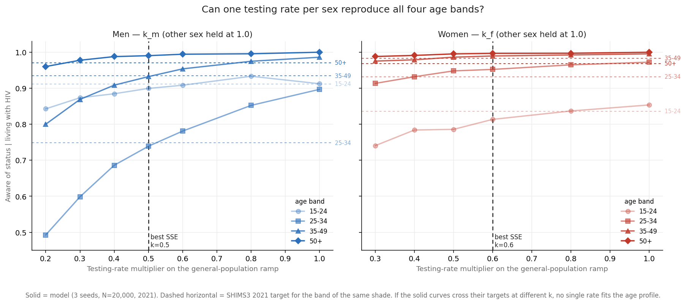
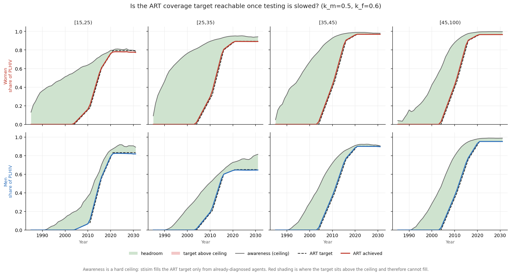
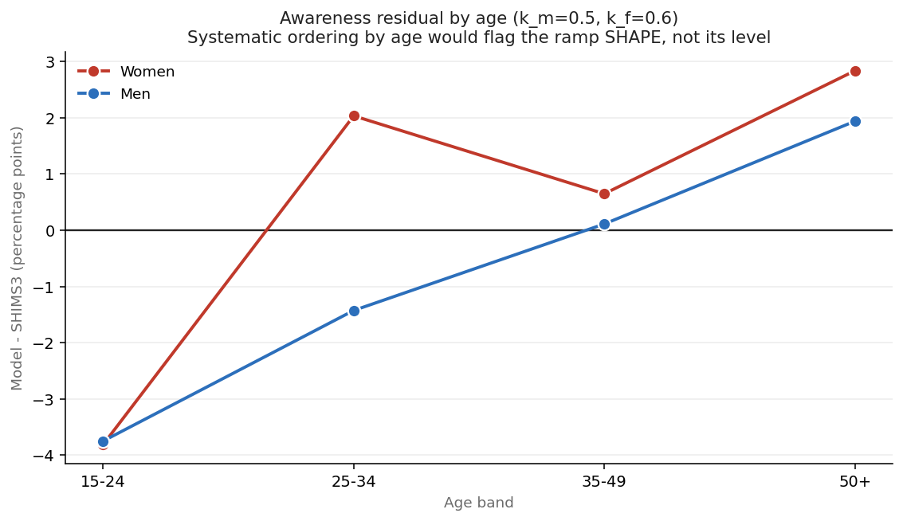

# Exp 030 — One testing rate per sex reproduces the male age profile, ART coverage survives everywhere but young women, and the oldest bands reveal a 2-3 pp floor no rate can reach

**Date:** 2026-09-18. **Model:** model-v1.5 + the testing split (model-v1.6 if
adopted). starsim 3.5.2 / stisim 1.5.11.
**Compute:** local laptop. Scan 35 sims (wall clock inflated by a straggler that
hit a sleep cycle; median 476 s/sim at 10-way contention on 12 cores). Confirm
10 sims, 964 s at 6 workers.
**Parameters:** 024 design row 868, unchanged. Only `k_m` / `k_f` move.

**Question.** Following [029](../029_cascade_audit/SUMMARY.md): can sex-specific
routine testing rates reproduce the eight observed awareness strata, and does ART
coverage survive the correction, given SHIMS3 leaves as little as 0.2 pp of
headroom between awareness and ART coverage?

**Result.** `k_m = 0.5`, `k_f = 0.6`. A single rate per sex **does** fit the male
age profile — and the fit is over-identified, since the two informative male
bands agree independently. ART coverage survives in 215 of 216 non-trivial
strata-years; the exception is **young women, who become a binding constraint
from 2021 onward**. And the 50+ bands expose a **2-3 pp awareness floor that no
testing rate can reach**, which is the hard-to-reach signature 029 looked for and
did not find at the level it first proposed.

## Observations

**obs 1 — The split is behaviourally neutral.** `k = (1.0, 1.0)` reproduces 029's
awareness to within **0.44 pp** on all eight strata. Splitting one intervention
into two changes the random stream but not the behaviour, so every experiment
through 029 remains comparable.

**obs 2 — The male fit is genuinely over-identified, and it passes.** At
`k_m = 0.5`, RMSE across the four male bands is **1.25 pp**:

| band | model | SHIMS3 | err (pp) | span over the scan |
|---|---|---|---|---|
| 15-24 | 0.899 | 0.911 | −1.18 | 0.090 |
| **25-34** | 0.739 | 0.748 | **−0.93** | **0.404** |
| **35-49** | 0.932 | 0.934 | **−0.21** | **0.186** |
| 50+ | 0.990 | 0.970 | +2.00 | 0.040 |

The two bands that carry information — 25-34 and 35-49 — **independently pick out
the same `k_m`**. That is the pre-registered over-identification test, and
failure mode 2 did not occur: a uniform-within-sex hazard reproduces the full
male age profile, including the 25-34 dip that motivated the whole enquiry.

**obs 3 — The female fit is weakly identified and should be described as such.**
Three of four female bands are saturated across the entire scanned range
(25-34 spans 0.059, 35-49 spans 0.020, 50+ spans 0.012). `k_f` is effectively
determined by the 15-24 band alone. There is **no over-identification test for
women**, and `k_f = 0.6` should be read as one band's answer, not four bands'
agreement.

**obs 4 — The fitted rates agree with the independent Little's-Law estimate.**
`k_m = 0.5` implies a 0.25/yr hazard, i.e. ~4.0 years mean time unaware, against
029's estimate of ~3.8. `k_f = 0.6` implies 0.30/yr, ~3.3 years, against
~2.8-3.0 — and women additionally have ANC testing, so their effective hazard is
higher than the general-population rate alone. Two methods resting on different
assumptions landing in the same place is worth more than either on its own.

**obs 5 — Separability held well enough to use, but not perfectly.** The joint
run at (0.5, 0.6) fits slightly worse than the two 1-D scans predicted: men 15-24
moves from −1.18 to −3.75 pp and women 15-24 from −2.27 to −3.81. Part is seeds
(3 vs 10), part is the cross-sex transmission coupling the 1-D scans held fixed
at 1.0. The scans were adequate for *locating* the optimum; they are not a
substitute for the joint evaluation.

**obs 6 — Answering question 2: ART coverage survives, except in young women.**
Across **216 non-trivial strata-years** (target > 1%, 2005-2031) with the target
series interpolated annually the way stisim does it:

- **1 genuine ceiling breach** — women [15,25) in 2031, awareness 0.782 against a
  target of 0.794, i.e. **−1.10 pp of slack**: the target sits above the ceiling
  and cannot fill.
- **16 strata-years short by more than 1 pp**, almost all women [15,25).

That stratum degrades steadily once the target steps up in 2021:

| year | awareness (ceiling) | ART target | ART achieved | shortfall |
|---|---|---|---|---|
| 2020 | 0.796 | 0.755 | 0.761 | +0.63 |
| 2021 | 0.798 | 0.794 | 0.778 | **−1.56** |
| 2025 | 0.804 | 0.794 | 0.780 | −1.33 |
| 2030 | 0.797 | 0.794 | 0.777 | −1.65 |
| 2031 | 0.782 | 0.794 | 0.774 | **−2.00** |

**obs 7 — The binding stratum is not the one the data predicted, and the reason
matters.** 029's headroom table flagged women 50+ (0.2 pp) and women 35-49
(1.5 pp) as tightest *in the survey*. In the model the binding stratum is women
15-24 instead — because the model **over**-shoots awareness at 50+ (0.996 against
0.968), leaving ample ceiling there, and **under**-shoots at 15-24 (0.798 against
0.836), leaving almost none. So the breach is substantially a fit-quality
problem in one band rather than a pure structural impossibility. A better 15-24
fit would likely remove it.

**obs 8 — The 50+ residual is structural and is the real hard-to-reach signal.**
Men 50+ read +1.94 pp and women 50+ +2.83 pp, and those bands span only 0.040 and
0.012 across the entire scanned range — **no value of `k` can bring them down**.
Everyone that old has been infected long enough that the model diagnoses them
with near-certainty. The survey says ~3% of adults over 50 still do not know
after decades of infection; the model says ~1% and structurally cannot say more.

This locates the hard-to-reach fraction that 029 first proposed at 25% and then
withdrew: **it is real, and it is about 3%, visible only where duration can no
longer explain anything away.** Not worth a parameter now — a 3 pp effect in the
oldest band will not move the PrEP-versus-cascade contrast — but it is the honest
answer to the question, and it is now measured rather than argued.

**obs 9 — The shape flag is ambiguous, as pre-registered.** The residual pattern
is not cleanly ordered by age: −3.8, +2.0, +0.6, +2.8 for women and −3.7, −1.4,
+0.1, +1.9 for men. Both sexes are too low at 15-24 and too high at 50+, which is
*consistent with* the assumed ramp shape rising too fast — but it is equally
consistent with the model's age-at-infection distribution being wrong, and that
is unconstrained here (age-banded SHIMS incidence rows are `fit=False` for
false-recency bias). Reported, not diagnosed, per the README.

## What this does not establish

**The mechanism, only the level.** `k_m` / `k_f` are the only knobs with the
right shape, so if the true cause of low awareness in young men is absent index
testing, or an age gradient in service contact, the multiplier absorbs it as a
lower rate and fits 2021 while getting the mechanism wrong. obs 9 is the check
and it came back ambiguous.

**The ramp shape.** Awareness saturates, so 2021 data cannot test the historical
trajectory — the point made in the README and unchanged by the result. SHIMS1 and
SHIMS2 awareness would test it; those reports are not in the repo.

**No standard prevalence figure.** 030 changes who is *diagnosed*, not who is
infected, and ART coverage is forced to data — so prevalence is unaffected by
construction and was not re-checked. This is a deliberate departure from the
workflow's every-experiment rule and should be revisited if the rates are adopted.

## Acceptance

Accepted for the scan's purpose. **Not yet adopted as model-v1.6** — obs 6's
breach and obs 5's separability slippage both argue for a short joint refinement
around (0.5, 0.6) before tagging, particularly on the women's 15-24 band that
drives both the weak identification and the only ceiling breach.

## Next

1. **Local 2-D refinement** around (0.5, 0.6), ~9 points x 5 seeds, scoring on
   awareness SSE **and** ART shortfall jointly. If a nearby pair removes the
   women 15-24 breach without degrading the male fit, adopt it as model-v1.6.
2. **Then re-run 026's arms** with the adopted rates and `CascadeByAge`
   attached — the measurement 029 called for. `art_95` was already unreachable in
   three strata at 029's inflated awareness; at 030's lower awareness the ceiling
   binds harder, so 026's headline 16,525 needs re-reading against what the
   cascade arm can actually deliver.
3. **Add a testing-scale-up arm.** Now that testing is an explicit, fitted lever,
   "raise awareness toward 95%" is expressible for the first time — and 029's
   obs 5 showed two-thirds of the men 25-34 coverage gap is awareness, not
   linkage.
4. **Deferred, not dropped:** the ~3 pp hard-to-reach floor in obs 8. Revisit if
   a testing-scale-up arm turns out to be sensitive to it, since it is precisely
   the fraction that determines diminishing returns.

## Artifacts

| | |
|---|---|
| `outputs/scan.parquet` | 35 sims, 12 (k_m, k_f) combinations x 3 seeds, to 2022 |
| `outputs/scan_awareness.csv` | awareness per k, sex, band, with survey and error |
| `outputs/scan_fit.csv` | SSE / RMSE / max error per k per sex |
| `outputs/confirm.parquet` | 10 seeds at (0.5, 0.6) to 2031 |
| `outputs/confirm_awareness.csv` | joint awareness fit vs SHIMS3 |
| `outputs/art_reachability.csv` | **the primary diagnostic** — target, ceiling, achieved, every year |
| `figures/testing_rate_scan.png` | can one rate per sex fit four age bands |
| `figures/art_reachability.png` | ART target vs awareness ceiling, every year |
| `figures/residual_by_age.png` | the ramp-shape flag |
| `../../interventions.py` | sex-split general-population testing (`test_rate_m`/`test_rate_f`) |
| `../../cascade_analysis.py` | shared cascade helpers, promoted from 029 |
