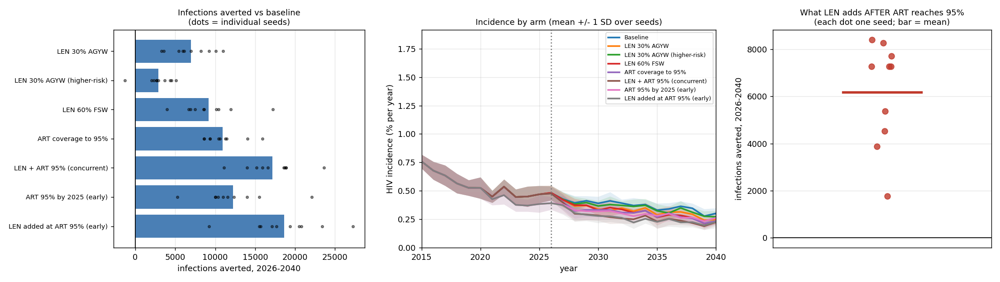
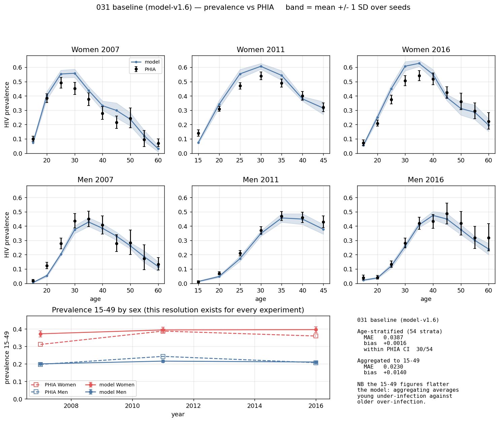

# Exp 031 — Correcting the testing rate cuts the cascade arm by a third and erases its lead over FSW PrEP, because four of eight strata cannot reach the target at all

**Date:** 2026-09-27. **Model:** model-v1.6 (starsim 3.5.2 / stisim 1.5.11).
**Compute:** local laptop, 10 workers, 8 arms x 10 seeds = 80 sims, 2550 s.
**Parameters:** a single point — 024 design row 868, as
[026](../026_scenarios/SUMMARY.md) and [029](../029_cascade_audit/SUMMARY.md).
No parameter uncertainty; between-seed spread only.

**Question.** 026 reported ART coverage to 95% averting **16,525** infections,
more than any single PrEP arm. 029 found that arm could not reach 0.95 in three
of eight strata — awareness is a hard ceiling and nothing warns when a target
sits above it — and that nobody had measured target against achieved.
[030](../030_testing_rate/SUMMARY.md) then corrected the model's testing rate
downward, lowering the ceiling further. So: how much coverage does the cascade
arm actually deliver, and what does that do to 026's numbers?

**Result.** **Every PrEP arm is unchanged and every cascade arm falls by a
quarter to two-fifths.** `art_95` drops from 16,525 to **10,960** (−34%) while
`prep_fsw` moves from 8,771 to **9,202**. 026's ordering — the cascade as the
larger prize — **does not survive**: paired by seed the cascade now averts only
**1,758 more than FSW PrEP (SD 3,744), ahead in 8 of 10 seeds**, against a clean
1.9x lead in 026. The mechanism is measured rather than inferred: at 2030 four
of eight strata are ceiling-bound, and in three of them **the delivered coverage
equals awareness exactly** — the arm put every diagnosed person on treatment and
still fell short.

**obs 10 reframes why.** Decomposing the same outputs shows the model's baseline
**already meets 95-95-95 in aggregate, and has since 2021** (0.876 of PLHIV
suppressed against the 0.857 product target, rising to 0.902 by 2040). There was
never much cascade left to close at the population level; what remains is a
31-point spread *between* strata that the average conceals.

## Scorecard against 026

Cumulative new infections 2026-2040, infections averted against each
experiment's own baseline.

| arm | 026 averted | 031 averted | change |
|---|---|---|---|
| LEN 30% AGYW | 7,203 | 6,998 | −3% |
| LEN 30% AGYW (higher-risk) | 3,785 | 2,903 | −23% |
| LEN 60% FSW | 8,771 | **9,202** | +5% |
| **ART coverage to 95%** | **16,525** | **10,960** | **−34%** |
| LEN + ART 95% (concurrent) | 20,974 | 17,132 | −18% |
| ART 95% by 2025 (early) | 19,936 | 12,231 | −39% |
| LEN added at ART 95% (early) | 25,197 | 18,644 | −26% |

## Observations

**obs 1 — The gate passes, so the contrasts are attributable to the testing
split.** 031's baseline gives **66,178** infections (seed range 61,863-76,693,
SD 4,440) against 026's **63,162** (its own SD 6,197): +4.8%, **0.7 SD**, and
026's value sits inside 031's seed range. v1.4 and v1.5 are recorded in their
tags as near-inert and they behave that way. Nothing moved between v1.3 and v1.6
that was not meant to.

**obs 2 — The PrEP/cascade split is the pre-registered signature, and it is
clean.** The testing correction changes who is *diagnosed*. It cannot touch a
PrEP arm, and it lowers the ceiling under every cascade arm. That is exactly
what the scorecard shows: the three PrEP-only arms move by −3%, −23% and +5%
(all within their seed noise), while all four arms containing a cascade
component fall by 18-39%. No other explanation is needed and none is available.

**obs 3 — 026's headline claim does not survive, and this is the result that
matters for the abstract.** Paired by seed:

| comparison | cascade averts more by | SD | seed range | cascade ahead in |
|---|---|---|---|---|
| ART 95% vs **LEN 60% FSW** | **+1,758** | 3,744 | −6,779 to +6,568 | **8/10** |
| ART 95% vs LEN 30% AGYW | +3,962 | 2,083 | +353 to +7,062 | 10/10 |

Against FSW PrEP the difference is **a third of its own standard deviation and
changes sign in two seeds** — not a distinguishable difference. Against broad
AGYW PrEP the cascade still wins cleanly. So the ordering is
**cascade ≈ FSW PrEP > AGYW PrEP**, not "the cascade is the larger prize".

**obs 4 — The mechanism, measured: the ceiling binds exactly, not
approximately.** `art_95` at 2030:

| stratum | asked for | awareness (ceiling) | delivered | unreachable |
|---|---|---|---|---|
| **Women 15-24** | 0.950 | 0.803 | **0.803** | **14.7 pp** |
| **Men 25-34** | 0.950 | 0.818 | **0.818** | **13.2 pp** |
| Men 15-24 | 0.950 | 0.905 | 0.896 | 4.5 pp |
| Men 35-44 | 0.950 | 0.912 | **0.912** | 3.8 pp |
| Women 25-34 | 0.950 | 0.948 | 0.942 | 0.2 pp |
| Women 35-44 | 0.970 | 0.982 | 0.969 | — met |
| Women 45+ | 0.966 | 0.997 | 0.965 | — met |
| Men 45+ | 0.953 | 0.987 | 0.952 | — met |

In three strata **delivered = awareness to three decimals**. The arm exhausted
the entire diagnosed pool and stopped, silently, with no warning and no error.
Across the scenario window `art_95` has **64 of 120 strata-years** where the
target sits above the ceiling.

And **men 25-34 — the stratum 026 built its whole cascade rationale on — is the
second worst**, 13.2 pp short.

**obs 5 — The PrEP increment went UP, not down: 4,449 → 6,172.** That is
**11.2% of the infections remaining once ART is maximised, positive in 10/10
seeds** (seed range 1,765-8,404). Mechanistically coherent and not a surprise: a
cascade arm that delivers less suppression leaves more residual transmission for
PrEP to prevent. **The "prevention still matters at high suppression" claim is
stronger at v1.6 than it was at v1.3**, which is the opposite of what the
correction did to everything else in this experiment.

**obs 6 — The efficiency spread is untouched and is still the most
decision-relevant number here.** Person-years of PrEP per infection averted:
**FSW 3.3**, higher-risk AGYW 65.6, broad AGYW 69.2 — a **21x spread**, against
026's 18x. This quantity depends on the PrEP arms only, so the testing
correction leaves it alone, and it survives everything else that moved.

**obs 7 — 026 obs 2 was right: the aggregate ART column cannot see any of
this.** At 2030, 15+, `art_95` against baseline: women 0.954 vs 0.942, men 0.930
vs 0.907. A two-percentage-point aggregate move, while the stratified picture
underneath shows two strata 13-15 pp short of target. Any verification table
built on the aggregate would have passed this arm without comment.

**obs 8 — Extending to 2040 found something 030 could not see at 2031, and it
is partly an artefact of the counterfactual.** Baseline men 15-24 fall from
−1.7 pp short of target in 2025 to −13.7 in 2035 and **−38.0 in 2040**. But that
stratum's PLHIV count collapses over the same period — **3,767 in 2020 to 368 in
2040**, a 90% decline. As incidence falls the youngest band is dominated by
recent infections who have not yet had time to be diagnosed, so awareness falls,
while the ART target is held flat at its 2021 value (0.832) forever.

Holding coverage-*among-PLHIV* constant is not a sensible status-quo
counterfactual for a stratum whose denominator is collapsing and turning over
rapidly. The effect is common-mode across arms, so it does not bias the
contrasts — but **"baseline holds coverage flat" is false in the youngest bands
after ~2032**, and 026's description of its counterfactual should not be reused
without this caveat.

**obs 9 — The prevalence fit is unharmed by v1.6.** MAE **0.039** across 54
strata, 30/54 within CI, bias +0.002 — against 029's 0.037, 29/54, +0.001 at
v1.5. Expected, since ART coverage remains forced to data, but it had to be
checked: the arms move coverage and the ceiling moved under them.

**obs 10 — The model's Eswatini already meets 95-95-95 in aggregate, and the
average hides a 31-point spread. This is the most consequential finding here.**
Computed from the same runs, no extra simulation. Both sexes, 15+, baseline:

| year | aware | x on ART \| aware | x VLS \| ART | = suppressed of PLHIV | vs 0.857 |
|---|---|---|---|---|---|
| 2021 | 0.945 | 0.964 | 0.962 | **0.876** | meets |
| 2030 | 0.963 | 0.966 | 0.962 | **0.895** | meets |
| 2040 | 0.964 | 0.973 | 0.961 | **0.902** | meets |

The UNAIDS target is a population *average*, so it can be met while individual
strata sit far below it — and in Eswatini it is, because the PLHIV stock is
concentrated in older women who have had decades to be diagnosed and treated.
At 2030, weighted by PLHIV share:

| stratum | % of PLHIV | aware | on ART \| aware | VLS \| ART | **suppressed of PLHIV** |
|---|---|---|---|---|---|
| Women 50+ | 18.9 | 0.999 | 0.979 | 0.960 | **0.939** |
| Men 50+ | 16.1 | 0.994 | 0.971 | 0.966 | 0.932 |
| Women 35-49 | 31.6 | 0.986 | 0.973 | 0.959 | 0.921 |
| Men 35-49 | 13.9 | 0.934 | 0.971 | 0.968 | 0.878 |
| Women 25-34 | 12.0 | 0.941 | 0.946 | 0.957 | 0.852 |
| Men 15-24 | 0.8 | 0.886 | 0.914 | 0.956 | 0.774 |
| Women 15-24 | 3.6 | 0.781 | 0.980 | 0.957 | 0.733 |
| **Men 25-34** | **3.1** | **0.792** | **0.810** | 0.971 | **0.623** |

Three quarters of the PLHIV stock sits in the four oldest strata, all at or
above 0.878. The four strata below the 95-95-95 product hold just **19.5% of
PLHIV**, and the three worst hold **7.5%** — so they barely move the average
while being the groups with the highest onward transmission.

**This explains obs 2 and obs 3 rather than sitting beside them.** The cascade
arm had little to give because the cascade is, on the UNAIDS metric, already
closed. And it locates the remaining headroom precisely: the first 95 in young
people and men, plus **one** second-95 gap — men 25-34 link only 0.810 of their
diagnosed, the single worst conditional step anywhere in the table.

**One caveat on the third column.** `vls_given_art` is flat at 0.956-0.971
across every stratum because it is an input with no age gradient (029 obs 6),
and against SHIMS3 the model reads 6.0 pp (women) and 9.7 pp (men) too high at
15-24. So the youth deficit is understated here, and the model **cannot
currently represent a third-95 intervention at all**.

## What this does not establish

**Anything about parameter uncertainty.** One parameter point. Every interval
here is Monte Carlo error across 10 seeds, **not** a credible interval, and the
abstract must say so. This is 026's constraint, unchanged.

**Whether the cascade's lost advantage is recoverable.** The obvious response to
obs 4 is an arm that raises testing alongside the ART target — 029 obs 5 found
two thirds of the men 25-34 coverage gap is people who do not know their status.
No such arm was run here. **So this experiment shows that a coverage-only
cascade push under-delivers; it does NOT show that the cascade is a weaker
lever than PrEP.** Those are different claims and only the first is supported.

**The mechanism behind low awareness.** 030's caveat carries: `k_m` / `k_f` fit
the *level*. If the true cause is absent index testing or an age gradient in
service contact, the multiplier absorbs it and the projected response to a
testing intervention would be wrong.

**Cost.** Efficiency is reported in person-years, not currency. No unit costs
are in this project.

## Acceptance

Accepted. The experiment answered its question, the gate passed, and it found
the outcome the README pre-registered as the interesting failure — `art_95`
delivering materially less than 026 credited it with, and the margin over
`prep_fsw` collapsing. 026's numbers are superseded by this run for any arm
containing a cascade component.

**The abstract's ordering sentence has to change, and obs 10 changes its
premise.** The defensible statement is that Eswatini already meets 95-95-95 in
aggregate, that a coverage-only cascade push and well-targeted FSW PrEP
therefore avert comparable numbers of infections, that FSW PrEP does so at 3.3
person-years per infection averted against 69.2 for broad AGYW delivery, and
that PrEP added on top of a maximised cascade still averts 11% of what remains.
The interesting question is no longer "can the cascade be closed" but what the
concentrated residual gaps — young people, and men 25-34 in particular — are
worth against prevention.

## Next

1. **A testing scale-up arm.** The one measurement that would settle whether the
   cascade's lost advantage is recoverable — and the first time "raise awareness"
   is expressible, since 030 made testing an explicit fitted lever. This is the
   single highest-value next run.
2. **Re-specify cascade arms on the conditional steps.** `art_95` targets
   coverage-among-PLHIV, which is the *product* of a testing outcome and a
   linkage outcome, so it silently asks for an awareness level nobody supplied.
   An arm specified as "on-ART-given-aware → 0.98" is reachable by construction.
   This is 029 obs 1 turned into a design rule and it should govern every future
   cascade arm.
3. **A perfect-cascade bound.** Everyone diagnosed, linked and suppressed
   instantly — not a policy, an upper bound on what any treatment-side
   intervention can deliver. The residual infections under it are the
   irreducible prevention gap, which is the direct answer to CLAUDE.md's "where
   does prevention still matter when suppression is high". One arm.
4. **A retention arm is now expressible.** stisim models ART discontinuation
   explicitly (`ti_stop_art`, `art_discontinued`, distinct from never-treated),
   so long-acting ART for people who cycle off treatment can be represented.
   `CascadeByAge` does not count `art_discontinued` and would need that column
   first — the same blind spot 029 found for awareness.
5. **Fix the flat-target counterfactual in the youngest bands** (obs 8) before
   any future experiment reports late-horizon coverage.

## Artifacts

| | |
|---|---|
| `outputs/sims/` | 80 per-run parquet, cache keyed by arm fingerprint incl. testing rate |
| `outputs/gate.csv` | baseline against 026's 63,162 — the trust check |
| `outputs/scorecard.csv` | per-arm infections, averted, efficiency |
| `outputs/per_seed.csv` | per-arm per-seed cumulative infections |
| `outputs/contrasts.csv` | the seven named contrasts, paired by seed |
| `outputs/headline.csv` | the PrEP increment on top of the cascade |
| `outputs/art_reachability.csv` | **the primary diagnostic** — target, ceiling, delivered, per arm x stratum x year |
| `outputs/delivered_art_95_2030.csv` | obs 4's table, with the reason each stratum fell short |
| `outputs/cascade_aggregate.csv` | obs 10 — the three 95s and their product, 2021/2030/2040 |
| `outputs/cascade_by_stratum.csv` | obs 10 — the same by age and sex, with PLHIV weights |
| `figures/scenarios.png` | infections averted, incidence, PrEP increment |
| `figures/art_target_vs_achieved.png` | asked for vs reachable vs delivered |
| `figures/prevalence_fit_vs_phia.png` | the standard figure |
| `../../interventions.py`, `../../run_sims.py` | model-v1.6 defaults |
