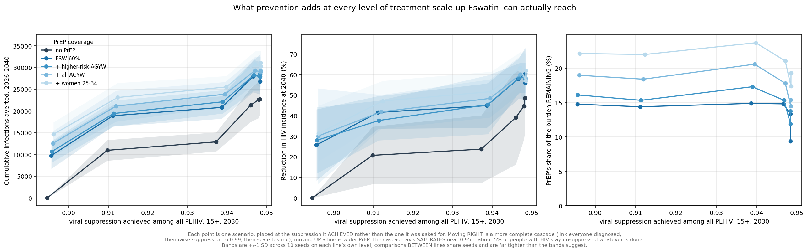
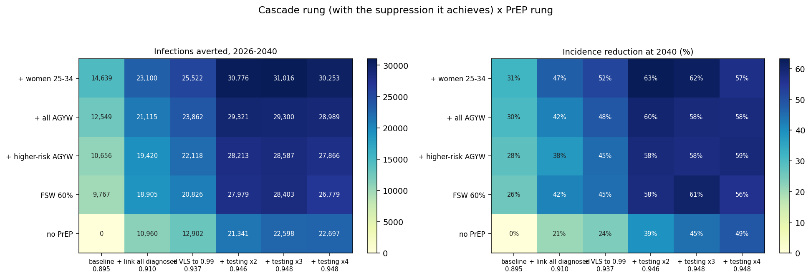

# Exp 032 — The cascade saturates at 0.95 suppression and PrEP does not: past a doubling of testing, another cascade step buys 99 infections while FSW PrEP buys 5,805

**Date:** 2026-09-27. **Model:** model-v1.6 (starsim 3.5.2 / stisim 1.5.11).
**Compute:** raccoon, 110 workers, 6 cascade x 5 PrEP x 10 seeds = 300 sims,
**218 s**. **Parameters:** 024 design row 868, as 026/029/031. Seed spread only.

**Question.** [031](../031_scenarios_v16/SUMMARY.md) found that an arm labelled
"ART coverage to 95%" delivered 0.818 in men 25-34, and that Eswatini already
meets 95-95-95 in aggregate. Discrete arms named for what they *ask* are the
wrong instrument. This experiment places every scenario at the viral suppression
it **achieved** and asks: across the full range of suppression Eswatini can
actually reach, what does adding PrEP buy?

**Result.** **The treatment axis saturates.** Linking every diagnosed person,
raising suppression-given-ART to 0.99, and testing every undiagnosed adult
annually moves VLS among all PLHIV only from **0.895 to 0.948** — about **5% of
people with HIV remain unsuppressed no matter what is done on the treatment
side**, and 43,481 of the baseline 66,178 infections still occur.

**PrEP's proportional value is flat across almost that entire range.** FSW PrEP
removes **14.8%** of the remaining burden at baseline and **14.9%** at the
suppression level a fully-linked, fully-suppressed cascade reaches; only at
saturation does it fall to 9.4%. And the marginal comparison is stark: once
testing is doubled, **one more step up the cascade averts 99 infections while
FSW PrEP averts 5,805.**

## The x axis: what each cascade rung actually achieves

No PrEP, 2030, 15+:

| rung | aware | on ART \| aware | VLS \| ART | **VLS of all PLHIV** |
|---|---|---|---|---|
| baseline | 0.963 | 0.966 | 0.962 | **0.895** |
| + link all diagnosed | 0.967 | 0.978 | 0.962 | **0.910** |
| + VLS to 0.99 | 0.968 | 0.978 | 0.990 | **0.937** |
| + testing x2 | 0.986 | 0.969 | 0.990 | **0.946** |
| + testing x3 | 0.994 | 0.963 | 0.990 | **0.948** |
| + testing x4 | 0.998 | 0.960 | 0.990 | **0.948** |

## Observations

**obs 1 — The stop check passes exactly.** C0/P0 gives **66,178** infections,
identical to 031's baseline, with the same seed range (61,863-76,693). Same
seeds, same parameters, same model: the grid harness is 031's, and the surface
is anchored to a result that has already been checked against 026.

**obs 2 — The cascade axis saturates, and this is the central finding.**
0.895 → 0.948 is a **5.3-point span**, and the last two rungs add 0.002 and
0.000. Testing is pushed to the point where every undiagnosed adult is tested
annually (the ramp probability clips at 1.0) and awareness reaches 0.998 — and
still **5.2% of PLHIV are not virally suppressed.** The residual is structural:
people are infected, not yet tested, or recently diagnosed and not yet
suppressed, at any instant.

**obs 3 — Linkage and suppression are nearly spent; testing does the work.**
Of the 5.3 points, linkage contributes 1.5 and suppression-to-0.99 contributes
2.7, with testing contributing the rest — and testing's contribution is
**self-limiting**, because `on_art_given_aware` *falls* from 0.978 to 0.960 as
testing intensifies. Finding people faster puts more newly-diagnosed people in
the queue at any moment, so part of each testing gain is given back. This was
predicted in the README and it is why the axis has a ceiling well below 1.

**obs 4 — Maximum treatment scale-up averts 22,697 of 66,178 infections
(34.3%), leaving 43,481.** That is the honest ceiling on treatment-side action
in this model, replacing 031's 10,960 from an arm that could not reach its
target. Incidence at 2040 falls 48.6% under the maximal cascade alone.

**obs 5 — PrEP's share of the remaining burden is flat, then falls only at
saturation.** Percent of the burden remaining at each rung that PrEP removes:

| PrEP | baseline | +linkage | +VLS | +test x2 | +test x3 | +test x4 |
|---|---|---|---|---|---|---|
| FSW 60% | 14.8 | 14.4 | **14.9** | 14.8 | 13.3 | 9.4 |
| + higher-risk AGYW | 16.1 | 15.3 | 17.3 | 15.3 | 13.7 | 11.9 |
| + all AGYW | 19.0 | 18.4 | 20.6 | 17.8 | 15.4 | 14.5 |
| + women 25-34 | 22.1 | 22.0 | **23.7** | 21.0 | 19.3 | 17.4 |

**Prevention does not become less useful as suppression rises** — it operates on
a smaller denominator at an almost unchanged rate. Even at full saturation the
broadest PrEP arm still removes 17.4% of what remains.

**obs 6 — The marginal comparison is the decision-relevant number.** What one
more step buys, from each position (no PrEP):

| from | one more cascade rung | FSW PrEP instead |
|---|---|---|
| baseline | **10,960** | 9,767 |
| + linkage | 1,942 | 7,945 |
| + VLS to 0.99 | 8,439 | 7,924 |
| + testing x2 | 1,257 | 6,638 |
| + testing x3 | **99** | **5,805** |

At baseline the two are comparable. **Past a doubling of testing the cascade is
exhausted and PrEP is not** — 99 against 5,805, a 59-fold difference.

**obs 7 — FSW delivery stays an order of magnitude more efficient everywhere,
and efficiency degrades as the cascade improves.** Person-years of PrEP per
infection averted, using the increment each PrEP arm is itself responsible for:

| PrEP | at baseline | at saturation |
|---|---|---|
| FSW 60% | **3.1** | **9.3** |
| + all AGYW | 40.4 | 82.2 |
| + women 25-34 | 60.5 | 120.5 |

FSW is **20x** more efficient than the broadest arm at baseline and **13x** at
saturation. The degradation is real and expected — fewer infections left to
prevent — and it is the number a costing exercise would need.

**obs 8 — The wobble at the last two rungs is seed noise, not a mechanism.**
Several PrEP rows read slightly lower at testing x4 than x3 (FSW: 28,403 →
26,779). Paired seed SDs are ~2,000-3,500, so differences of this size are not
resolvable at 10 seeds. **The no-PrEP row is monotonic** (21,341 → 22,598 →
22,697), which is the row the x axis is built from, so the axis itself is sound.
Do not report any of the x3-vs-x4 differences as real.

## What this does not establish

**Parameter uncertainty.** One parameter point. Every interval is Monte Carlo
error across 10 seeds and **not** a credible interval.

**That suppression is the right x axis.** It is an *outcome*, and two cells at
equal suppression can differ in impact because *who* is suppressed matters
(031 obs 10). The nested ladder used here produces only one path through that
space, so the surface does not test how much composition matters. A design that
reached the same suppression by different routes would.

**Anything about age-targeted suppression.** `VLSStockTarget` is sex-keyed, so
suppression was raised by sex only. The model's suppression-given-ART carries no
age gradient and reads 6-10 pp too high at 15-24 against SHIMS3 (029 obs 6), so
the youth cascade gap is understated and an adherence or long-acting-ART arm
remains unrepresentable.

**Costs.** Efficiency is in person-years. No unit costs exist in this project.

## Acceptance

Accepted. The stop check passed exactly, the axis behaves as designed, and the
surface answers the decision question directly. **These are the numbers for the
CROI abstract.**

The defensible headline: Eswatini already meets 95-95-95 in aggregate; pushing
treatment to its structural ceiling leaves 5% of PLHIV unsuppressed and 43,481
infections over 2026-2040; and PrEP removes a near-constant ~15% (FSW) to ~22%
(broad) of whatever remains at every level of treatment scale-up, at 3.1
person-years per infection averted when delivered to FSW against 60.5 when
delivered broadly.

## Next

1. **Vary the route to a given suppression level**, so the composition effect in
   031 obs 10 can be measured rather than assumed.
2. **Age-stratify `VLSStockTarget`** and re-run, to make the youth suppression
   gap representable (model-v1.7).
3. **Parameter uncertainty** — the wave-2 NROY sample instead of row 868, which
   is the one thing that would turn these seed ranges into real intervals.
4. **A perfect-cascade bound** to confirm obs 2's ceiling is structural rather
   than a limit of these particular levers.

## Artifacts

| | |
|---|---|
| `outputs/grid.csv` | one row per cell: achieved cascade, averted, incidence drop, PrEP increment, efficiency |
| `outputs/per_seed.csv` | per-cell per-seed cumulative infections and end-of-horizon incidence |
| `outputs/substitution.csv` | what one more PrEP rung buys against one more cascade rung |
| `figures/surface.png` | the headline three panels |
| `figures/surface_heatmap.png` | the same grid in (cascade, PrEP, z) form |
| `run.py` | 30 cells, fingerprinted cache, disjoint PrEP eligibility |
| `analyse.py` | grid assembly, substitution, figures |

Raw per-cell parquet (300 files) stay on raccoon at
`~/work/HIVsim/hivsim_eswatini/experiments/032_cascade_prep_grid/outputs/sims/`.
