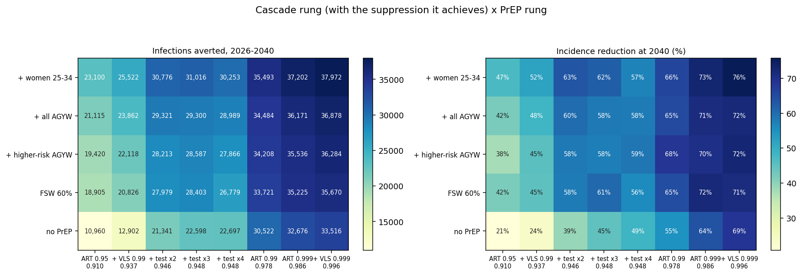
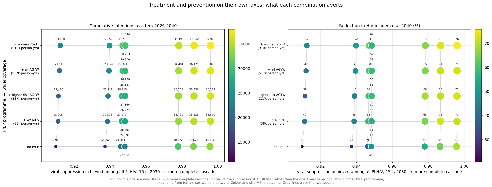

# Exp 033 — 032's "saturation" was my own ART target: the cascade reaches 0.996, not 0.948 — but every rung past 0.95 is counterfactual

**Date:** 2026-09-27. **Model:** model-v1.6 (starsim 3.5.2 / stisim 1.5.11).
**Compute:** raccoon, 110 workers, 9 cascade x 5 PrEP x 10 seeds = 450 sims.
**Parameters:** 024 design row 868, as 026/029/031/032. Seed spread only.

**Question.** [032](../032_cascade_prep_grid/SUMMARY.md) concluded the cascade
saturates at 0.948 viral suppression and that ~5% of PLHIV are structurally
unreachable. Decomposing that residual showed **78% of it was people diagnosed
but NOT on ART**, with delivered coverage 0.958 against a target of 0.950 — the
target was binding, not any ceiling. This experiment raises the ART target
itself to find where the model actually stops.

**Result.** **032's ceiling was an artefact of its own specification.** Raising
the ART target to 0.99 and then 0.999 takes suppression to **0.978 and 0.986**,
and adding a 0.999 suppression target reaches **0.996** — the residual is
0.43% of PLHIV, not 5%. 032's claim that cascade effort is exhausted past a
doubling of testing was likewise wrong: C5 → C8 averts a further **10,819**
infections.

**But the new top rungs are not policy scenarios.** They require every age and
sex group simultaneously to exceed the best-performing group Eswatini has ever
measured, and the model can only reach them because of defects we have already
documented. **The realistic frontier is 0.91-0.95 — the left half of this
ladder.**

## Observations

**obs 1 — The stop check passes exactly.** C0/P0 gives 66,178, identical to
031's and 032's baseline, same seed range. The ladder is anchored.

**obs 2 — The ceiling moves as soon as the ART target does.** No PrEP, 2030:

| rung | ART target | aware | on ART \| aware | VLS \| ART | **VLS of PLHIV** |
|---|---|---|---|---|---|
| C5 (032's top) | 0.95 | 0.998 | 0.960 | 0.990 | 0.948 |
| C6 | 0.99 | 0.999 | 0.989 | 0.990 | **0.978** |
| C7 | 0.999 | 0.999 | 0.998 | 0.990 | **0.986** |
| C8 | 0.999 + VLS 0.999 | 0.999 | 0.998 | 0.999 | **0.996** |

**obs 3 — Why testing alone stalled in 032, and it is a real programme lesson.**
Across testing x2 → x4 with the ART target fixed at 0.95, the undiagnosed
fraction falls 1.18 pp (1.37% → 0.18%) — testing works — but diagnosed-but-
untreated **rises 0.94 pp** (3.09% → 4.03%), absorbing ~80% of the gain. ART
coverage of PLHIV stays pinned at 0.955-0.958, because the target is expressed
as a fraction of PLHIV and is already satisfiable once >95% are diagnosed.
People merely move from one unsuppressed category to another; epidemiologically
nothing changes.

Release the cap and the picture inverts: C6 lifts coverage 0.958 → 0.988 and
collapses diagnosed-but-untreated 4.03% → 1.07%, gaining more suppression than
all three testing rungs combined. **Diagnosis converts into suppression only if
treatment expands to absorb it.**

**obs 4 — The residual at the top is 0.43% and is no longer dominated by
linkage.** 0.13 pp never diagnosed, 0.22 pp diagnosed-untreated, 0.08 pp
treated-unsuppressed.

**obs 5 — Even at 0.996 suppression, 32,662 of 66,178 infections still occur
(49%).** Maximum treatment scale-up averts 33,516 (50.6%). **This is the
result worth reporting, and it is a bound rather than a scenario** — it says
treatment cannot solve this even in the limit.

**obs 6 — PrEP's proportional value declines with suppression, contradicting
032 obs 5.** 032's "flat" reading was an artefact of its truncated ladder.
Share of the burden remaining that PrEP removes:

| PrEP | baseline | 0.937 | 0.948 | 0.978 | 0.996 |
|---|---|---|---|---|---|
| FSW 60% | 14.8 | 14.9 | 9.4 | 9.0 | **6.6** |
| broad (to women 25-34) | 22.1 | 23.7 | 17.4 | 13.9 | **13.6** |

Prevention retains roughly **60%** of its proportional effectiveness at
near-total suppression — substantial and non-zero, but declining.

**obs 7 — Adding broad PrEP at an achievable suppression beats a perfect
cascade without PrEP.** Broad PrEP at 0.978 averts **1,977 more** than the
maximal cascade at 0.996 with no PrEP (SD 1,618, **10/10 seeds**): 35,493
against 33,516. The FSW version of the same comparison is **not** reportable
(+205, 4/10 seeds).

**obs 8 — At the very top PrEP still adds**: FSW +2,154 (SD 1,361), broad
+4,456 (SD 1,146), both 10/10 seeds.

**obs 9 — THE TOP OF THE LADDER IS NOT ACHIEVABLE, and the model reaches it
only because of known defects.** SHIMS3 2021 measured, 15+: **0.937 aware,
0.973 on-ART-given-aware, 0.962 VLS-given-ART**. The best single stratum
anywhere in the survey: awareness 0.983 (women 35-49), linkage 0.998 (women
50+), suppression 0.992 (women 50+). C6-C8 demand 0.999 / 0.998 / 0.999 — from
*every* group, including men 25-34 who currently sit at 0.792 aware and 0.810
linked.

Worse, each of those ceilings is soft in the model for a documented reason:

- **Awareness 0.999** is attainable only because the model has no never-testing
  subgroup. 030 obs 8 measured this: the survey says ~3% of over-50s still do
  not know after decades; the model says ~1% and structurally cannot say more.
- **Linkage 0.998** is attainable because stisim's stratified ART path ignores
  both the linkage delay and the initiation probability (029's upstream note).
- **Suppression 0.999** is attainable because `vls_coverage` carries no age
  gradient (029 obs 6), so there is no youth deficit in the way.

Granting every stratum the best-ever-measured value on each step gives
0.983 x 0.998 x 0.992 = **0.973**. Plausible programme targets land around
**0.91-0.95** — C1 to C4 here. **032's range was roughly the right policy
space even though its ceiling was an artefact.**

**obs 10 — In the plausible zone PrEP's contribution is larger than at the
bound.** At 0.937, broad PrEP adds 12,620 (23.7% of residual); at 0.946, 9,435
(21.0%). Reporting from the realistic range helps the prevention argument
rather than hurting it.

## What this does not establish

**Anything about achievability.** The ladder is a mechanical sweep of targets,
not a set of costed or operationally grounded programmes. obs 9 is the
correction; exp 034 builds the plausible version.

**Parameter uncertainty.** One point; all intervals are seed noise.

**Age-targeted anything.** The testing lever is a sex-specific multiplier with
no age dimension, so "raise awareness in men 25-34" is not expressible here —
only "raise it everywhere and see which strata respond".

## Acceptance

Accepted, and it **supersedes 032's ceiling, saturation and flat-PrEP claims**.
032's SUMMARY stays as written; this one is the correction.

The defensible statements are: even at 99.6% suppression — beyond anything
achieved anywhere — 49% of projected infections still occur; PrEP's
proportional contribution falls from 22% to 14% of the residual across that
range but never vanishes; and adding broad PrEP at an achievable 0.978 averts
more than a counterfactually perfect cascade with no PrEP.

## Next

1. **[Opened — exp 034]** A plausible ladder: per-stratum UNAIDS 95-95-95, a
   testing-only rung to demonstrate obs 3's bottleneck, a best-in-class rung,
   and this ladder's top retained explicitly as a bound.
2. **Age-targeted testing**, so the lagging strata can be addressed directly
   rather than by raising the rate everywhere.
3. **A never-testing subgroup** (030 obs 8) — without it the model's first 95
   has no realistic ceiling, which is what made obs 9 necessary.
4. **Parameter uncertainty** via the wave-2 NROY sample.

## Artifacts

| | |
|---|---|
| `outputs/grid.csv` | 45 cells: achieved cascade, averted, incidence drop, PrEP increment, efficiency |
| `outputs/per_seed.csv` | per-cell per-seed infections and end-of-horizon incidence |
| `outputs/substitution.csv` | one more PrEP rung against one more cascade rung |
| `outputs/residual_decomposition.csv` | **the table that caught 032's error** — who is unsuppressed, per rung |
| `figures/xyz_scatter.png` | achieved suppression x PrEP programme size, outcome as colour |
| `figures/surface_heatmap.png` | the same grid, with achieved suppression on the x ticks |
| `figures/surface.png` | the three-panel line view |

Raw per-cell parquet (450 files) stay on raccoon under
`~/work/HIVsim/hivsim_eswatini/experiments/033_cascade_ceiling/outputs/sims/`.
