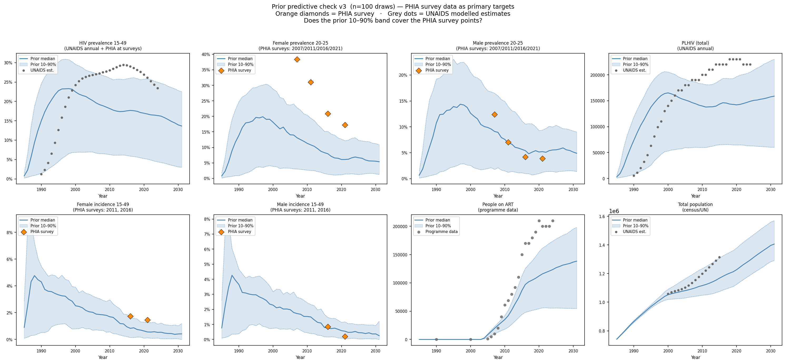
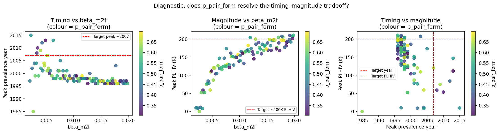

# Experiment 03 — Coverage check against PHIA survey data

## Question
Two questions combined:
1. Does adding `p_pair_form` to the prior resolve the timing–magnitude tradeoff found in experiment 02?
2. When we plot the coverage check against **PHIA survey data** (not UNAIDS modelled estimates), does the prior envelope cover the observations?

## What we ran
100 Latin-hypercube draws from the updated prior (see table), 1985–2031, 10 000 agents,
10 CPUs, 311 s wall time. All 100/100 draws completed.

| Parameter | Range | Change from 02 |
|---|---|---|
| `beta_m2f` | 0.002 – 0.020 | Unchanged |
| `eff_condom` | 0.50 – 0.90 | Unchanged |
| `rel_init_prev` | 0.05 – 0.50 | Unchanged |
| `rel_dur_on_art` | 1.0 – 20.0 | Unchanged |
| `prop_f0` | 0.55 – 0.90 | Unchanged |
| `prop_m0` | 0.55 – 0.80 | Unchanged |
| `m1_conc` | 0.05 – 0.30 | Unchanged |
| `p_pair_form` | **0.30 – 0.70** | **New** — test timing–magnitude hypothesis |

Coverage plots now show PHIA survey measurements as primary targets (orange diamonds) and
UNAIDS modelled estimates as secondary context (grey dots).

## Findings

### 1. `p_pair_form` does not resolve the timing–magnitude tradeoff
The diagnostic scatter confirms the same pattern as experiment 02: draws with late
epidemic peaks (≥ 2005) have low peak PLHIV (~50K vs data ~200K). Coloring by
`p_pair_form` shows no clean separation in timing-vs-magnitude space — the parameter
does not provide an independent route to a late, large epidemic.

### 2. Prior does not cover PHIA 2016/2021 female prevalence 20–25
PHIA female prevalence 20–25 is ~31–37% across all four survey years (2007, 2011, 2016,
2021). The model's 90th-percentile line reaches this range at peak (early 2000s) but
then declines. By 2016 and 2021, the PHIA data points sit below the model 10th
percentile — the model has already collapsed while the data shows sustained epidemic.

### 3. PHIA incidence data exposes the fast-decline problem directly
PHIA female incidence 15–49: ~3.1%/yr in 2011, ~1.7%/yr in 2016.
The model median at 2011 is near the data, but the model median at 2016 is well above
the data — incidence falls far too fast in the model relative to PHIA observations.

Interpretation: the model's epidemic is burning through the susceptible pool too quickly
in the early 2000s and then running out of transmission opportunity. The mechanism
sustaining transmission into the 2010s in the real epidemic (ongoing FSW/client
seeding into the medium-risk population) is insufficiently active in the model.

### 4. ART coverage and total population are adequately covered
`n_on_art` tracks the programme data within the prior band. Total population growth
is covered by the prior envelope.

## Structural hypothesis for experiment 04
The medium-risk female group (`f1_conc = 0.15`, fixed) controls how many medium-risk
women have concurrent partnerships. This governs the rate at which FSW-to-client
transmission "bridges" into the general population. If `f1_conc` is too low, the
medium-risk group saturates slowly and the epidemic cannot sustain at scale past 2005.

**Next test:** add `f1_conc` to the prior (e.g. 0.05–0.40) and check whether the prior
envelope can simultaneously cover the 2007 and 2021 PHIA prevalence points for women
aged 20–25.

## Figures

